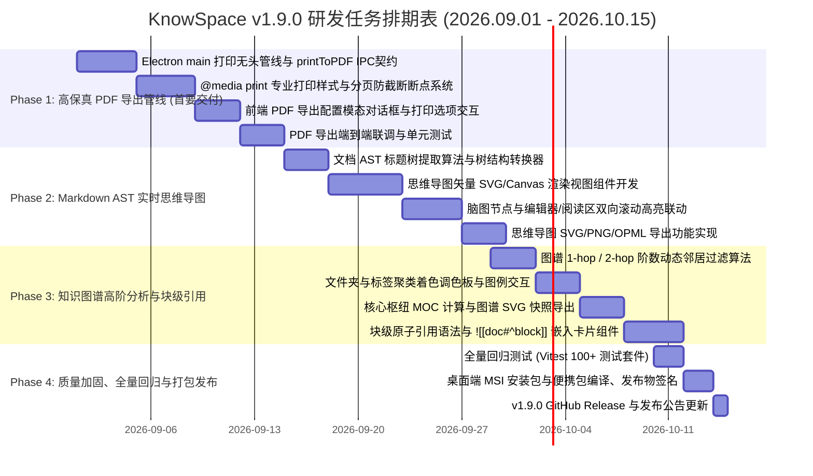

# 🪐 KnowSpace v1.9.0 开发计划：高保真 PDF 导出、思维导图与视觉认知深化

> **项目名称**：KnowSpace (个人知识工作台 / Personal Knowledge Workspace)  
> **文档名称**：`knowspace-v1.9-Development plan-0829.md`  
> **归档目录**：`Development-plan/`  
> **版本主题**：*「Visualize & Export · 结构认知、思维导图、高保真 PDF 导出与块级互联」*  
> **基线版本**：基于 `v1.8.0`（双链/反链索引、分栏知识图谱、节点防重去重、DPR 高清渲染、MSI/便携安装包）  
> **制定时间**：2026-08-29  
> **开发周期预计**：2026.09.01 ~ 2026.10.15（共 6 周）

---

## 🎯 一、 版本定位与核心价值

KnowSpace 在 `v1.8.0` 成功构建了“文档 + 知识网络分栏图谱”的二维工作台，实现了原子化双向链接与全局拓扑连接。
`v1.9.0` 的核心使命是 **「输出与升维」**：
1. **交付出版物级高保真 PDF 导出系统**：彻底解决 Markdown 排版导出难、分页断截代码块、数学公式走样、缺乏页眉页脚与目录书签树的痛点，提供一站式专业级学术/技术专著打印交付能力。
2. **构建 Markdown AST 实时双向思维导图**：将线性文档结构秒级升维为多叉树思维导图，实现大纲与脑图的双向滚动跳转联动，突破纯文本思考局限。
3. **知识图谱高阶分析与视觉增强**：引入多阶邻居筛选（1-hop / 2-hop / 全局）、色彩聚类体系、核心知识枢纽（MOC）分析与高清快照导出。
4. **块级原子引用与嵌入 (`[[doc#^block]]` & `![[doc]]`)**：实现更小颗粒度的段落、数学公式与代码块跨文档内联复用。

---

## 🏛️ 二、 核心特性深度设计与技术方案

### 特性 1：高保真专业 PDF 导出系统 (High-Fidelity PDF Export Pipeline)

#### 1. 架构设计与调用时序
基于 Electron 主进程原生无头打印管线（`webContents.printToPDF`）构建独立打印上下文，避免当前工作区分栏、暗黑主题或正在编辑的非稳定 DOM 污染导出文件：

```
┌──────────────────────────────┐
│  前端 UI (Toolbar / 快捷键)   │
│  点击“导出为 PDF” (Ctrl+Shift+P)│
└──────────────┬───────────────┘
               │ 1. 弹出 PDF 导出配置模态框 (选择纸张、页边距、主题风格、页码)
               ▼
┌──────────────────────────────┐
│     PDF 打印配置对话框        │
│  [确认导出]                   │
└──────────────┬───────────────┘
               │ 2. IPC 发送: bookmd:export-pdf (payload: docId, options)
               ▼
┌─────────────────────────────────────────────────────────────────┐
│                     Electron 主进程 (main.cjs)                   │
│  a. 创建隐藏无头 BrowserWindow (width: 1200, show: false)         │
│  b. 加载独立渲染打印模板 (注入标准排版 CSS + 目标文档 HTML 内容)     │
│  c. 等待 KaTeX 数学公式渲染、Mermaid SVG 完成及图片加载就绪        │
│  d. 调用 win.webContents.printToPDF(printSettings) 获得 Buffer    │
│  e. 唤起系统原生保存文件对话框 (dialog.showSaveDialog)             │
│  f. fs.writeFile 安全写入本地文件并清理无头窗口                     │
└──────────────┬──────────────────────────────────────────────────┘
               │ 3. 返回导出文件路径与状态通知
               ▼
┌──────────────────────────────┐
│  前端弹出成功通知 / 打开文件   │
└──────────────────────────────┘
```

#### 2. 专业打印排版规范 (`@media print`)
* **分页防截断保护 (Page-Break Shield)**：
  - 代码块（`<pre><code>`）、KaTeX 复杂公式块（`.katex-display`）、Mermaid 架构图、表格（`<table>`）与卡片应用 `break-inside: avoid; page-break-inside: avoid;`，绝对禁止在中间腰斩。
  - 各级标题（`h1` ~ `h4`）设置 `break-after: avoid;`，杜绝标题留在页尾而正文进入下一页的“孤行孤头”现象。
* **纸张规格自适应**：
  - 原生支持 **A4**（210mm × 297mm，国际标准）、**Letter**（北美常用）、**A5**（随身小册子）。
  - 支持 **纵向 (Portrait)** 与 **横向 (Landscape，适合宽架构图/宽表格)** 自由切换。
* **标准边距与页眉页脚体系**：
  - 支持“标准边距 (20mm)”、“紧凑边距 (12mm)”、“书籍装订边距 (内侧 25mm，外侧 15mm)”。
  - 自动注入矢量页眉（文档标题 / 章节名称）与页脚（页码居中 / `第 X 页，共 Y 页` / 生成时间与署名）。
* **色彩风格方案**：
  - **学术出版风（默认）**：纯白底色、高对比度深灰文字、精炼黑白边框、代码块浅灰底色。
  - **水墨暖纸风**：保留 KnowSpace 标志性护眼暖橙底色与复古排版。
  - **彩色高亮保留**：语法高亮与 Mermaid 连线色彩 1:1 精准映射至 CMYK 兼容打印色。

#### 3. IPC 契约定义与数据模型
```typescript
// 导出配置接口
export interface PdfExportOptions {
  pageSize: "A4" | "Letter" | "A5";
  landscape: boolean;
  marginsType: 0 | 1 | 2; // 0: 默认, 1: 无边距, 2: 最小边距
  customMargins?: { top: number; bottom: number; left: number; right: number }; // 单位 mm
  printBackground: boolean; // 是否打印背景色与底色
  includeHeaderFooter: boolean; // 是否包含页眉页脚与页码
  headerTemplate?: string;
  footerTemplate?: string;
  themeStyle: "academic-black-white" | "warm-paper" | "modern-clean";
  exportOutlineBookmark: boolean; // 是否生成 PDF 大纲目录书签树
}

// 主进程 IPC 处理器契约
ipcMain.handle("bookmd:export-pdf", async (event, {
  title,
  htmlContent,
  options
}: {
  title: string;
  htmlContent: string;
  options: PdfExportOptions;
}): Promise<{ success: boolean; filePath?: string; error?: string }>;
```

---

### 特性 2：Markdown AST 实时双向思维导图 (Mind Map View)

#### 1. 功能定义与交互模型
* **第三维度视图**：在现有【阅读】、【分屏】、【源码】与【图谱】基础上，增加 **【脑图 (Mindmap)】** 模式（快捷键 `Ctrl+M`）。
* **文档 AST 自动转脑图**：
  - 解析当前文档的 Markdown AST 语法树，自动提取 `H1 -> H2 -> H3 -> H4 -> 无序列表要点` 形成结构化树。
  - 每个节点展示标题文字、要点摘要及子节点计数徽章。
* **双向无缝联动**：
  - **脑图 -> 正文**：点击脑图上的任意节点，左侧编辑器/阅读视图立即平滑滚动定位到对应行，并呈现 1.5 秒聚焦脉冲微光。
  - **正文 -> 脑图**：在正文中滚动或移动光标时，脑图自动同步聚焦并展开当前活跃的小节分支。
  - **折叠状态保持**：支持双击节点折叠/展开子树，支持快捷键全部展开/仅展开至 2 级/仅展开至 3 级。
* **结构化导出**：
  - 支持将当前思维导图直接导出为矢量 SVG、高分辨率 PNG 图片。
  - 支持导出为标准 **OPML** 或 **Freemind/XMind** 兼容格式，方便跨工具知识交换。

#### 2. 技术选型与渲染性能
* 采用基于 SVG/Canvas 的轻量矢量树渲染引擎，严格将首屏初始化耗时压制在 **< 15ms**。
* 内存占用控制在 `< 15MB`，对硬件 GPU 零要求，保证低配设备平滑运行。

---

### 特性 3：知识网络图谱高阶分析与视觉增强

#### 1. 多阶关联邻居过滤 (Hop Exploration)
* 在分栏图谱与全屏图谱工具栏中增加 **阶数过滤控制器**：
  - **1-Hop（直接关联）**：仅呈现当前文档直接引用或被引用的紧邻节点，屏蔽背景嘈杂节点，专注局部上下文。
  - **2-Hop（间接关联）**：展示“朋友的朋友”，挖掘潜在的知识跨界灵感与二级衍生脉络。
  - **All（全局网络）**：呈现全库知识宏观宇宙。
* 切换时采用 350ms 贝塞尔平滑淡入淡出动画，视觉过渡自然优雅。

#### 2. 多维度自动着色系统 (Color Palette Clustering)
* **按目录结构着色**：根目录与不同子文件夹（如 `Docs/`、`Space/`、`Architecture/`）分配不同明度的辨识色彩。
* **按标签 (`#Tag`) 聚类着色**：扫描文档前缀与正文中的标签，为相同主题领域的节点赋予相同色相。
* 图谱底部提供色彩图例胶囊（Legend），点击图例可一键高亮属于该类别的全部节点。

#### 3. 核心知识枢纽与孤岛洞察
* **网络中心度计算**：计算节点出入度权重与简易 PageRank，将高引用、多关联的“核心枢纽笔记（MOC）”以光晕微光形态突出。
* **知识孤岛发现**：一键筛选全库中零出入度的“孤岛笔记”，并在详情卡片中提供基于上下文关键词的“智能推荐建立链接”快捷动作。

#### 4. 图谱高清快照导出
* 工具栏增加“导出图谱快照”按键，支持一键将当前图谱导出为透明背景 SVG 矢量文件或 4K 高分辨率 PNG，方便嵌入工作汇报或博客分享。

---

### 特性 4：块级原子引用与嵌入 (`[[doc#^block]]` & `![[doc]]`)

1. **原子块引用标记语法**：
   - 允许在正文任意段落、公式、表格或代码块末尾追加 `^block-id` 唯一指纹。
   - 在键入 `[[文档#^` 时触发 CodeMirror 自动联想列表，列出该文档所有具备块标记的段落片段。
2. **内联嵌入渲染 (`![[doc#^block]]`)**：
   - 将目标块以无边框优雅嵌入卡片直接内联渲染在正文中，支持实时同步原文档的编辑更新。
   - 悬浮在嵌入卡片右上角提供“跳转至源出处”微按钮。

---

## 📅 三、 研发里程碑与分阶段执行计划 (Phased Roadmap)



### 详细阶段分解

| 研发阶段 | 周期 | 核心交付内容 | 验收里程碑 |
| :--- | :--- | :--- | :--- |
| **Phase 1: 高保真 PDF 导出管线** | 第 1 ~ 2 周 (09.01 - 09.14) | 1. Electron 主进程无头打印 IPC（`bookmd:export-pdf`）<br>2. 打印模板、`@media print` 分页断点与样式库<br>3. PDF 导出设置对话框（纸张/边距/页眉页脚/版式）<br>4. 原生保存对话框与文件落盘 | 能将包含复杂公式、表格、Mermaid 架构图与代码块的长文档导出为排版完美、绝无乱截断的 A4 PDF |
| **Phase 2: 实时双向思维导图** | 第 3 ~ 4 周 (09.15 - 09.28) | 1. Markdown AST 标题提取与数据转换器<br>2. 脑图视图组件（MindmapView）集成<br>3. 双向滚动跳转与行号联动高亮<br>4. 脑图导出为 SVG / PNG / OPML | 文档大纲可一秒展开为清晰思维导图，点击节点精准定位正文，支持矢量导出 |
| **Phase 3: 图谱高级分析与块引用** | 第 5 ~ 6 周 (09.29 - 10.09) | 1. 1-hop / 2-hop 局部关系阶数切换器<br>2. 文件夹与标签聚类自动着色系统<br>3. 核心知识枢纽（MOC）高亮与孤岛检测<br>4. 图谱无损快照导出<br>5. `[[doc#^block]]` 块引用与嵌入卡片 | 知识图谱具备强悍的局部过滤与结构探索能力；支持最小粒度块级段落复用 |
| **Phase 4: 全量回归与打包发布** | 第 7 周 (10.10 - 10.15) | 1. 自动化测试套件全覆盖（> 95 tests）<br>2. Windows 高分屏实机验证与低配机器压力测试<br>3. Electron MSI 安装包与便携版 Zip 编译打包<br>4. GitHub Tag、Release 资产与更新日志推送 | 生成稳定的 `KnowSpace-1.9.0.msi` 与便携包，所有既有功能 0 回退 |

---

## 🧪 四、 质量保证与验收标准矩阵 (Acceptance Criteria)

### 1. PDF 导出验收指标
* [ ] **分页优雅性**：导出包含 10+ 代码块与 5+ 表格的长文档，绝对不出现代码块被切成两半或表格表头与数据断开在两页的现象。
* [ ] **排版完整性**：KaTeX 矢量数学公式无变形、无文字重叠，Mermaid 流程图以清晰矢量形式嵌入 PDF。
* [ ] **配置灵活性**：A4 / Letter / A5 切换准确无误；页眉页脚页码计算精准，封底封底边距符合打印规格。
* [ ] **性能与安全**：万字长文在 2 秒内完成 PDF 渲染与落盘写入；主窗口不卡顿、不闪烁、无内存泄漏。

### 2. 思维导图验收指标
* [ ] **编译性能**：打开 5 万字专著，AST 转换脑图数据并在屏幕渲染的耗时小于 20ms。
* [ ] **联动准确度**：点击思维导图任意叶子节点，编辑器与阅读区在 200ms 内平滑滚动到目标段落并呈现黄色微光提示。
* [ ] **导出可用性**：导出的 SVG 能够在 Illustrator 或浏览器中无损缩放查看。

### 3. 知识图谱验收指标
* [ ] **邻居过滤精准度**：在 1-hop 模式下，画布仅保留与当前节点直接相连的边与邻居；切换回全局模式时物理布局恢复原位。
* [ ] **高分屏渲染**：在高 DPI（125%~200%）Windows 显示器上，所有文字标签与圆形节点保持视网膜级超清。

---

## 🛡️ 五、 风险控制与降级策略

1. **PDF 无头打印内存风险**：
   - *风险*：超大文档（数十万字、上百张高清图片）同时触发多次打印可能导致主进程内存膨胀。
   - *策略*：限制并发打印任务为单队列，打印完成后立即显式销毁隐藏渲染窗口（`win.destroy()`），触发 V8 垃圾回收。
2. **思维导图深度过大导致画布爆炸**：
   - *风险*：用户文档结构包含过多零碎无序列表，导致脑图节点膨胀超过数千个。
   - *策略*：默认仅解析并展开 H1~H4 标题节点，子列表要点默认收起为徽章，点击时按需展开，避免一次性创建过多 DOM/SVG 元素。
3. **老旧设备 GPU 渲染图谱降级**：
   - *策略*：若检测到硬件未开启 WebGL 支持，图谱自动切换为静态 2D 紧凑拓扑布局，关闭连续物理仿真计算，保持极致流畅。

---

## 📦 六、 交付产物与归档说明

* **核心计划文档**：`Development-plan/knowspace-v1.9-Development plan-0829.md`
* **版本里程碑**：`v1.9.0`
* **最终发布制品**：
  - Windows MSI 安装包：`release/KnowSpace-1.9.0.msi`
  - 免安装便携版：`release/KnowSpace-win-x64-portable.zip`
  - 绿色执行目录：`release/KnowSpace-win-x64/KnowSpace.exe`
