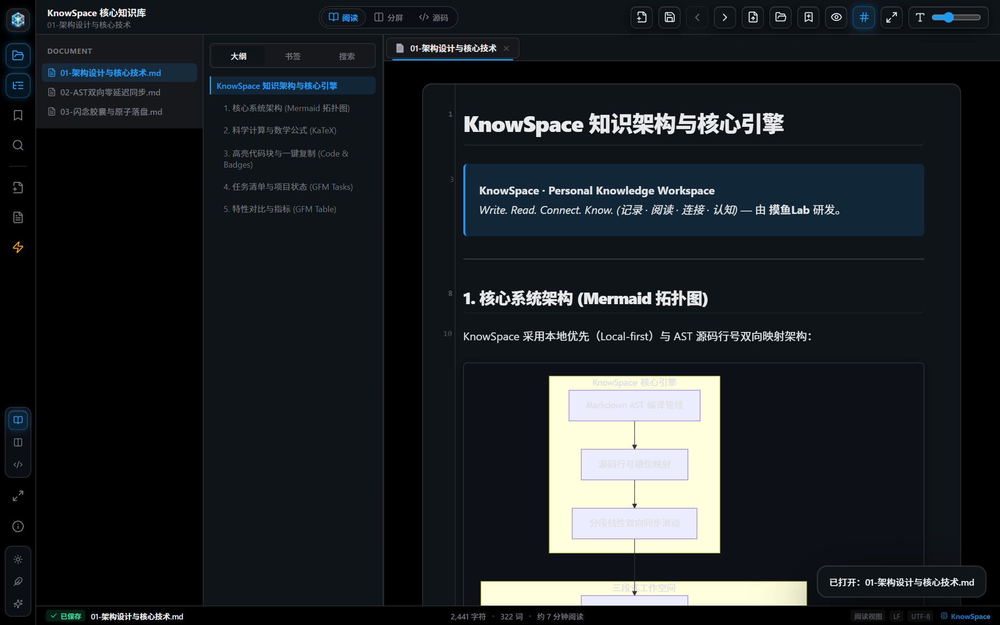

# BookMD Reader

<p align="center">
  
</p>

<p align="center">
  <strong>现代化高颜值 Markdown 书籍阅读与编辑桌面应用 | Modern High-Performance Markdown Reader & Editor</strong>
</p>

<p align="center">
  
  
  
  
  
  
  
</p>

<p align="center">
  
</p>

<p align="center">
  <a href="#-核心功能特性">中文文档</a> •
  <a href="#️-平台开发架构与语言构成">架构与语言</a> •
  <a href="#-key-features">English Docs</a> •
  <a href="#-便携版与-msi-安装包">下载运行</a> •
  <a href="#-键盘快捷键">快捷键</a> •
  <a href="#️-研发与构建">开发构建</a>
</p>

---

BookMD Reader 是一个本地优先、高颜值的 Markdown 文档阅读与编辑桌面应用。由 **摸鱼Lab** 研发，融入现代极客设计美学，支持多级目录树浏览、多级大纲实时追踪、分屏双向高精度同步滚动与双侧联动高亮、界面分栏自由拖拽缩放、正文预览行号显示、书签与阅读进度记忆、安全原子落盘保存、外部冲突检测，并提供 Windows MSI 安装包与绿色便携版。

---

## 🌟 核心功能特性

### 1. 现代视觉与双主题交互系统
- **全新极客暗黑主题**：
  - 采用 Lights Out 纯黑底色 (`#000000`)、电光蓝高亮 (`#1D9BF0`) 与发丝微边框 (`#2F3336`)。
  - 支持 **☀️ 日光浅色 / ✨ 极客暗黑** 双重主题一键平滑切换。
- **📐 界面多栏边界自由鼠标拖拽调整（Resizable Splitters）**：
  - **文档目录栏**（`ChapterList`，160px ~ 480px）、**大纲/书签/搜索侧栏**（`side-panel`，180px ~ 520px）以及**分屏模式下编辑器与预览窗口**（`DocumentWorkspace`，15% ~ 85%）均支持鼠标自由拖拽调整。
  - 分栏处配备专属 `.layout-resizer` 分隔线，鼠标悬停即变双向调整箭头（`col-resize`），拖拽时光晕高亮反馈，并锁定文字划选（`user-select: none`），体验极致丝滑。
  - 用户自定义分栏宽度与比例自动保存至本地 `localStorage`，重启软件自动恢复。
- **左侧 Activity Bar 功能活动栏**：
  - 顶部品牌专属 BookMD 橙光书卷 Logo 徽章（摸鱼Lab 研发出品）。
  - 快捷切换：📁 **文档目录树**、📑 **文档大纲 (TOC)**、⭐ **精选书签**、🔍 **全文即时检索**。
  - 快速操作：➕ **新建文档** (`Ctrl+N`)、📂 **打开目录** (`Ctrl+Shift+O`)。
  - 底部控制：微型三段式视图切换器、精选双主题无缝切换（☀️ 日光浅色 / ✨ 极客暗黑）。
- **底部实时状态信息栏（Footer Dock Bar）**：
  - **保存状态徽章**：绿色已保存（`● 已保存`）、橙色修改中（`● 未保存`）、青色只读标识。
  - **实时文档统计**：字数、词数统计及阅读预估时长（例如 `2,450 字符 • 约 6 分钟阅读`）。
  - **环境指标胶囊**：当前视图模式、换行符格式（`LF / CRLF`）、`UTF-8` 编码与 `BookMD` 引擎标识。
- **弹性动力学动效**：全局接入 `cubic-bezier(0.16, 1, 0.3, 1)` 弹性物理缓动，抽屉展开与弹窗呼出丝滑轻快。

### 2. 编辑与创作（全新升级）
- **三段式视图随心切换**：
  - 📖 **阅读模式**：纯净无干扰的书籍沉浸式排版阅读。
  - 🪟 **分屏模式**：左侧 CodeMirror 6 源码编辑、右侧实时渲染预览；支持鼠标自由拖拽分割线调整比例，在窄屏（`<980px`）下自适应垂直分屏。
  - 💻 **源码模式**：全屏纯源码极客专注编写。
- **🔢 正文预览区行号自动显示（Automatic Preview Line Numbers）**：
  - 利用 Markdown 编译阶段 AST 元数据 `data-source-line`，在正文标题、段落、列表项、代码块、引用块及表格左侧槽位自动显示源码行号。
  - 采用等宽字体（`JetBrains Mono` / `Consolas`）右对齐排版，鼠标悬停该文段时行号自动点亮为电光蓝（`#1d9bf0`），与源码侧行号精准对齐。
  - 顶部工具栏提供快捷显隐切换按钮（`#`），随心一键切换开启或关闭。
- **双向高精度同步滚动（Synchronized Scrolling）**：
  - 基于 AST 块级源码行号标记（`data-source-line`）与分段线性插值算法，彻底消除富文本与源码高度差异产生的滚动漂移。
  - 支持编辑器顶部一键开启/关闭同步滚动胶囊徽章（`🔗 同步滚动`）。
- **CodeMirror 6 现代编辑器**：Markdown 语法高亮、实时行号、代码折叠、括号自动补全与撤销/重做历史。
- **防抖实时预览与版本防乱序**：250ms 智能防抖渲染，结合 Revision 乱序淘汰机制，保障大段快速输入时预览流畅不丢帧。
- **大文档性能守护**：超大文档（>2MB）自动开启性能保护模式，暂停高频防抖并提供手动一键刷新。

### 3. 阅读与知识检索
- **单文件与多层级文档库**：打开单个 `.md` 文件，或载入整套技术文档/书籍文件夹自动构建树状目录。
- **稳定章节标识符**：基于相对路径哈希生成稳定 ID，文件夹增删改或文档重命名不丢失已有书签与阅读进度。
- **动态大纲随动高亮**：正文滚动时多级大纲实时高亮当前小节，点击大纲平滑跳转。
- **全文即时检索与卡片聚合**：
  - 同一文段多次命中聚合为 1 张卡片，展示行号徽标（如 `L4`）、关键词精准高亮匹配、匹配总数与一键清空。
  - 点击卡片精准平滑跳转定位，正文触发 1.8 秒专属呼吸电光蓝微光聚焦（`searchPulse`）。
- **丰富富文本渲染**：完美支持 GFM 表格、任务清单、Front Matter 元数据标签、KaTeX 数学公式与 Mermaid 动态图表。
- **🖥️ 全屏沉浸模式**：支持 `F11` 快捷键沉浸全屏阅读写作与 `Esc` 退出。

### 4. 数据安全与防丢稿守卫
- **原子事务落盘保存**：同目录临时文件写入 + `fsync` 物理落盘 + 原子重命名替换，杜绝断电或异常退出的文件截断损坏。
- **编码与换行风格保真**：自动识别并保留原文件的 UTF-8 BOM 以及 CRLF (`\r\n`) / LF (`\n`) 格式。
- **外部修改冲突检测**：保存前校验磁盘 `{ size, mtimeMs }`。若文件被外部工具修改，自动弹出冲突协商弹窗（重新载入、强制覆盖或另存为）。
- **全链路未保存守卫**：切换章节、新建文件、打开文件/目录或关闭窗口时，若有未保存修改均触发拦截提示，杜绝误操作丢稿。

---

## ⌨️ 键盘快捷键

| 快捷键 | 功能 | 说明 |
| :--- | :--- | :--- |
| `Ctrl + N` | **新建文件** | 打开保存对话框创建新 Markdown 文件并进入编辑 |
| `Ctrl + S` | **保存文件** | 保存当前文档修改（未保存时顶部与底部指示灯高亮） |
| `Ctrl + Shift + S` | **另存为** | 将当前编辑内容另存为新路径 |
| `Ctrl + O` | **打开文件** | 快速打开本地单个 Markdown 文件 |
| `Ctrl + Shift + O` | **打开目录** | 选择并载入 Markdown 文档文件夹 |
| `Ctrl + \` | **折叠/展开目录栏** | 快捷切换左侧文件目录树显示状态 |
| `Ctrl + F` | **搜索内容** | 呼出右侧搜索面板并快速定位关键词 |
| `Ctrl + B` | **添加书签** | 快速记录当前小节与阅读百分比 |
| `F11` | **全屏模式** | 切换沉浸式全屏阅读/写作（支持 `Esc` 退出） |
| `Alt + ←` | **上一篇** | 切换到上一章节（未保存修改时自动拦截提醒） |
| `Alt + →` | **下一篇** | 切换到下一章节（未保存修改时自动拦截提醒） |

---

## 📦 便携版与 MSI 安装包

本项目提供两种 Windows 运行与安装形式：

### 1. Windows MSI 标准安装包
- **文件**：`BookMD-Reader-1.4.2.msi`
- **特点**：双击即可安装至 Windows 系统，自动创建桌面快捷方式与开始菜单官方品牌图标，支持标准控制面板卸载与静默安装。

### 2. Windows 绿色免安装便携版
- **文件**：`BookMD-Reader-win-x64-portable.zip`
- **直接运行**：解压后双击 `BookMD Reader.exe`
- **特点**：解压即用，无需配置 Node.js、Electron 等任何运行时；支持右键"打开方式"关联 `.md` 文件。

---

## 🛠️ 研发与构建

### 环境要求
- Node.js >= 18.0.0
- npm >= 9.0.0

### 本地开发
```powershell
# 1. 安装依赖
npm install

# 2. 运行单元测试 (Vitest)
npm test

# 3. 启动 Vite 开发服务器 (Web 预览)
npm run dev

# 4. 启动 Electron 桌面应用开发模式
npm run desktop
```

### 生产打包
```powershell
# 构建 Web 静态 bundle
npm run build

# 生成 Windows 绿色便携版
npm run desktop:pack

# 生成 Windows MSI 标准安装包
npm run desktop:msi
```

---

## 🛠️ 平台开发架构与语言构成 (Architecture & Languages)

项目基于严谨的跨平台桌面应用架构设计，各开发语言在技术栈中承担明确的核心职责：

| 开发语言 / 技术栈 | 架构层次 | 核心职责与代表模块 | 仓库语言权重 |
| :--- | :--- | :--- | :---: |
| **TypeScript / TSX** | 核心业务与交互层 (Core Logic & UI) | React 19 用户界面、CodeMirror 6 极客源码编辑引擎、Markdown/AST 行号映射注入、双向精准同步滚动与高亮 Hook、会话状态机、持久化存储服务 | **~75%** |
| **CSS3 (Design System)** | 视觉设计系统 (Aesthetic Styling) | Antigravity / Dribbble 现代流体视觉规范、日光白 / 黑曜暗主题变量、Acrylic 毛玻璃卡片、物理弹性动画、响应式断点适配 | **~15%** |
| **JavaScript / CommonJS** | 原生运行时与桥接层 (Electron Desktop Runtime) | Electron 42 主进程生命周期管理、`contextBridge` 安全跨进程通信、原子落盘物理事务保存、UTF-8 BOM/换行符保真与外部修改冲突检测 | **~6%** |
| **PowerShell / WiX** | 发布构建与自动化 (Build & DevOps) | Windows MSI 安装包生成流水线、WiX 工具链自动编译链接、便携版零依赖打包压缩自动化脚本 | **~4%** |

### 📂 目录结构与分层

```text
electron/
  ├── main.cjs                  # Electron 主进程、窗口管理、原生菜单、外部链接安全跳转与 IPC
  ├── preload.cjs               # contextBridge 安全桌面 API 暴露
  └── markdown-files.cjs        # 稳定 ID 树生成、原子落盘保存、BOM保护与冲突检测
src/
  ├── components/
  │     ├── ActivityBar.tsx         # 左侧核心活动功能栏（Logo、工具切换、视图模式、主题与关于）
  │     ├── StatusBar.tsx           # 底部科技信息停靠栏（字数统计、状态徽章、编码与阅读预估）
  │     ├── EditorPane.tsx          # CodeMirror 6 编辑器集成与选区监听
  │     ├── ReaderPane.tsx          # 渲染阅读面板与富文本交互
  │     ├── DocumentWorkspace.tsx   # 阅读/分屏/源码工作区与拖拽分割调度
  │     ├── Toolbar.tsx             # 顶部工具栏（章节标题、保存、大纲/目录控制、行号切换、关于）
  │     ├── ChapterList.tsx         # 目录树列表
  │     ├── TocPanel.tsx            # 多级大纲侧栏
  │     ├── BookmarkPanel.tsx       # 书签侧栏
  │     ├── SearchPanel.tsx         # 全文检索侧栏
  │     ├── AboutDialog.tsx         # 关于应用卡片弹窗（项目简介、GitHub、作者与环境）
  │     ├── UnsavedChangesDialog.tsx# 未保存修改守卫弹窗
  │     └── FileConflictDialog.tsx  # 外部修改冲突处理弹窗
  ├── hooks/
  │     ├── useSyncScroll.ts        # 双向高精度行号映射同步滚动 Hook
  │     ├── useSyncSelection.ts     # 双向选择同步高亮与平滑上移聚焦 Hook
  │     ├── useDocumentSession.ts   # 文档编辑会话状态机与防抖渲染调度
  │     └── useReadingTracker.ts    # 标题位置追踪与阅读进度记忆
  ├── services/
  │     ├── markdown.ts             # markdown-it 渲染管线、AST行号注入、KaTeX 公式、Mermaid 图表
  │     ├── storage.ts              # 本地阅读偏好与进度持久化
  │     ├── bookmarks.ts            # 书签索引与校验
  │     └── bookSource.ts           # 文档源数据加载
  └── core/
        └── types.ts                # 全局核心类型定义
scripts/
  ├── package-desktop.cjs       # Windows 便携版打包脚本
  ├── publish_github_release.py # GitHub Release 自动化发布与资源上传脚本
  ├── build-msi.ps1             # WiX / Electron-Builder MSI 安装包自动化脚本
  ├── build-msi.cjs             # WiX MSI 编译链接配置
  └── extract-wix.cjs           # WiX 工具链环境解压准备脚本
release/                        # 便携版与 MSI 安装包发布输出目录
```

---

## 🌐 English

### Key Features

- **Activity Bar & Dock Architecture**: Modern activity navigation rail with custom BookMD logo, sidebar panels (Directory Tree, TOC Outline, Bookmarks, and Full-Text Search), view mode switcher, and light/dark theme toggles.
- **Resizable Layout Splitters**: Drag and resize the directory sidebar (160px~480px), side panels (180px~520px), and split editor/preview ratio (15%~85%) freely with persistent layout state saved in `localStorage`.
- **Automatic Preview Line Numbers**: Zero-runtime-overhead gutter line numbering powered by Markdown AST `data-source-line` attributes with hover highlights and top bar toggle button (`#`).
- **Three Editing & Reading Modes**: Read mode (clean reader), Split mode (side-by-side editing with live preview & draggable splitter, vertical responsive wrap on small screens), and Source mode (fullscreen code editor).
- **Bidirectional Synchronized Scrolling & Selection Highlighting**: Line-mapped piecewise linear keyframe interpolation using AST `data-source-line` attributes, paired with frame-scheduled selection highlighting and smooth upper reading zone alignment.
- **CodeMirror 6 Editor**: Syntax highlighting, line numbers, code folding, auto-closing brackets, and undo/redo history.
- **Safe Atomic Saving & Conflict Detection**: Same-directory temporary write + `fsync` + atomic rename, preserving UTF-8 BOM and CRLF/LF line endings. Automatically detects external modifications before writing.
- **Status Bar Dock**: Real-time word count, character count, estimated read time, dirty status indicator badge, line ending format, and encoding.
- **Distribution Packages**: Windows MSI installer (`BookMD-Reader-1.4.2.msi`) and zero-dependency portable package (`BookMD-Reader-win-x64-portable.zip`).

---

## 📄 License

MIT License © 2026 摸鱼Lab (Moyu Lab)

