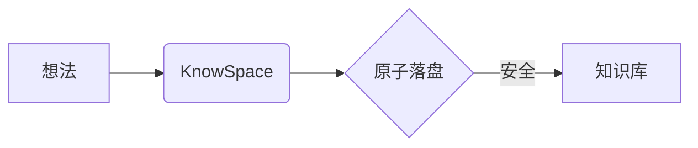

# KnowSpace 操作手册 (User Operation Manual)

<p align="center">
  
</p>

<p align="center">
  <strong>KnowSpace · Personal Knowledge Workspace | 现代化个人知识工作台</strong><br />
  <em>Write. Read. Connect. Know. (记录 · 阅读 · 连接 · 认知)</em>
</p>

<p align="center">
  
  
  
  
</p>

---

## 📑 目录导引

- [一、 产品概述与设计理念](#一-产品概述与设计理念)
- [二、 工作台界面全貌与布局](#二-工作台界面全貌与布局)
- [三、 三款沉浸式主题系统](#三-三款沉浸式主题系统)
- [四、 三段式工作区视图与编辑](#四-三段式工作区视图与编辑)
- [五、 多标签页协同与窗口管理](#五-多标签页协同与窗口管理)
- [六、 🗗 双文档左右分屏对比查看模式](#六--双文档左右分屏对比查看模式)
- [七、 全功能知识导航与即时检索体系](#七-全功能知识导航与即时检索体系)
- [八、 富文本排版与科学计算增强](#八-富文本排版与科学计算增强)
- [九、 媒体与架构图无损灯箱 (Media Lightbox)](#九-媒体与架构图无损灯箱-media-lightbox)
- [十、 闪念胶囊 (Flash Notes) 全局灵感速记浮窗](#十-闪念胶囊-flash-notes-全局灵感速记浮窗)
- [十一、 沉浸写作辅助与专注模式](#十一-沉浸写作辅助与专注模式)
- [十二、 数据安全基石与防丢稿守卫](#十二-数据安全基石与防丢稿守卫)
- [十三、 键盘快捷键完整速查指南](#十三-键盘快捷键完整速查指南)
- [十四、 安装与便携运行指南](#十四-安装与便携运行指南)

---

## 一、 产品概述与设计理念

**KnowSpace** 是一个本地优先、高颜值的现代化个人知识工作台（Personal Knowledge Workspace）。由 **摸鱼Lab** 研发，秉承 **“Write. Read. Connect. Know.（记录 · 阅读 · 连接 · 认知）”** 的产品理念，以「超立方空间」HyperSpace Cube 为设计核心，旨在为你打造一个收纳所有想法、文档、图表与知识的私密安全空间。

### 💎 核心产品特性一览
1. **纯粹阅读与极客编辑双修**：兼备极致排版的沉浸阅读器与基于 CodeMirror 6 的现代代码编辑器，支持双向毫秒级精准同步滚动。
2. **多文档协同与左右分屏对比**：原生多标签管理，一键开启双文档并排对照，支持标签页脱离为独立新窗口。
3. **三大专属调优主题**：日光浅色（暖橙黄护眼）、仿电子墨水屏（E-ink 纸质墨水感）、极客暗黑（Lights Out 纯黑电光蓝）。
4. **动态架构图与 Retina 超清导出**：实时渲染 Mermaid 拓扑图与 LaTeX/KaTeX 数学公式，支持毛玻璃全屏灯箱缩放平移及 3× Retina 超清 PNG 导出。
5. **闪念胶囊全局速记**：`Alt+Space` 全局热键随叫随到，灵感、待办、双链秒级原子落盘。
6. **工业级数据安全体系**：物理事务原子落盘、UTF-8 BOM/换行符保真、外部修改冲突检测与全链路未保存守卫。

---

## 二、 工作台界面全貌与布局

KnowSpace 采用经典现代的三栏流线型布局，各功能区职责分明且支持自由调整尺寸。


### 1. 界面区域拆解
- **左侧 Activity Bar 活动栏（68px）**：
  - 顶部应用品牌专属「超立方空间」Logo 徽章。
  - 核心功能导航：📁 **文档目录树**、📑 **文档大纲 (TOC)**、⭐ **精选书签**、🔍 **全文搜索**。
  - 快捷操作：➕ **新建文档** (`Ctrl+N`)、📂 **打开目录** (`Ctrl+Shift+O`)、⚡ **闪念胶囊**。
  - 底部控制区：微型三段式视图切换器、🖥️ 全屏切换、ℹ️ 关于弹窗、☀️/📖/✨ 三主题直选。
- **左侧导航与信息侧栏（160px ~ 520px 可调）**：
  - 显示当前选中的目录树、大纲目录、书签卡片或全文检索面板。
- **顶部多标签页协同栏（Multi-Tabs Bar）**：
  - 展示所有已打开文档，支持未保存呼吸灯指示、鼠标中键关闭、右键上下文菜单。
- **顶部辅助工具栏（Toolbar）**：
  - 当前文档名称、三段式视图胶囊切换器、保存/另存为、上一篇/下一篇、正文行号切换（`#`）、打字机模式切换、字号无级滑块。
- **中央主工作区（Workspace）**：
  - 承载 Markdown 富文本阅读、分屏实时编辑、纯源码编写或双文档对比。
- **底部实时状态栏（Status Bar Dock）**：
  - 保存状态徽章（绿色 `✔ 已保存` / 橙色 `● 未保存`）。
  - 文档实时字数、词数统计及阅读预估时长。
  - 当前视图模式、换行符（`LF / CRLF`）、编码（`UTF-8`）及 KnowSpace 引擎标识。

### 2. 界面分栏自由拖拽调整
- 文档目录栏（160px ~ 480px）与大纲/搜索侧栏（180px ~ 520px）的右侧边界配备专属分栏拖拽手柄。
- 鼠标悬停显示双向箭头（`col-resize`），拖拽时光晕高亮，松开后自动保存至本地存储，重启软件保持记忆。

---

## 三、 三款沉浸式主题系统

KnowSpace 深度打磨了三款覆盖全天候、多场景的专属主题，点击左侧活动栏底部的三态切换按钮即可无缝轮播。

### 1. ☀️ 日光浅色主题 (Warm Light)
专为日间阅读与长时间写作调优的温暖浅色主题。采用自然柔白底色（`#ffffff` / `#f5f5f7`）与雅致暖橙黄强调色（`#D97706` / `#F59E0B`），视觉舒适温和，告别刺眼白底。


### 2. 📖 仿电子墨水屏主题 (E-ink Paper)
模拟实体电子纸的温润质感，采用高对比度纯净黑白灰排版（`#f4f1ea` 纸白背景与 `#1a1a1a` 沉墨字色）、精致衬线字体、专属印刷风代码高亮以及 Mermaid 纯净灰度墨水矢量渲染，长时间深度阅读护眼无疲劳。


### 3. ✨ 极客暗黑主题 (Geek Dark)
采用 Lights Out 纯黑底色（`#000000`）、电光蓝高亮（`#1D9BF0`）与发丝级科技微边框（`#2F3336`）。在 OLED 屏幕上拥有纯净深邃的对比度，沉浸感极强。


---

## 四、 三段式工作区视图与编辑

通过顶部工具栏中间的胶囊按钮或快捷键，可在三种编辑阅读形态间随心切换：

### 1. 🪟 分屏对比协作模式 (Split Mode)
左侧为 CodeMirror 6 现代源码编辑器，右侧为毫秒级防抖渲染预览。


- **AST 行号双向高精度同步滚动**：基于 AST 块级源码行号标记（`data-source-line`）与分段线性插值算法，富文本与源码高度差异无论多大，滚动均严丝合缝、彻底告别偏移。
- **选区联动微光**：在预览区点击任意文段，自动聚焦对应源码行号。
- **分割线自由拖拽**：鼠标拖拽中部分割线自由调整编辑与预览比例（15% ~ 85%），在窄屏下自适应垂直分屏。

### 2. 💻 源码极客模式 (Source Mode)
全屏呈现 CodeMirror 6 极客编辑器，适合专注编写大段内容或修改代码。


- 支持 Markdown 语法着色、行号显示、代码折叠、括号自动补全与撤销/重做历史。
- 深度防抖与光标稳定优化：标题语法输入与目录刷新不跳光标，多行代码划选稳定流畅。

### 3. 📖 纯净阅读模式 (Read Mode)
纯净无干扰的书籍沉浸式排版阅读界面，正文采用 960px 黄金阅读视宽。


- **正文预览区 AST 行号自动显示**：标题、段落、列表、代码块左侧自动呈现等宽行号槽位，鼠标悬停点亮高亮，顶部工具栏提供 `#` 按钮一键显隐。

---

## 五、 多标签页协同与窗口管理

KnowSpace 顶部集成了现代标签页系统，轻松支持跨多个文档或章节并行查阅与修改。


### 1. 核心操作
- **快速切换**：点击标签标题直接切换；或使用快捷键 `Ctrl + Tab`（下一标签）/ `Ctrl + Shift + Tab`（上一标签）。
- **未保存修改提示**：当文档处于修改未落盘状态时，标签页右侧自动亮起橙色小圆点呼吸灯（`isDirty`）。
- **快速关闭**：点击标签上的 `✕`，或**鼠标滚轮中键直接点击标签**，或使用快捷键 `Ctrl + W`。
- **关闭防护**：若有未保存修改，关闭时会自动弹出保存确认拦截弹窗，绝不误丢数据。

### 2. 标签页右键菜单功能
在任意标签页上点击鼠标右键，可呼出强大的上下文功能菜单：
- 📖 **在右侧分屏对比查看**：将所选文档作为副文档开启左右分屏对比。
- 🗗 **分离到独立新窗口**：将该标签页秒级脱离为主窗口之外的独立 Electron 窗口，多屏办公极度高效。
- **关闭当前标签页**
- **关闭其他标签页**
- **关闭右侧标签页**

---

## 六、 🗗 双文档左右分屏对比查看模式

双文档分屏模式（Dual Document Split View）让您能够在同一个窗口内并排对照两份不同的 Markdown 文档，无论是对照两版草稿、校对翻译还是参考技术规范都非常得心应手。


### 1. 如何开启分屏对比
1. 打开至少两份 Markdown 文档（标签栏出现多个标签）。
2. 在任意**未激活标签**上点击鼠标右键。
3. 选择 **「📖 在右侧分屏对比查看」** 菜单项。

### 2. 分屏模式特色
- **沉浸全宽布局**：系统会自动折叠左侧活动栏，将最大化的横向视野留给双文档对照。
- **自由拖拽比例**：鼠标按住中央分割线，可在 20% ~ 80% 范围内随意拖拽调整左右栏比例。
- **顶部清晰标识**：左侧标注 `主文档`，右侧标注 `对照分屏`。
- **便捷退出**：随时按下键盘 `Esc` 键，或点击右上角 **「✕ 退出分屏」** 按钮，即可瞬间恢复常规工作台。

---

## 七、 全功能知识导航与即时检索体系

通过左侧活动栏的图标，可以快速在四种导航索引视图间切换：

### 1. 📁 多级文档目录树 (Directory Tree)
载入技术书籍或 Markdown 文件夹时自动生成多级目录树。
- 支持任意层级的文件夹递归折叠与展开。
- 顶部提供一键「全部收起」按钮。
- 自动记忆文件夹展开折叠状态，切换文档或重启不丢失。

### 2. 📑 实时文档大纲 (TOC Outline)
自动抽取正文全部 H1 ~ H6 标题层级。


- **视口随动高亮**：正文阅读滚动时，侧栏对应小节实时点亮高亮，时刻掌握阅读方位。
- **平滑定位**：点击大纲项，正文精准平滑滚动至对应标题。

### 3. ⭐ 精选书签 (Bookmarks)
随时按下 `Ctrl + B` 或点击工具栏书签按钮，即可为当前浏览位置打上书签。


- 记录章节标题、对应小节锚点以及阅读百分比（如 `45%`）。
- 点击书签卡片一键平滑跳转复位，跨文件跨会话精准持久化。

### 4. 🔍 全文即时段落卡片检索 (Search Panel)
按下 `Ctrl + F` 或点击搜索图标快速呼出。


- **段落卡片聚合**：同一文段内的多次命中自动归纳聚合为 1 张卡片，卡片展示行号徽标（如 `L12`）、匹配词高亮及命中总数。
- **专属呼吸微光（searchPulse）**：点击卡片平滑定位至文段，正文触发 1.8 秒专属电光蓝/暖橙微光聚焦脉冲，一目了然。

---

## 八、 富文本排版与科学计算增强

KnowSpace 具备极其优秀的富文本与科技排版引擎，支持各类高级 Markdown 语法。


### 1. LaTeX / KaTeX 高性能数学公式
- **行内公式**：使用单个 `$` 包裹，例如 `$E = mc^2$`。
- **居中公式块**：使用双 `$$` 包裹，支持矩阵、微积分、分数等复杂排版：
  ```markdown
  $$ \hat{f}(\xi) = \int_{-\infty}^{\infty} f(x) e^{-2\pi i x \xi} dx $$
  ```

### 2. Mermaid 动态拓扑图表
原生支持 Mermaid 流程图、时序图、类图、甘特图、状态图：
````markdown

````

### 3. 高亮代码块与一键复制 (Code Badges & Copy)
- 自动识别语言并在代码块右上角呈现语言胶囊（`PYTHON`, `TYPESCRIPT`, `JSON`, `BASH` 等）。
- 点击右上角 **「📋 复制」** 按钮，代码无损复制至系统剪贴板，伴随绿色 `✓ 已复制` 动效反馈。

### 4. GFM 任务清单与表格
- 支持 `- [x]` 已完成与 `- [ ]` 待办复选框。
- 标准 GFM Markdown 表格自动渲染为高对比度排版样式。

---

## 九、 媒体与架构图无损灯箱 (Media Lightbox)

在阅读文档时，点击任何图片或复杂 Mermaid 架构图，即可一键呼出高画质毛玻璃全屏灯箱。


### 1. 交互操作
- **滚轮平滑缩放**：支持 0.2× ~ 6×（20% ~ 600%）鼠标滚轮连续无级缩放。
- **任意拖拽平移**：按住鼠标左键即可拖拽图表自由漫游。
- **一键复位与退出**：点击 `↺ 100%` 复位，按键盘 `Esc` 或点击右上角 `✕` 退出。

### 2. Mermaid 架构图 3× Retina 超清 PNG 导出
点击灯箱右上角的 **「⬇ 导出 PNG」** 按钮：
- 基于实时 DOM 矢量包围盒（`getBBox()`）精准裁剪多余边距。
- 自动深度内联当前主题底色与文字颜色。
- 以 **3× Retina（超高清）** 分辨率栅格化输出完整、无裁切、300+ DPI 的专业印刷级 PNG 图片，直接调起原生文件保存窗口安全落盘。

---

## 十、 闪念胶囊 (Flash Notes) 全局灵感速记浮窗

灵感稍纵即逝。KnowSpace 独创全局悬浮「闪念胶囊」微窗，无论您当前在浏览器、IDE 还是其他软件中，无需切换主窗口即可随时捕捉灵感。


### 1. 极速速记与一键归档
- **全局呼出**：按下全局热键（默认 `Alt + Space`），半透明磨砂玻璃卡片即刻聚焦在屏幕正中央。
- **快捷标记工具栏**：
  - `待办`：一键插入 `- [ ] `。
  - `标签`：一键插入 `#`。
  - `双链`：一键插入 `[[`。
  - `时间`：一键插入当前时间（如 `14:30 `）。
  - `灵感`：一键插入 `> 💡 ` 重点引用。
- **原子瞬时归档**：按下 `Ctrl + Enter`，浮窗即刻隐退，内容以带时间戳的 Markdown 格式毫秒级落盘至知识库 `Inbox/YYYY-MM-DD.md`。

### 2. 自定义设置与常驻后台
点击闪念胶囊右上角的 ⚙️ 设置按钮，可呼出高级配置面板：


- **自定义热键录制**：支持一键选用预设（`Alt+Space`、`Ctrl+Shift+Space`、`Alt+N`、`F9`），或直接在录制框中按下您喜好的键盘组合键。
- **开机自启（静默就绪）**：开启后系统开机自动以 `--hidden` 模式静默就绪，随时响应热键。
- **保持后台运行（关闭至托盘）**：关闭主窗口后 KnowSpace 自动最小化至 Windows 系统托盘常驻，保障闪念热键持续可用。

---

## 十一、 沉浸写作辅助与专注模式

为了让您能够保持心流、专注输出，KnowSpace 提供了多项贴心的写作辅助工具：

### 1. 🧘 专注极简模式 (Zen Mode / `F10`)
按下 `F10` 快捷键，界面自动隐藏侧边导航栏、大纲栏与底部状态栏，正文自适应居中在 960px 黄金视宽中，免除一切视觉干扰。再次按下 `F10` 即可恢复全功能视图。

### 2. ✍️ 打字机居中滚动模式 (Typewriter Mode / `Alt+T`)
点击顶部工具栏的 👁️ 眼睛图标或按下 `Alt + T` 开启。编辑时，光标所在行始终自动锁定在屏幕垂直视口中央（45% ~ 50% 视线黄金区域），无论输入多少行都不必频繁低头，对颈椎极其友好。

### 3. 🖥️ 全屏模式 (`F11`)
支持一键切换进入沉浸式全屏，按 `Esc` 或再次按 `F11` 退出。

### 4. 🔤 阅读字号自由滑块
顶部工具栏右侧提供无级字号调节滑块（0.85× ~ 1.35×），随时根据屏幕 DPI 与阅读距离舒适调整。

---

## 十二、 数据安全基石与防丢稿守卫

知识是无价的，KnowSpace 从底层架构上构筑了银行级的数据安全防线：

```
用户保存 (Ctrl+S) ──► 写入同目录临时文件 (.tmp) ──► 物理 fsync 刷盘 ──► 原子重命名替换 (Atomic Rename)
```

1. **物理原子事务落盘**：文件保存采用“同目录临时文件写入 ➔ 强制调用操作系统 `fsync` 确保数据完全落入物理扇区 ➔ 原子重命名覆盖目标文件”的严密流程，彻底杜绝断电或进程崩溃导致的文件截断与损坏。
2. **编码与换行风格保真**：读取文件时自动检测并保留原文件的 UTF-8 BOM，且严格尊重并延续原始文件的换行风格（Windows `CRLF \r\n` 或 Linux/macOS `LF \n`），绝不在 Git 仓库中产生无意义的换行变更。
3. **外部修改冲突检测**：保存前会自动校验磁盘文件的物理指纹 `{ size, mtimeMs }`。若该文件已被 VSCode、Git 或其他外部编辑器修改，KnowSpace 会立即拦截并弹出冲突协商对话框，提供「从磁盘重新载入」、「强制覆盖保存」或「另存为新文件」三种安全选项。
4. **全链路未保存守卫**：切换章节、新建文档、打开外部文件/目录或关闭窗口时，若当前存在尚未保存的修改，系统均会主动弹出拦截提醒，彻底消除误操作丢稿风险。

---

## 十三、 键盘快捷键完整速查指南

掌握快捷键可以让您在使用 KnowSpace 时如行云流水：

| 快捷键 | 功能名称 | 使用场景与说明 |
| :--- | :--- | :--- |
| **文件与工程** | | |
| `Ctrl + N` | **新建文档** | 调起创建对话框新建 Markdown 文件并立即进入编辑 |
| `Ctrl + S` | **保存文件** | 保存当前编辑文档（未保存时状态栏指示灯亮起） |
| `Ctrl + Shift + S` | **另存为** | 将当前文档内容另存至新路径 |
| `Ctrl + O` | **打开文件** | 快速打开本地任意 `.md` 文件 |
| `Ctrl + Shift + O` | **打开目录** | 载入技术文档或笔记工程文件夹构建目录树 |
| **标签页与导航** | | |
| `Ctrl + W` | **关闭标签页** | 关闭当前激活的标签页（未保存时触发防护提示） |
| `Ctrl + Tab` | **下一标签页** | 向后循环切换到下一个文档标签 |
| `Ctrl + Shift + Tab` | **上一标签页** | 向前循环切换到上一个文档标签 |
| `Ctrl + \` | **折叠/展开目录** | 快捷切换左侧文件目录树显示与隐藏 |
| `Alt + ←` | **上一章节** | 顺序切换到文档树中的前一章节 |
| `Alt + →` | **下一章节** | 顺序切换到文档树中的后一章节 |
| **检索与书签** | | |
| `Ctrl + F` | **全文搜索** | 呼出搜索面板，即刻输入关键词进行段落卡片检索 |
| `Ctrl + B` | **添加书签** | 为当前阅读位置打上精准进度书签 |
| **沉浸与显示** | | |
| `Alt + Space` | **呼出闪念胶囊** | 全局热键唤起灵感速记悬浮微窗（支持自定义） |
| `F10` | **专注模式 (Zen)** | 隐藏侧栏与状态栏，正文居中沉浸写作 |
| `Alt + T` | **打字机滚动** | 锁定编辑光标行始终在视口垂直中心 |
| `F11` | **全屏模式** | 切换全屏沉浸阅读写作（按 `Esc` 退出） |
| `Esc` | **退出/取消** | 关闭全屏灯箱、退出分屏对比或关闭弹窗 |

---

## 十四、 安装与便携运行指南

KnowSpace 面向 Windows 平台提供两种开箱即用的分发形态：

### 1. Windows MSI 标准安装包 (`KnowSpace-1.5.0.msi`)
- **使用方法**：双击 `.msi` 安装文件，按照向导完成安装。
- **优势**：
  - 自动在桌面和开始菜单创建官方超立方空间品牌图标。
  - 自动注册 Windows 文件关联，双击任意 `.md` 文件直接唤起 KnowSpace 秒开浏览。
  - 支持 Windows 标准控制面板一键卸载与企业级静默部署。

### 2. Windows 免安装绿色便携版 (`KnowSpace-win-x64-portable.zip`)
- **使用方法**：
  1. 将压缩包解压至任意目录（如 `D:\Tools\KnowSpace\`）。
  2. 双击解压目录下的 `KnowSpace.exe` 即可启动运行。
- **优势**：
  - 零依赖、无需安装 Node.js、Electron 或任何外部环境。
  - 配置与便携数据跟随文件夹，适合存放于 U 盘或移动硬盘中随身携带。

---

## ℹ️ 关于与技术支持

点击左侧活动栏的 ℹ️ 关于按钮，可查看当前应用环境与技术指标：


- **产品架构**：React 19 + TypeScript + Electron 42 + CodeMirror 6 + Markdown-it + KaTeX + Mermaid
- **研发团队**：摸鱼Lab (Moyu Lab)
- **开源协议**：MIT License © 2026

*愿 KnowSpace 成为您探索知识、记录思考、建立连接的得力伙伴！*
