# KnowSpace 完整操作手册与进阶实战指南 (Ultimate User Manual)

<p align="center">
  
</p>

<p align="center">
  <strong>KnowSpace · Personal Knowledge Workspace | 现代化个人知识工作台</strong><br />
  <em>Write. Read. Connect. Know. (记录 · 阅读 · 连接 · 认知)</em>
</p>

<p align="center">
  
  
  
  
</p>

---

## 📑 核心模块与实战案例目录

- [一、 产品理念与「超立方空间」架构体系](#一-产品理念与超立方空间架构体系)
- [二、 工作台界面全貌与布局调度](#二-工作台界面全貌与布局调度)
  - [2.1 工作台四大核心功能分区详解](#21-工作台四大核心功能分区详解)
  - [【案例 2.1】新入职工程师快速载入大型文档库并定制个性化分栏布局](#案例-21新入职工程师快速载入大型文档库并定制个性化分栏布局)
- [三、 三款全天候专属沉浸主题](#三-三款全天候专属沉浸主题)
  - [3.1 ☀️ 日光浅色主题 (Warm Light)](#31--日光浅色主题-warm-light)
    - [【案例 3.1】白天明亮办公环境下编写产品规范与高亮批注](#案例-31白天明亮办公环境下编写产品规范与高亮批注)
  - [3.2 📖 仿电子墨水屏主题 (E-ink Paper)](#32--仿电子墨水屏主题-e-ink-paper)
    - [【案例 3.2】长篇技术著作与学术文献的低疲劳护眼深度阅读](#案例-32长篇技术著作与学术文献的低疲劳护眼深度阅读)
  - [3.3 ✨ 极客暗黑主题 (Geek Dark)](#33--极客暗黑主题-geek-dark)
    - [【案例 3.3】夜间低光照环境专注编码与架构设计](#案例-33夜间低光照环境专注编码与架构设计)
- [四、 三段式工作区视图与极客编辑](#四-三段式工作区视图与极客编辑)
  - [4.1 🪟 左右分屏协同模式 (Split Mode)](#41--左右分屏协同模式-split-mode)
    - [【案例 4.1】基于 AST 块级映射分段线性双向同步滚动编写长篇教程](#案例-41基于-ast-块级映射分段线性双向同步滚动编写长篇教程)
  - [4.2 💻 纯源码极客模式 (Source Mode)](#42--纯源码极客模式-source-mode)
    - [【案例 4.2】批量重构 Front Matter 元数据与代码块精准折叠](#案例-42批量重构-front-matter-元数据与代码块精准折叠)
  - [4.3 📖 纯净排版阅读模式 (Read Mode)](#43--纯净排版阅读模式-read-mode)
    - [【案例 4.3】利用正文等宽 AST 行号槽位进行同行文档代码审查](#案例-43利用正文等宽-ast-行号槽位进行同行文档代码审查)
- [五、 多标签页协同与双文档分屏对比](#五-多标签页协同与双文档分屏对比)
  - [5.1 多标签页并行管理与窗口脱离](#51-多标签页并行管理与窗口脱离)
    - [【案例 5.1】跨章节协同编辑、鼠标中键秒关与独立新窗口多屏办公](#案例-51跨章节协同编辑鼠标中键秒关与独立新窗口多屏办公)
  - [5.2 🗗 双文档左右分屏对比查看模式 (Dual Document Split View)](#52--双文档左右分屏对比查看模式-dual-document-split-view)
    - [【案例 5.2】API 接口文档新旧版本逐行对照校对与无级拖拽分栏](#案例-52api-接口文档新旧版本逐行对照校对与无级拖拽分栏)
- [六、 科学计算、动态图表与富文本增强排版](#六-科学计算动态图表与富文本增强排版)
  - [6.1 LaTeX / KaTeX 高性能数学公式排版](#61-latex--katex-高性能数学公式排版)
    - [【案例 6.1】撰写微积分推导、傅里叶变换与量子力学方程](#案例-61撰写微积分推导傅里叶变换与量子力学方程)
  - [6.2 Mermaid 动态多类型图表渲染](#62-mermaid-动态多类型图表渲染)
    - [【案例 6.2】绘制分布式系统服务拓扑图与微服务调用时序图](#案例-62绘制分布式系统服务拓扑图与微服务调用时序图)
  - [6.3 语法高亮代码块与一键无损复制](#63-语法高亮代码块与一键无损复制)
    - [【案例 6.3】查看语法胶囊、一键复制并接收绿色反馈](#案例-63查看语法胶囊一键复制并接收绿色反馈)
  - [6.4 GFM 任务清单与高对比度表格交互](#64-gfm-任务清单与高对比度表格交互)
    - [【案例 6.4】构建项目敏捷冲刺任务看板与性能指标对比表](#案例-64构建项目敏捷冲刺任务看板与性能指标对比表)
- [七、 知识网络双向链接与全景拓扑图谱](#七-知识网络双向链接与全景拓扑图谱)
  - [7.1 双向链接 `[[WikiLink]]` 与已链引用](#71-双向链接-wikilink-与已链引用)
    - [【案例 7.1】利用反向链接面板自动聚合各章节上下文并精准溯源](#案例-71利用反向链接面板自动聚合各章节上下文并精准溯源)
  - [7.2 未链接提及智能扫描与一键升级双链](#72-未链接提及智能扫描与一键升级双链)
    - [【案例 7.2】一键将散落文本转化为正式双链节点](#案例-72一键将散落文本转化为正式双链节点)
  - [7.3 Cytoscape 交互式全景力导向图谱](#73-cytoscape-交互式全景力导向图谱)
    - [【案例 7.3】探索知识网络聚类、过滤孤岛节点并双击穿梭跳转](#案例-73探索知识网络聚类过滤孤岛节点并双击穿梭跳转)
- [八、 闪念胶囊 (Flash Notes) 与时间线/待办看板](#八-闪念胶囊-flash-notes-与时间线待办看板)
  - [8.1 全局热键随叫随到的灵感速记浮窗](#81-全局热键随叫随到的灵感速记浮窗)
    - [【案例 8.1】在浏览器查资料时用 `Alt+Space` 秒级捕捉灵感并原子落盘](#案例-81在浏览器查资料时用-altspace-秒级捕捉灵感并原子落盘)
  - [8.2 闪念高级设置与后台常驻守护](#82-闪念高级设置与后台常驻守护)
    - [【案例 8.2】自定义全局热键、开机静默自启与关闭至系统托盘](#案例-82自定义全局热键开机静默自启与关闭至系统托盘)
  - [8.3 闪念时间线瀑布流与跨文件待办看板](#83-闪念时间线瀑布流与跨文件待办看板)
    - [【案例 8.3】在时间线面板原地勾选待办完成并一键合并入主文档](#案例-83在时间线面板原地勾选待办完成并一键合并入主文档)
- [九、 全功能知识导航与段落即时检索体系](#九-全功能知识导航与段落即时检索体系)
  - [9.1 实时文档大纲目录 (TOC Outline)](#91-实时文档大纲目录-toc-outline)
    - [【案例 9.1】阅读长篇技术方案时的大纲视口动态追踪与平滑锚定](#案例-91阅读长篇技术方案时的大纲视口动态追踪与平滑锚定)
  - [9.2 全文即时段落卡片聚合检索](#92-全文即时段落卡片聚合检索)
    - [【案例 9.2】跨段落模糊搜索与 1.8 秒电光蓝微光脉冲精准聚焦](#案例-92跨段落模糊搜索与-18-秒电光蓝微光脉冲精准聚焦)
  - [9.3 精选书签与阅读进度记录](#93-精选书签与阅读进度记录)
    - [【案例 9.3】`Ctrl+B` 记录关键技术论证章节并在多文件间随心复位](#案例-93ctrlb-记录关键技术论证章节并在多文件间随心复位)
  - [9.4 多级无限递归文档目录树](#94-多级无限递归文档目录树)
    - [【案例 9.4】大型知识库的目录层级折叠、记忆恢复与章节重命名重构](#案例-94大型知识库的目录层级折叠记忆恢复与章节重命名重构)
- [十、 媒体与架构图无损灯箱 (Media Lightbox)](#十-媒体与架构图无损灯箱-media-lightbox)
  - [10.1 0.2× ~ 6× 自由缩放漫游灯箱](#101-02-6-自由缩放漫游灯箱)
    - [【案例 10.1】全屏毛玻璃下平移审阅超大型复杂微服务架构图细节](#案例-101全屏毛玻璃下平移审阅超大型复杂微服务架构图细节)
  - [10.2 Mermaid 架构图 3× Retina 超清 PNG 导出](#102-mermaid-架构图-3-retina-超清-png-导出)
    - [【案例 10.2】一键无损导出 300+ DPI 矢量级透明透明底图用于演讲幻灯片](#案例-102一键无损导出-300-dpi-矢量级透明透明底图用于演讲幻灯片)
- [十一、 沉浸心流与排版写作辅助](#十一-沉浸心流与排版写作辅助)
  - [11.1 🧘 专注极简模式 (Zen Mode / `F10`)](#111--专注极简模式-zen-mode--f10)
    - [【案例 11.1】进入 960px 黄金视宽全屏屏蔽一切杂质的高效闭关创作](#案例-111进入-960px-黄金视宽全屏屏蔽一切杂质的高效闭关创作)
  - [11.2 ✍️ 打字机居中滚动模式 (Typewriter Mode / `Alt+T`)](#112-️-打字机居中滚动模式-typewriter-mode--altt)
    - [【案例 11.2】保持视线水平不低头的颈椎友好型马拉松输入体验](#案例-112保持视线水平不低头的颈椎友好型马拉松输入体验)
  - [11.3 🔤 正文行号与字号自由滑块调节](#113--正文行号与字号自由滑块调节)
    - [【案例 11.3】针对 4K 高分屏的舒适阅读缩放微调](#案例-113针对-4k-高分屏的舒适阅读缩放微调)
- [十二、 工业级数据安全基石与防丢稿守卫](#十二-工业级数据安全基石与防丢稿守卫)
  - [12.1 物理事务原子落盘与断电安全](#121-物理事务原子落盘与断电安全)
    - [【案例 12.1】异常掉电与进程崩溃下的零截断损坏保障](#案例-121异常掉电与进程崩溃下的零截断损坏保障)
  - [12.2 UTF-8 BOM 与 CRLF/LF 换行格式保真](#122-utf-8-bom-与-crlflf-换行格式保真)
    - [【案例 12.2】跨 Windows 与 Linux 团队协作下的 Git 纯净提交](#案例-122跨-windows-与-linux-团队协作下的-git-纯净提交)
  - [12.3 外部编辑器并发修改冲突检测与协商](#123-外部编辑器并发修改冲突检测与协商)
    - [【案例 12.3】VSCode 与 KnowSpace 并发修改同一文档时的安全协商](#案例-123vscode-与-knowspace-并发修改同一文档时的安全协商)
  - [12.4 全链路未保存守卫拦截](#124-全链路未保存守卫拦截)
    - [【案例 12.4】误触切章节或关窗时弹出拦截弹窗挽救心血成果](#案例-124误触切章节或关窗时弹出拦截弹窗挽救心血成果)
- [十三、 键盘全快捷键高效实战速查表](#十三-键盘全快捷键高效实战速查表)
- [十四、 安装部署与便携绿色版运行](#十四-安装部署与便携绿色版运行)

---

## 一、 产品理念与「超立方空间」架构体系

**KnowSpace** 是一个本地优先、高颜值的现代化个人知识工作台（Personal Knowledge Workspace）。由 **摸鱼Lab** 研发，秉承 **“Write. Read. Connect. Know.（记录 · 阅读 · 连接 · 认知）”** 的产品理念，以「超立方空间」HyperSpace Cube 为设计核心，旨在为你打造一个收纳所有想法、文档、图表与知识的私密安全空间。

```mermaid
flowchart TD
    subgraph Space [超立方空间 (HyperSpace Cube)]
        W[Write · 极客编辑]
        R[Read · 沉浸阅读]
        C[Connect · 双链图谱]
        K[Know · 闪念内化]
    end

    subgraph Core [工业级本地底座]
        AST[Markdown-it AST 语法解析]
        CM6[CodeMirror 6 现代代码引擎]
        Atomic[fsync 物理原子落盘与冲突检测]
        Graph[Cytoscape 力导向网络计算]
    end

    W <--> CM6
    R <--> AST
    C <--> Graph
    K <--> Atomic
```

---

## 二、 工作台界面全貌与布局调度

KnowSpace 采用经典现代的三栏流线型布局，各功能区职责分明且支持自由调整尺寸。


### 2.1 工作台四大核心功能分区详解
1. **左侧 Activity Bar 活动栏（68px 固定宽）**：
   - 顶部品牌专属 Logo 徽章。
   - 核心功能导航：📁 **文档目录树** (`Ctrl+\`)、📑 **文档大纲 (TOC)**、⭐ **精选书签** (`Ctrl+B`)、🔍 **全文搜索** (`Ctrl+F`)、⚡ **闪念时间线**、🔀 **反向链接与引用**。
   - 快捷动作：➕ **新建文档** (`Ctrl+N`)、📂 **打开目录** (`Ctrl+Shift+O`)、⚡ **呼出闪念胶囊**、🕸️ **知识网络全景图谱**。
   - 底部控制区：微型三段式视图切换器、🖥️ 全屏模式切换 (`F11`)、ℹ️ 关于软件对话框、☀️/📖/✨ 三大专属主题直选按钮。
2. **导航与信息侧栏（160px ~ 520px 可调）**：展示当前激活的目录树、大纲、书签卡片、搜索面板、闪念时间线或双链。
3. **顶部多标签页协同栏（Multi-Tabs Bar）**：展示所有已打开文档，支持未保存呼吸灯指示、鼠标中键关闭、右键上下文菜单。
4. **顶部辅助工具栏（Toolbar）**：当前文档标题、三段式视图胶囊切换、保存/另存为、上一篇/下一篇、正文行号开关（`#`）、打字机模式开关（`Alt+T`）、阅读字号无级滑块（0.85× ~ 1.35×）。
5. **中央主工作区（Workspace）**：支持阅读模式、分屏协同、纯源码模式或双文档对比。
6. **底部实时状态栏（Status Bar Dock）**：实时保存状态徽章（绿色 `✔ 已保存` / 橙色 `● 未保存`）、文档总字符/词数/阅读时长、当前换行格式（`LF / CRLF`）、编码（`UTF-8`）。

### 【案例 2.1】新入职工程师快速载入大型文档库并定制个性化分栏布局
- **场景描述**：工程师小张拉取了团队包含 80 余篇系统设计的文档库，初次打开时希望将文件树与正文调整为最适合自己 2K 屏幕的比例。
- **操作步骤**：
  1. 按下快捷键 `Ctrl + Shift + O`，在弹出的原生目录选择框中定位至文档根目录 `D:\Projects\Docs`。
  2. 左侧目录栏瞬间递归加载出所有技术章节，首篇自动载入主屏。
  3. 将鼠标移至目录树与侧栏之间的分割线，光标变为双向调节箭头（`col-resize`）。
  4. 按住鼠标左键向右平移拖动至 280px 宽度；如果想要快速恢复最紧凑视宽，直接双击拖拽手柄即可一键自适应最佳宽度。
- **运行效果**：窗口布局数据自动由底层持久化缓存，下次启动或切换项目时自动继承，无需重复配置。

---

## 三、 三款全天候专属沉浸主题

KnowSpace 深度打磨了三款覆盖全天候、多场景的专属主题，点击左侧活动栏底部的三态切换按钮即可无缝轮播。

### 3.1 ☀️ 日光浅色主题 (Warm Light)
专为日间自然光阅读调优，采用柔白底色（`#ffffff` / `#f5f5f7`）与雅致暖橙黄高亮强调色（`#D97706` / `#F59E0B`），对比清晰温和，告别刺眼白底。

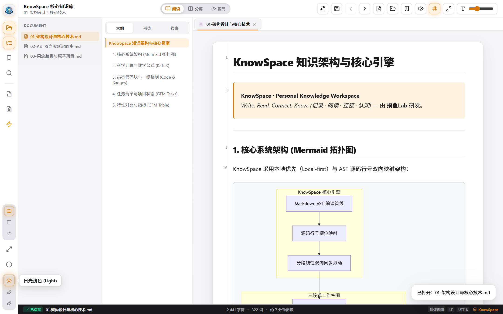

#### 【案例 3.1】白天明亮办公环境下编写产品规范与高亮批注
- **操作方式**：点击活动栏底部的 ☀️「日光浅色」图标。
- **实战效果**：在阳光充足的窗边工位，界面背景温润柔和，橙黄色的引用强调块和高亮文本极易聚焦，长时间打字审阅不产生视觉眩晕。

### 3.2 📖 仿电子墨水屏主题 (E-ink Paper)
模拟实体电子纸的温润质感，采用高对比度纯净黑白灰排版（`#f4f1ea` 纸白背景与 `#1a1a1a` 沉墨字色）、精致衬线字体、专属印刷风代码高亮以及 Mermaid 纯净灰度墨水矢量渲染。

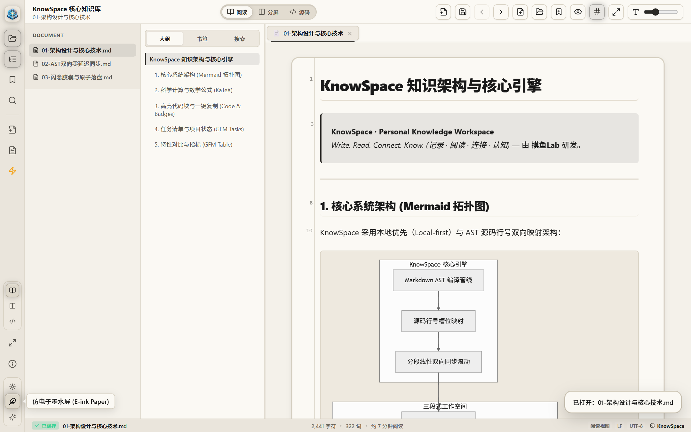

#### 【案例 3.2】长篇技术著作与学术文献的低疲劳护眼深度阅读
- **操作方式**：点击活动栏底部的 📖「仿电子墨水屏」图标。
- **实战效果**：正文文字与标题自动切换为宋体/西文衬线字体，所有图表与代码块去除了高饱和度色彩，化为细腻的灰度印刷网点质感。在连续 3 小时精读 5 万字系统架构白皮书后，眼部疲劳感大幅降低。

### 3.3 ✨ 极客暗黑主题 (Geek Dark)
采用 Lights Out 纯黑底色（`#000000`）、电光蓝高亮（`#1D9BF0`）与发丝级科技微边框（`#2F3336`）。在 OLED/Mini-LED 屏幕上拥有纯净深邃的黑位对比度。

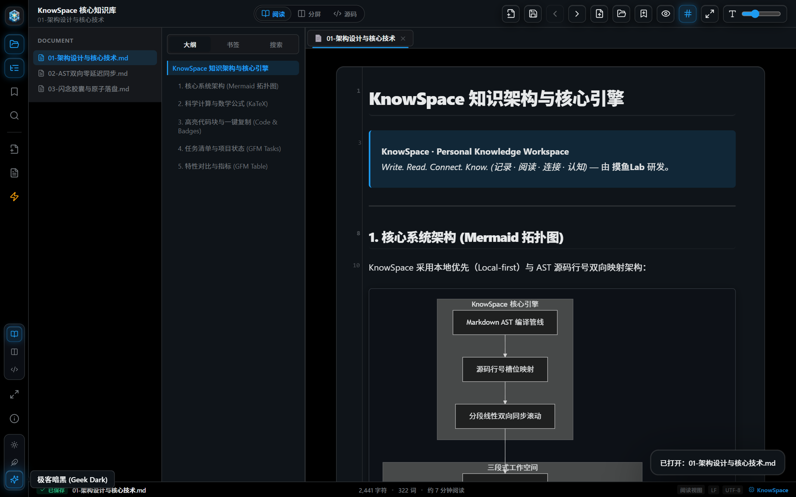

#### 【案例 3.3】夜间低光照环境专注编码与架构设计
- **操作方式**：点击活动栏底部的 ✨「极客暗黑」图标。
- **实战效果**：背景纯黑不发光，电光蓝色彩精准点亮代码关键字和高频操作元素，配合暗光环境营造极强的无打扰心流沉浸感。

---

## 四、 三段式工作区视图与极客编辑

顶部工具栏中心提供直观的胶囊三段式视图切换按钮：

### 4.1 🪟 左右分屏协同模式 (Split Mode)
左侧为基于 CodeMirror 6 的现代代码编辑器，右侧为毫秒级防抖渲染预览。

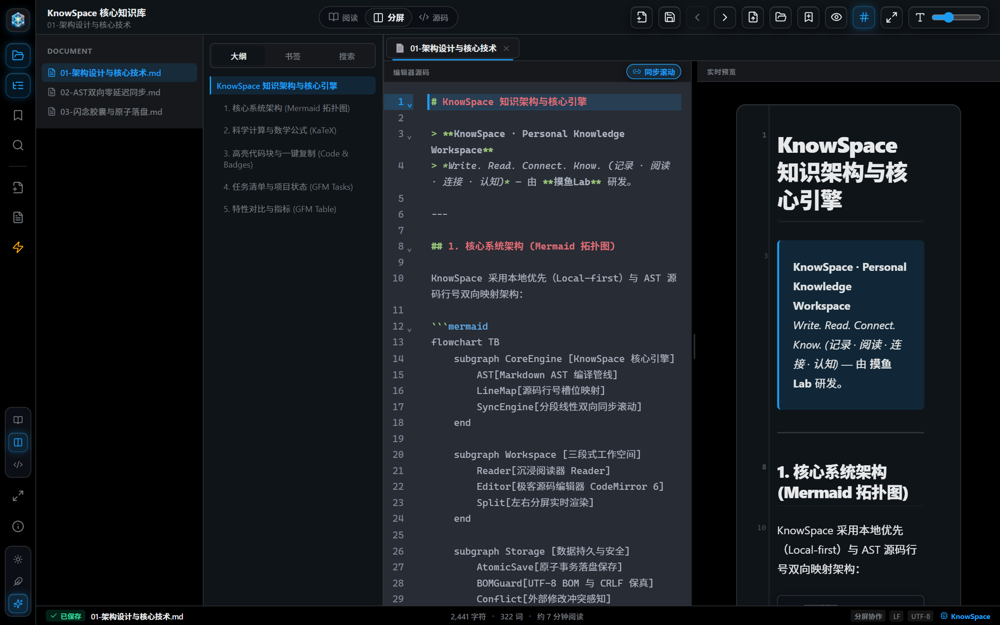

- **AST 行号双向高精度同步滚动**：基于 AST 块级源码行号标记（`data-source-line`）与分段线性插值算法，富文本与源码高度差异无论多大，滚动均严丝合缝、彻底告别偏移。
- **选区联动微光**：在预览区点击任意文段，自动聚焦对应源码行号。
- **分割线自由拖拽**：鼠标拖拽中部分割线自由调整编辑与预览比例（15% ~ 85%），在窄屏下自适应垂直分屏。

#### 【案例 4.1】基于 AST 块级映射分段线性双向同步滚动编写长篇教程
- **场景描述**：编写包含 10 个数学公式块、8 个架构图、大量文字和代码的超长 Markdown。
- **实操过程**：
  1. 选中分屏模式，滚动左侧源码；右侧预览区不论公式和图表占据多大垂直像素空间，均自动分段线性锚定。
  2. 当源码滚动至第 240 行的代码块时，右侧预览区该代码块精准出现在视窗同等比例位置，完全消除传统百分比滚动的“上下乱窜”漂移问题。
  3. 在预览区点击一段结论文字，左侧编辑器光标瞬间跳至该行，并激发柔和光晕反馈。

### 4.2 💻 纯源码极客模式 (Source Mode)
全屏呈现 CodeMirror 6 极客编辑器，适合专注编写大段内容或修改代码。

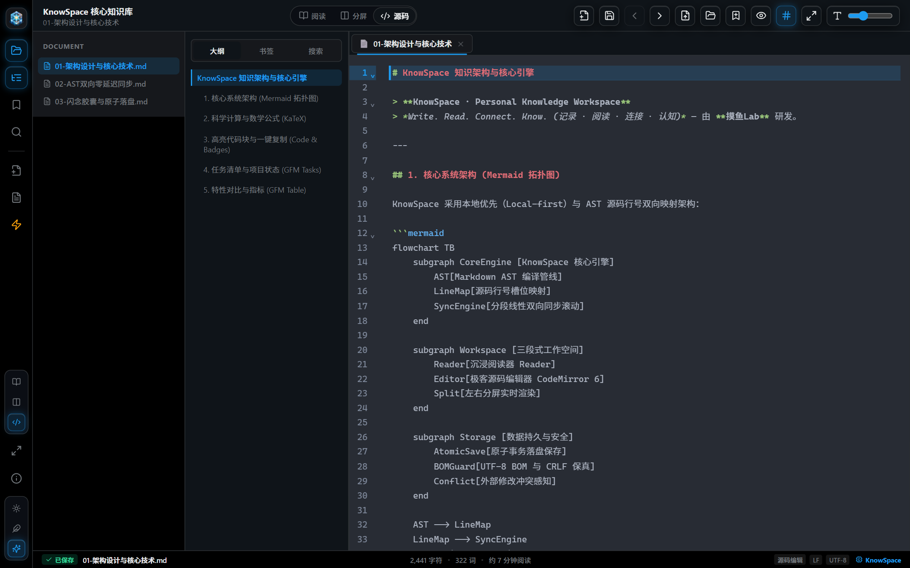

#### 【案例 4.2】批量重构 Front Matter 元数据与代码块精准折叠
- **场景描述**：对已有的知识库文章头部 YAML Front Matter 进行批量字段增补，或者快速折叠长达 200 行的 JSON 配置代码。
- **实操过程**：
  1. 点击顶部「源码」模式胶囊，全屏呈现 CodeMirror 6 现代代码环境。
  2. 利用编辑器左侧行号旁的折叠箭头（`▾`）瞬间折叠大段代码块或长列表。
  3. 享受毫秒级快速输入反馈，打字时光标绝对稳定，完全避免频繁重渲染引起的丢帧。

### 4.3 📖 纯净排版阅读模式 (Read Mode)
纯净无干扰的书籍沉浸式排版阅读界面，正文采用 960px 黄金阅读视宽。正文预览区左侧呈现等宽 AST 行号槽位，顶部工具栏提供 `#` 按钮一键显隐。

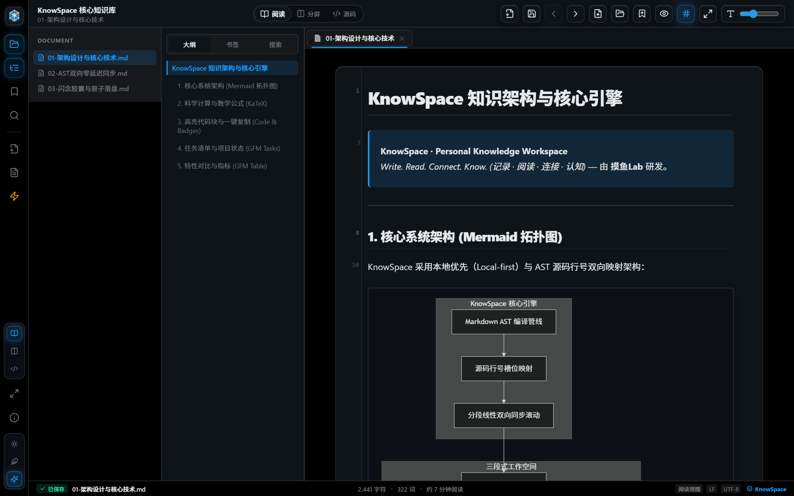

#### 【案例 4.3】利用正文等宽 AST 行号槽位进行同行文档代码审查
- **场景描述**：研发团队组织线下技术方案评审会，需要投影文档并指明具体段落与代码位置。
- **实操过程**：
  1. 切换至「阅读」模式，保证大屏幕展示版面极其美观且无代码编辑器的杂乱光标。
  2. 点击顶部工具栏的 `#` 按钮，开启正文 AST 行号槽位。
  3. 每个段落、公式块、图表、代码块左侧均清晰标明其实际源码行号（如 `L18`、`L42`）。评审人直接说“请看第 42 行架构图说明”，全场人员秒级对齐。

---

## 五、 多标签页协同与双文档分屏对比

顶部流线型标签页栏支持跨多个章节与独立文档并行查阅与修改。

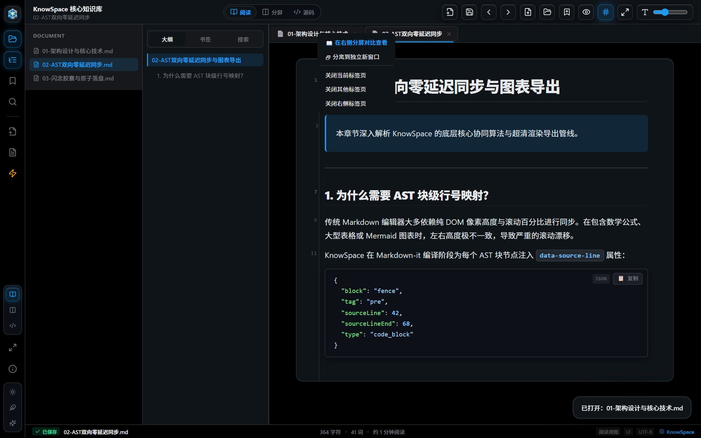

### 5.1 多标签页并行管理与窗口脱离
- **呼吸灯提示**：文件处于修改未保存状态时，标签右侧自动闪烁橙黄色呼吸微灯（`isDirty`）。
- **极速关闭**：鼠标滚轮中键直接单击标签，或按 `Ctrl+W` 极速关闭。
- **右键菜单**：
  - 📖 **在右侧分屏对比查看**：开启双文档对照模式。
  - 🗗 **分离到独立新窗口**：脱离为主窗口之外的独立 Electron 窗口。
  - **关闭其他标签页 / 关闭右侧标签页**。

#### 【案例 5.1】跨章节协同编辑、鼠标中键秒关与独立新窗口多屏办公
- **实操流程**：
  1. 同时打开开发指南的 5 个章节。
  2. 右键点击 `03-网络协议.md` 标签，选择 **「🗗 分离到独立新窗口」**。
  3. 该文档瞬间脱离为主窗口之外的独立窗口，可拖拽至副显示器上常驻参考，且两边拥有完全独立的滚动位置与落盘能力。
  4. 查阅完毕的辅助参考标签，用鼠标滚轮中键直接轻轻点击标签标题即可秒速关闭。

### 5.2 🗗 双文档左右分屏对比查看模式 (Dual Document Split View)

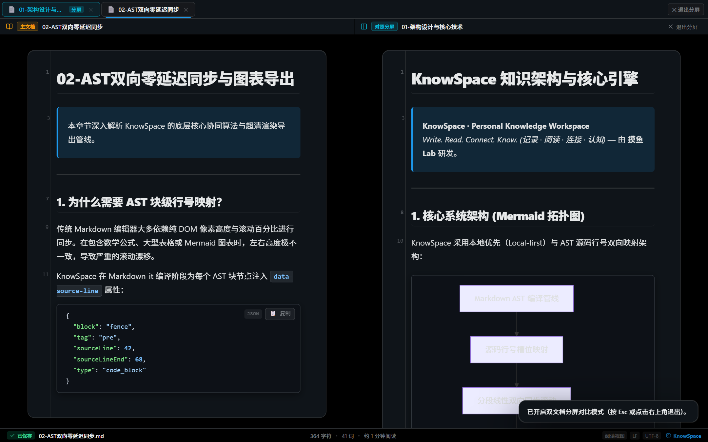

#### 【案例 5.2】API 接口文档新旧版本逐行对照校对与无级拖拽分栏
- **场景描述**：升级系统时需要核对 `UserAPI-v1.md` 与 `UserAPI-v2.md` 的参数增减与向下兼容性。
- **实操步骤**：
  1. 在标签栏处于打开状态的 `UserAPI-v2.md` 标签上右键点击。
  2. 选择 **「📖 在右侧分屏对比查看」**。
  3. 软件瞬间进入沉浸全宽对比状态，左侧标明 `主文档`，右侧标明 `对照分屏`。
  4. 鼠标拖住中央分栏手柄，随意微调左右比例（如 40%:60%）。
  5. 左右两栏均具备独立的滚动控制器与渲染能力，轻松逐行校对核心参数。
  6. 校对结束，按下键盘 `Esc` 键或点击右上角 **「✕ 退出分屏」**，一秒还原单工作台。

---

## 六、 科学计算、动态图表与富文本增强排版

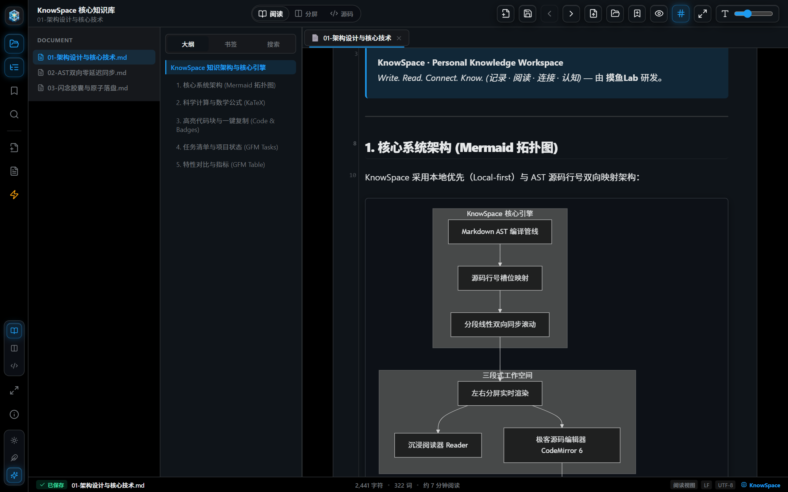

### 6.1 LaTeX / KaTeX 高性能数学公式排版
- **行内公式**：使用单个 `$` 包裹，例如 `$E = mc^2$`。
- **独立居中公式块**：使用双 `$$` 包裹：
  ```markdown
  $$ \hat{f}(\xi) = \int_{-\infty}^{\infty} f(x) e^{-2\pi i x \xi} dx $$
  ```

#### 【案例 6.1】撰写微积分推导、傅里叶变换与量子力学方程
- **代码输入**：
  ```markdown
  ### 量子薛定谔方程
  $$ i\hbar \frac{\partial}{\partial t}\Psi(\mathbf{r},t) = \left[ -\frac{\hbar^2}{2m}\nabla^2 + V(\mathbf{r},t)\right] \Psi(\mathbf{r},t) $$
  ```
- **效果呈现**：无需等待或加载外网 CDN，本地 KaTeX 引擎瞬间以高解析度矢量字形排版输出，放大缩小绝不模糊。

### 6.2 Mermaid 动态多类型图表渲染
原生内置 Mermaid 渲染引擎，支持流程图、时序图、类图、甘特图等：

````markdown
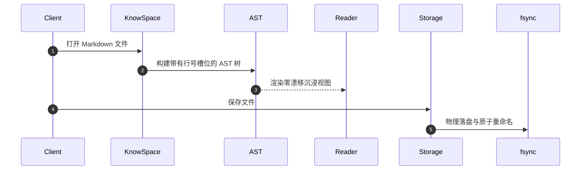
```mermaid
sequenceDiagram
    autonumber
    Client->>KnowSpace: 打开 Markdown 文件
    KnowSpace->>AST: 构建带有行号槽位的 AST 树
    AST-->>Reader: 渲染零漂移沉浸视图
    Client->>Storage: 保存文件
    Storage->>fsync: 物理落盘与原子重命名
```
````

#### 【案例 6.2】绘制分布式系统服务拓扑图与微服务调用时序图
- **效果呈现**：代码块直接转化为交互式拓扑图表，且自动与当前所选主题（日光浅色/电子墨水屏/极客暗黑）配色深度融合。

### 6.3 语法高亮代码块与一键无损复制
代码块右上角自动呈现大写语言识别胶囊（如 `TYPESCRIPT`、`PYTHON`），右侧配有复制按钮。


#### 【案例 6.3】查看语法胶囊、一键复制并接收绿色反馈
- **实操效果**：点击代码块右上角的 **「📋 复制」** 按钮，代码无损写入系统剪切板，按钮随即变为绿色的 **「✓ 已复制」** 并维持 2 秒，给予明确的物理触觉式视觉反馈。

### 6.4 GFM 任务清单与高对比度表格交互
#### 【案例 6.4】构建项目敏捷冲刺任务看板与性能指标对比表
- **输入示例**：
  ```markdown
  - [x] 完成 React 19 升级
  - [ ] 性能优化测试
  
  | 特性 | 传统编辑器 | KnowSpace 工作台 |
  | :--- | :--- | :--- |
  | **落盘机制** | 简单写覆易损坏 | 原子事务 + fsync 刷盘 |
  ```
- **交互体验**：复选框原生可点，表格自适应视宽并带有斑马条纹与高对比度边框。

---

## 七、 知识网络双向链接与全景拓扑图谱

### 7.1 双向链接 `[[WikiLink]]` 与已链引用
通过 `[[文档标题]]` 或 `[[文档标题|显示别名]]` 即可建立文档间的强关联。

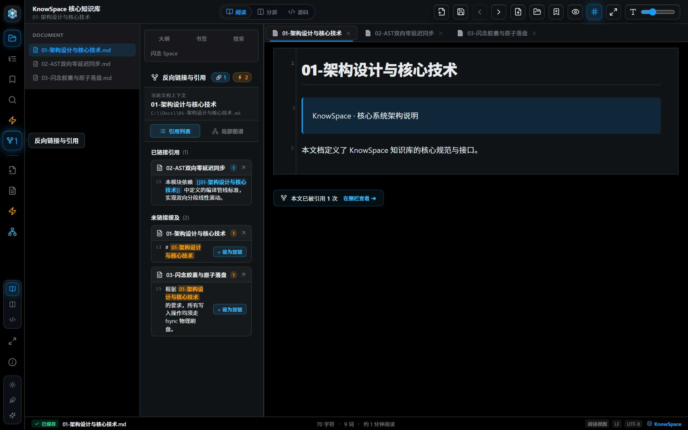

#### 【案例 7.1】利用反向链接面板自动聚合各章节上下文并精准溯源
- **场景描述**：在阅读《01-架构设计与核心技术》时，想知道知识库中哪些其他文章引用了本篇。
- **实操过程**：
  1. 点击活动栏的 🔀「反向链接与引用」图标。
  2. 侧栏自动展示已链引用卡片，清楚标明引用来源《02-AST双向零延迟同步》的第 5 行以及上下文文本。
  3. 点击卡片上的跳转图标，工作台瞬间平滑切换至引用源文件并高亮所在段落。

### 7.2 未链接提及智能扫描与一键升级双链
系统后台自动扫描全库文本，发现文章内容中出现过当前文档标题、但尚未添加 `[[...]]` 的“潜在关联”。

#### 【案例 7.2】一键将散落文本转化为正式双链节点
- **实操过程**：
  1. 在反向链接面板下方的「未链接提及」分类中，看到《03-闪念胶囊与原子落盘》在正文中提到了当前文档名称。
  2. 直接点击该卡片右侧的 **「+ 设为双链」** 按钮。
  3. KnowSpace 自动在底层对该文件的原文本完成替换包裹，未链接提及瞬间跃升为已链接引用，构建知识网络不费吹灰之力。

### 7.3 Cytoscape 交互式全景力导向图谱
点击活动栏的 🕸️「知识网络全景图谱」按钮，展开全屏拓扑图：

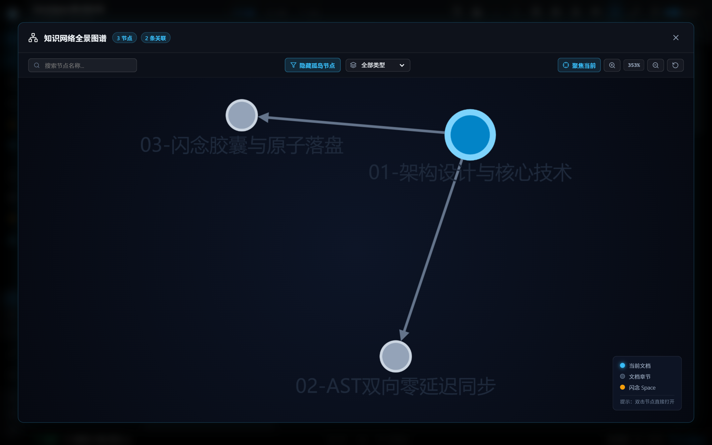

#### 【案例 7.3】探索知识网络聚类、过滤孤岛节点并双击穿梭跳转
- **实操过程**：
  1. 呼出全景图谱，数以百计的文档节点通过力导向算法自然聚类，关联紧密的知识簇群一目了然。
  2. 勾选顶部的 **「隐藏孤岛节点」**，瞬间过滤无连接的孤立零散笔记，聚焦知识主干。
  3. 在图谱中**双击任意感兴趣的节点**，图谱弹窗优雅隐退，主工作区秒级切换打开该文档。

---

## 八、 闪念胶囊 (Flash Notes) 与时间线/待办看板

### 8.1 全局热键随叫随到的灵感速记浮窗
在任何软件界面下按下全局快捷键（默认 `Alt + Space`），磨砂速记微窗跃然屏上：

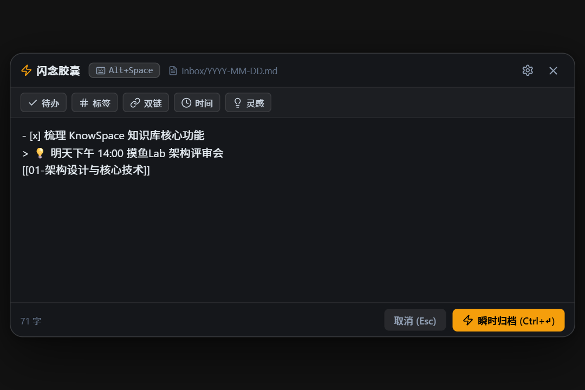

#### 【案例 8.1】在浏览器查资料时用 `Alt+Space` 秒级捕捉灵感并原子落盘
- **实操过程**：
  1. 在看论文或代码时触发灵感，无需打开或切换 KnowSpace 主窗，直接敲击 `Alt + Space`。
  2. 悬浮窗以毛玻璃效果居中弹出，光标已自动聚焦于文本框。
  3. 点击工具栏快捷按钮插入 `- [ ] ` 待办标记或 `> 💡 ` 灵感标识。
  4. 按下 `Ctrl + Enter`，浮窗隐退，内容毫秒级原子归档写入当前知识库的 `Inbox/YYYY-MM-DD.md`。

### 8.2 闪念高级设置与后台常驻守护
点击闪念胶囊右上角的 ⚙️ 齿轮按钮，进入设置抽屉：

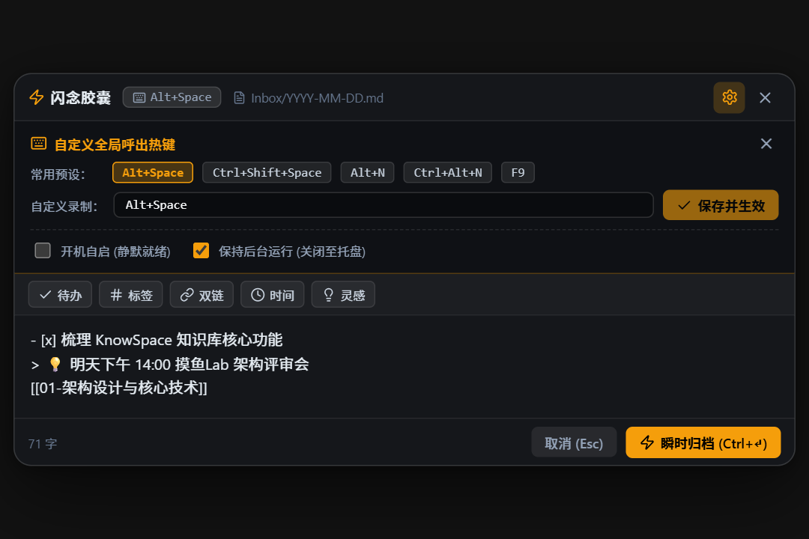

#### 【案例 8.2】自定义全局热键、开机静默自启与关闭至系统托盘
- **实操过程**：
  1. 点击录制热键输入框，按下自定义组合键（如 `Ctrl+Shift+Space` 或 `F9`），热键即时生效。
  2. 勾选 **「开机自启（静默就绪）」**，计算机开机自动在后台以 `--hidden` 模式静默就绪。
  3. 勾选 **「保持后台运行（关闭至托盘）」**，点击主窗口关闭按钮时最小化至 Windows 系统托盘，保障全局灵感随时呼之即来。

### 8.3 闪念时间线瀑布流与跨文件待办看板
点击活动栏的 ⚡ 图标呼出时间线面板：

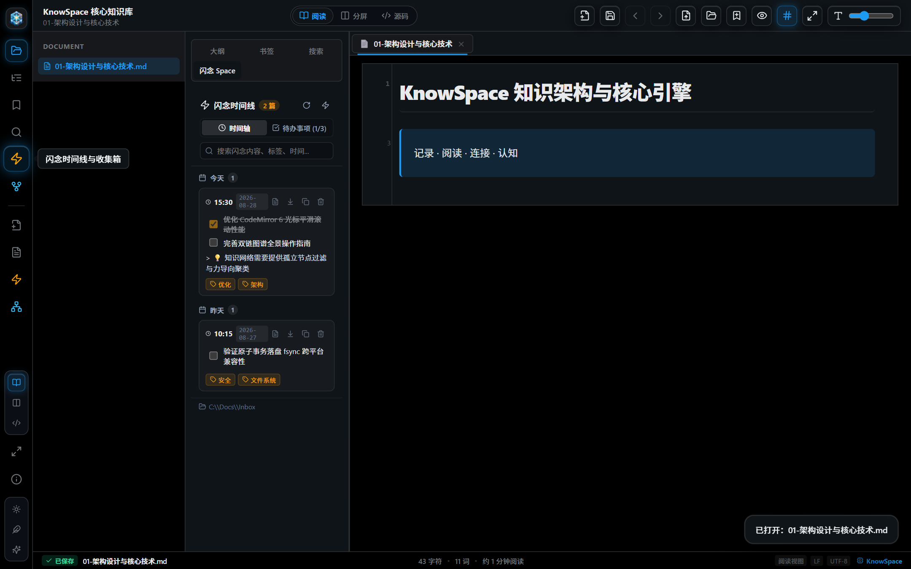

#### 【案例 8.3】在时间线面板原地勾选待办完成并一键合并入主文档
- **实操过程**：
  1. 切换至「待办事项」标签，跨所有日期收集箱的待办事项被一站式提炼汇总。
  2. 完成任务后直接在侧栏列表点击复选框，底层源 Markdown 文件中的 `- [ ]` 瞬间原地更新为 `- [x]`。
  3. 点击卡片上的 📥「合并入当前文档」图标，速记内容秒级附录追加到正在撰写的正式文档末尾。

---

## 九、 全功能知识导航与段落即时检索体系

### 9.1 实时文档大纲目录 (TOC Outline)
自动抽取文档 H1 ~ H6 标题形成层级导航：

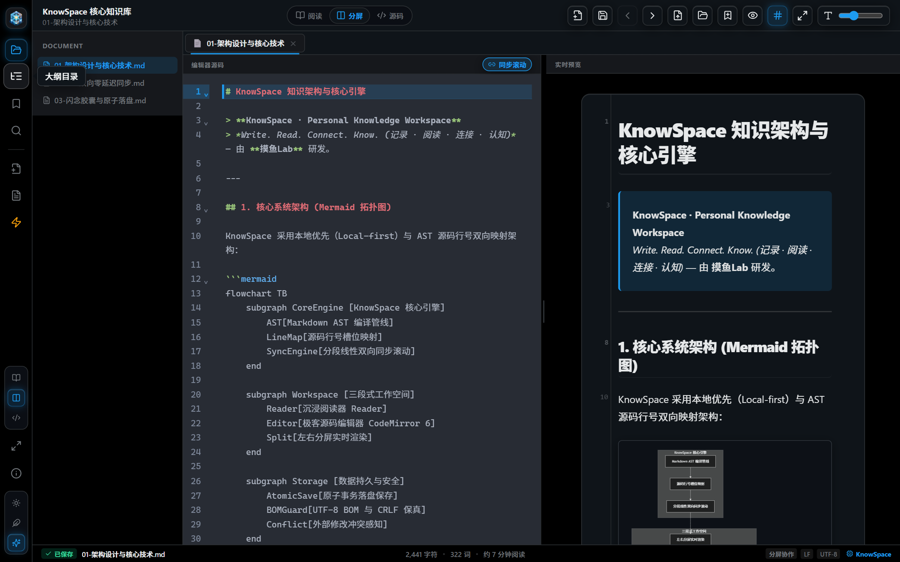

#### 【案例 9.1】阅读长篇技术方案时的大纲视口动态追踪与平滑锚定
- **实操效果**：随着正文滚轮滑动，侧栏 TOC 大纲对应条目同步亮起高亮标记；点击任意大纲项，正文伴随顺滑的平滑滚动动画精准到达目标小节。

### 9.2 全文即时段落卡片聚合检索
按下 `Ctrl + F` 呼出搜索侧栏：

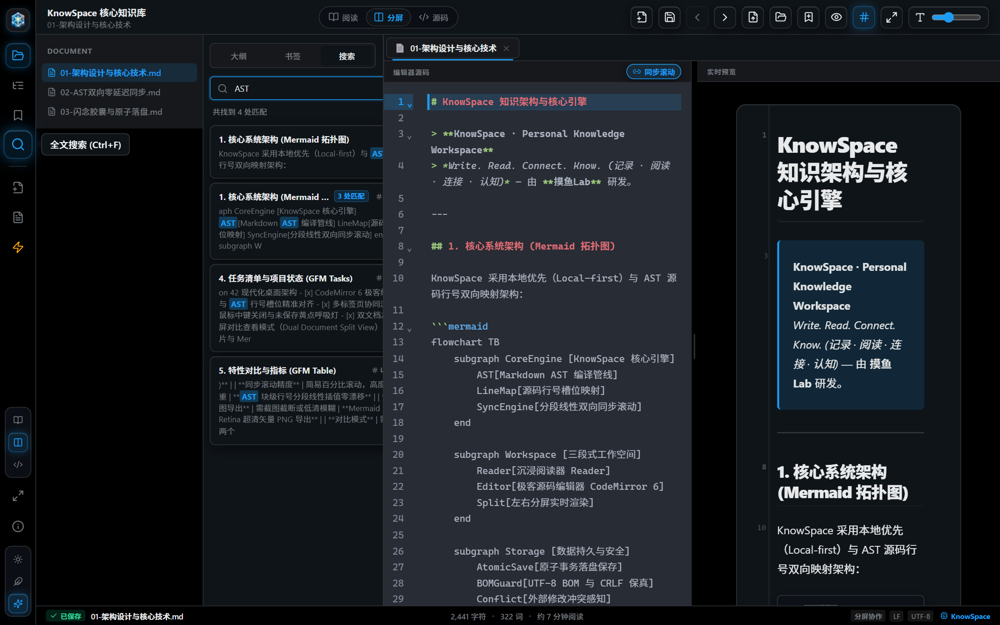

#### 【案例 9.2】跨段落模糊搜索与 1.8 秒电光蓝微光脉冲精准聚焦
- **实操过程**：
  1. 输入关键词 `AST`，侧栏即时聚合展示命中卡片，并标明每个命中所在的行号徽标（如 `L10`、`3 处匹配`）。
  2. 点击其中一张卡片，正文滚动至该处，段落被柔和明亮的电光蓝微光脉冲（`searchPulse`）笼罩 1.8 秒，瞬间锁定视线，无需在密密麻麻的文字中寻找光标。

### 9.3 精选书签与阅读进度记录
点击书签图标或按 `Ctrl + B` 打上进度书签：

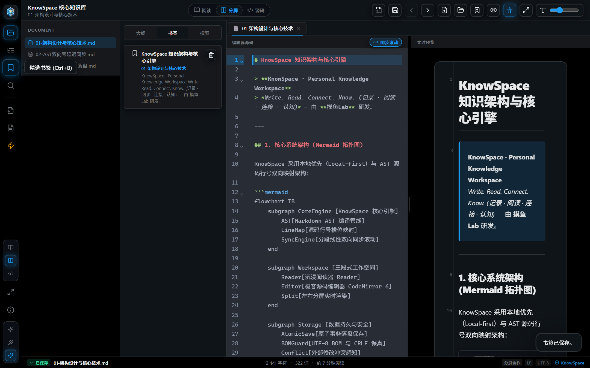

#### 【案例 9.3】`Ctrl+B` 记录关键技术论证章节并在多文件间随心复位
- **实操过程**：在长达百页的技术标准中看到关键定义，按下 `Ctrl + B`。书签面板自动保存所属文件名、小节标题以及阅读百分比（如 `45%`）。无论何时点击书签，视口精准无偏差复位。

### 9.4 多级无限递归文档目录树
#### 【案例 9.4】大型知识库的目录层级折叠、记忆恢复与章节重命名重构
- **实操过程**：支持任意深度的文件夹层级展开/收起，目录顶端支持一键「全部折叠」。在目录项上右键可重命名文件，系统会自动联动重构相关双链引用，保证知识网不出现断链死链。

---

## 十、 媒体与架构图无损灯箱 (Media Lightbox)

点击正文图片或复杂 Mermaid 架构图，即可展开高画质毛玻璃全屏灯箱：

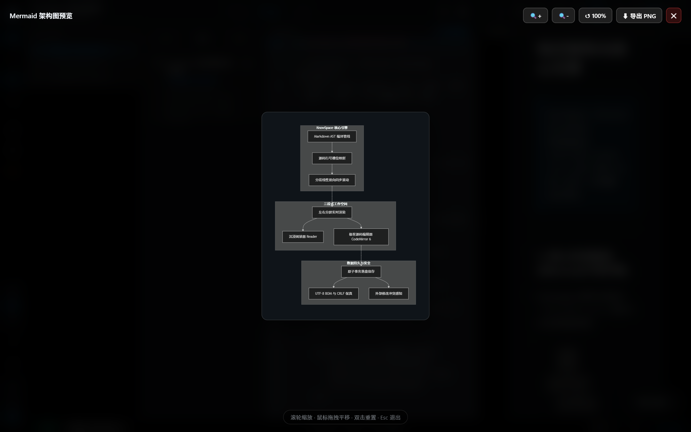

### 10.1 0.2× ~ 6× 自由缩放漫游灯箱
#### 【案例 10.1】全屏毛玻璃下平移审阅超大型复杂微服务架构图细节
- **实操过程**：
  1. 正文中的复杂时序图过于密集，点击图表唤起毛玻璃灯箱。
  2. 向上滚动鼠标滚轮放大至 400%，鼠标按住左键任意拖动画布漫游。
  3. 双击空白处或点击 `↺ 100%` 按钮一键复位，按键盘 `Esc` 退出。

### 10.2 Mermaid 架构图 3× Retina 超清 PNG 导出
#### 【案例 10.2】一键无损导出 300+ DPI 矢量级透明透明底图用于演讲幻灯片
- **实操过程**：
  1. 在灯箱右上角点击 **「⬇ 导出 PNG」** 按钮。
  2. 系统调用原生底层管线，依据 `getBBox()` 动态计算矢量边界、内联当前主题样式及高解析度字体，以 3 倍视网膜精度光栅化导出无锯齿、无黑边的超清 PNG 图片，直接保存至本地。

---

## 十一、 沉浸心流与排版写作辅助

### 11.1 🧘 专注极简模式 (Zen Mode / `F10`)
按下 `F10` 键，界面自动隐去所有侧边栏与工具栏，正文自适应居中在 960px 黄金视宽：

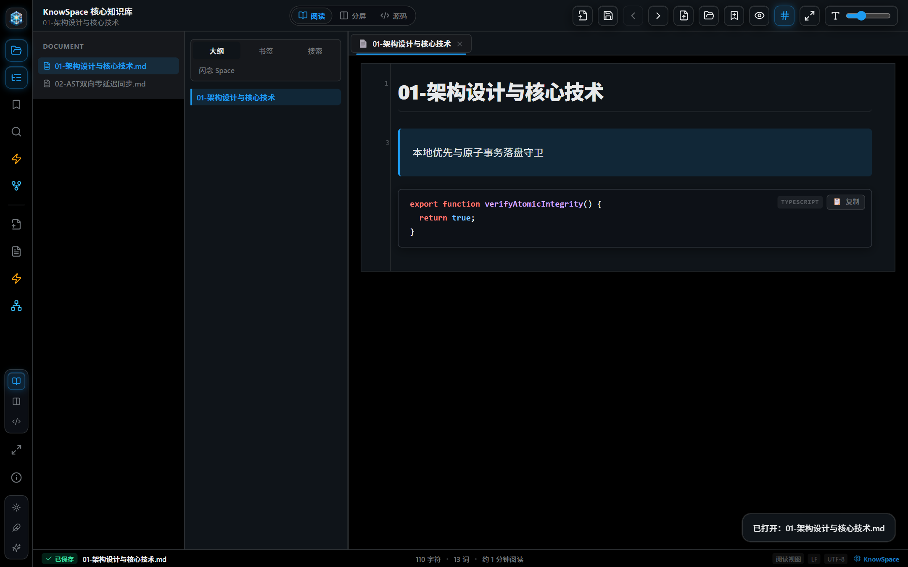

#### 【案例 11.1】进入 960px 黄金视宽全屏屏蔽一切杂质的高效闭关创作
- **实操体验**：屏幕四周所有干扰性控件退隐，只留下一片纯粹的文字输入空间，正文两边留白呼吸感十足，助力瞬间进入深度心流写作状态。再次敲击 `F10` 瞬间恢复全功能工作台。

### 11.2 ✍️ 打字机居中滚动模式 (Typewriter Mode / `Alt+T`)
#### 【案例 11.2】保持视线水平不低头的颈椎友好型马拉松输入体验
- **实操体验**：点击顶部工具栏 👁️ 眼睛图标或按 `Alt + T`，光标所在行自动被锁定在屏幕垂直视口中央（45% ~ 50% 视线黄金区域）。随着敲击键盘，页面自动平滑上卷，视线永远保持水平直视，彻底告别低头看屏幕下沿导致的肩颈酸痛。

### 11.3 🔤 正文行号与字号自由滑块调节
#### 【案例 11.3】针对 4K 高分屏的舒适阅读缩放微调
- **实操体验**：拖动顶部工具栏右侧的字体滑块（0.85× ~ 1.35×），整个正文排版比例平滑线性缩放，图文比例与行间距自适应微调，在各种高分屏与视距下均能找到最舒适的视觉平衡点。

---

## 十二、 工业级数据安全基石与防丢稿守卫

```
用户保存 (Ctrl+S) ──► 写入同目录临时文件 (.tmp) ──► 物理 fsync 刷盘 ──► 原子重命名替换 (Atomic Rename)
```

### 12.1 物理事务原子落盘与断电安全
#### 【案例 12.1】异常掉电与进程崩溃下的零截断损坏保障
- **底层机制**：KnowSpace 绝不在原文件上直接写覆数据，而是先写入同目录隐藏临时文件，调用 OS 级 `fsync` 确保数据真正沉入磁盘物理扇区后，再执行原子重命名覆盖。即便在写入瞬间电脑断电关机，原有文件依然完好无损，绝不留下 0 字节损坏空文件。

### 12.2 UTF-8 BOM 与 CRLF/LF 换行格式保真
#### 【案例 12.2】跨 Windows 与 Linux 团队协作下的 Git 纯净提交
- **底层机制**：打开带 Windows CRLF 或 UTF-8 BOM 的老旧工程文件时，KnowSpace 自动侦测并忠实继承其文件格式。保存时严格保真，绝不在 Git Diff 中产生几千行无意义的换行符全局变动。

### 12.3 外部编辑器并发修改冲突检测与协商
保存前主动比对磁盘物理指纹 `{ size, mtimeMs }`：


#### 【案例 12.3】VSCode 与 KnowSpace 并发修改同一文档时的安全协商
- **实战流程**：
  1. 在 KnowSpace 编辑的同时，外部 Git 执行了 `git pull` 更新了磁盘上的该文件。
  2. 在 KnowSpace 中按下 `Ctrl+S` 时，系统感知到物理指纹不一致，立即拦截并弹出「检测到文件冲突」对话框。
  3. 提供三种清晰选择：**重新载入磁盘内容**（丢弃本地改动）、**强制覆盖磁盘文件**（以本地为主）、**另存为新文件**（两者兼顾）。用户选择另存为，双方修改安全保全。

### 12.4 全链路未保存守卫拦截


#### 【案例 12.4】误触切章节或关窗时弹出拦截弹窗挽救心血成果
- **实操体验**：只要文档处于 `isDirty` 未保存状态，无论是误触关闭标签、切换目录树章节，还是点击右上角叉号退出，系统都会主动弹出防丢稿弹窗，提供「保存文件 / 放弃更改 / 取消」，彻底消除误操作丢稿遗憾。

---

## 十三、 键盘全快捷键高效实战速查表

| 分类 | 快捷键 | 功能名称 | 场景与说明 |
| :--- | :--- | :--- | :--- |
| **文件与工程** | `Ctrl + N` | **新建文档** | 弹出新建对话框快速创建 Markdown 文件 |
| | `Ctrl + S` | **保存文件** | 执行底层原子落盘物理刷盘 |
| | `Ctrl + Shift + S` | **另存为** | 将当前内容另存至新路径 |
| | `Ctrl + O` | **打开单文件** | 浏览本地任意单个 `.md` 文件 |
| | `Ctrl + Shift + O` | **打开工程目录** | 载入技术文库构建多级目录树 |
| **标签与导航** | `Ctrl + W` | **关闭标签页** | 关闭当前激活标签（支持鼠标中键单击关闭） |
| | `Ctrl + Tab` | **下一标签页** | 循环向后切换打开的标签 |
| | `Ctrl + Shift + Tab` | **上一标签页** | 循环向前切换打开的标签 |
| | `Ctrl + \` | **折叠/展开目录** | 切换左侧文件目录树显隐 |
| | `Alt + ←` / `Alt + →` | **上一篇 / 下一篇** | 顺序切换章节列表（带未保存拦截防护） |
| **检索与双链** | `Ctrl + F` | **全文搜索** | 呼出搜索侧栏并聚焦输入框 |
| | `Ctrl + B` | **添加书签** | 记录当前小节与阅读百分比进度 |
| **速记与沉浸** | `Alt + Space` | **呼出闪念胶囊** | 全局热键唤起灵感速记悬浮微窗（支持自定义） |
| | `F10` | **专注模式 (Zen)** | 一键隐藏侧栏工具栏，正文 960px 黄金视宽居中 |
| | `Alt + T` | **打字机滚动** | 开启/关闭光标视口垂直居中锁定 |
| | `F11` | **全屏模式** | 切换全屏沉浸阅读（按 `Esc` 退出） |
| | `Esc` | **退出/取消** | 退出全屏灯箱、退出分屏对比或关闭弹窗 |

---

## 十四、 安装部署与便携绿色版运行

### 1. Windows MSI 标准安装包 (`KnowSpace-1.5.0.msi`)
- **适用场景**：个人常用工作电脑、企业团队桌面统一交付。
- **产品特性**：
  - 自动在开始菜单与桌面创建官方品牌图标。
  - 自动注册 `.md` 文件关联，双击本地 Markdown 秒开。
  - 支持 Windows 标准控制面板一键安全卸载与无缝版本迭代。

### 2. Windows 免安装绿色便携版 (`KnowSpace-win-x64-portable.zip`)
- **适用场景**：移动 U 盘办公、涉密无管理员权限设备、临时开发工作站。
- **产品特性**：
  - 解压即用，双击 `KnowSpace.exe` 直接运行。
  - 零外部运行时依赖（无需配置 Node.js、Electron 或 Python 环境）。
  - 用户个性化设置与笔记数据跟随本地文件夹，即插即用，拔盘即走。

---

## ℹ️ 关于软件与技术支持

点击左侧活动栏底部的 ℹ️ 按钮可查看应用系统指标：

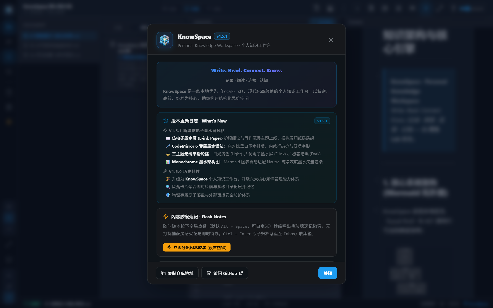

- **核心技术栈**：React 19 + TypeScript + Electron 42 + CodeMirror 6 + Markdown-it + KaTeX + Mermaid + Cytoscape
- **研发团队**：摸鱼Lab (Moyu Lab)
- **开源协议**：MIT License © 2026

*愿 KnowSpace 成为您探索知识、记录思考、建立连接的得力伙伴！*
