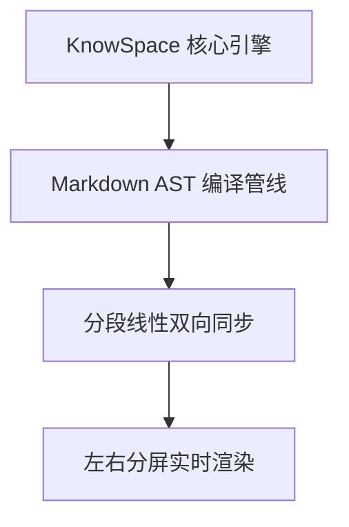

# KnowSpace 操作手册与实战指南 (User Manual & Practical Guide)

<p align="center">
  
</p>

<p align="center">
  <strong>KnowSpace · Personal Knowledge Workspace | 现代化个人知识工作台</strong><br />
  <em>Write. Read. Connect. Know. (记录 · 阅读 · 连接 · 认知)</em>
</p>

<p align="center">
  
  
  
  
</p>

---

## 📑 全局目录导引

- [一、 产品概述与架构定位](#一-产品概述与架构定位)
- [二、 工作台全貌与界面布局](#二-工作台全貌与界面布局)
  - [【案例 1】新入职工程师快速载入工程文档与定制三栏工作区](#案例-1新入职工程师快速载入工程文档与定制三栏工作区)
- [三、 三款全天候专属设计主题](#三-三款全天候专属设计主题)
  - [【案例 2】全天候写作心流切换：从白昼清爽到深夜极客](#案例-2全天候写作心流切换从白昼清爽到深夜极客)
- [四、 三段式工作区视图与极客编辑](#四-三段式工作区视图与极客编辑)
  - [【案例 3】基于 AST 零漂移同步滚动编写技术长文](#案例-3基于-ast-零漂移同步滚动编写技术长文)
- [五、 多标签页协同与左右分屏对比模式](#五-多标签页协同与左右分屏对比模式)
  - [【案例 4】接口文档 v1 与 v2 版本双文档分屏对照校对](#案例-4接口文档-v1-与-v2-版本双文档分屏对照校对)
- [六、 科学计算、图表与富文本增强排版](#六-科学计算图表与富文本增强排版)
  - [【案例 5】撰写包含微积分公式、系统架构拓扑与代码的代码备忘录](#案例-5撰写包含微积分公式系统架构拓扑与代码的代码备忘录)
- [七、 知识网络双向链接与全景拓扑图谱](#七-知识网络双向链接与全景拓扑图谱)
  - [【案例 6】从孤立零散笔记构建互相连通的「超立方」知识网络](#案例-6从孤立零散笔记构建互相连通的超立方知识网络)
- [八、 闪念胶囊 (Flash Notes) 与时间线/待办看板](#八-闪念胶囊-flash-notes-与时间线待办看板)
  - [【案例 7】浏览器查资料时的秒级热键灵感速记与正文一键归档](#案例-7浏览器查资料时的秒级热键灵感速记与正文一键归档)
- [九、 全功能知识导航与段落即时检索体系](#九-全功能知识导航与段落即时检索体系)
  - [【案例 8】在大型技术书籍中通过段落卡片与微光精确定位](#案例-8在大型技术书籍中通过段落卡片与微光精确定位)
- [十、 媒体与架构图无损灯箱 (Media Lightbox)](#十-媒体与架构图无损灯箱-media-lightbox)
  - [【案例 9】复杂分布式拓扑图的 6× 缩放审阅与 3× Retina PNG 超清导出](#案例-9复杂分布式拓扑图的-6-缩放审阅与-3-retina-png-超清导出)
- [十一、 沉浸心流与排版写作辅助](#十一-沉浸心流与排版写作辅助)
  - [【案例 10】开启 960px 黄金视宽专注模式与打字机居中滚动](#案例-10开启-960px-黄金视宽专注模式与打字机居中滚动)
- [十二、 工业级数据安全基石与防丢稿守卫](#十二-工业级数据安全基石与防丢稿守卫)
  - [【案例 11】外部编辑器并发修改冲突协商与原子防丢实战](#案例-11外部编辑器并发修改冲突协商与原子防丢实战)
- [十三、 键盘全快捷键高效实战速查表](#十三-键盘全快捷键高效实战速查表)
- [十四、 安装部署与便携绿色版运行](#十四-安装部署与便携绿色版运行)

---

## 一、 产品概述与架构定位

**KnowSpace** 是一个本地优先、高颜值的现代化个人知识工作台（Personal Knowledge Workspace）。由 **摸鱼Lab** 研发，秉承 **“Write. Read. Connect. Know.（记录 · 阅读 · 连接 · 认知）”** 的产品理念，以「超立方空间」HyperSpace Cube 为设计核心，旨在为你打造一个收纳所有想法、文档、图表与知识的私密安全空间。

```
┌─────────────────────────────────────────────────────────────┐
│                    KnowSpace 核心能力矩阵                   │
├──────────────┬──────────────┬──────────────┬────────────────┤
│  沉浸阅读器  │  极客编辑器  │  双链知识网  │  工业数据安全  │
│ Markdown AST │ CodeMirror 6 │ [[WikiLink]] │  fsync 原子写  │
│ KaTeX/Mermaid│ 双向零延迟   │ Cytoscape图谱│  BOM/CRLF保真  │
│ 3×Retina导出 │ 打字机滚动   │ 闪念时间线   │  外部冲突协商  │
└──────────────┴──────────────┴──────────────┴────────────────┘
```

---

## 二、 工作台全貌与界面布局

KnowSpace 采用经典现代的三栏流线型布局，各功能区职责分明且支持自由调整尺寸。


### 1. 界面区域详解
- **左侧 Activity Bar 活动栏（68px）**：
  - 顶部品牌专属 Logo 徽章。
  - 核心功能导航：📁 **文档目录树**、📑 **文档大纲 (TOC)**、⭐ **精选书签**、🔍 **全文搜索**、⚡ **闪念时间线**、🔀 **反向链接与引用**。
  - 快捷操作：➕ **新建文档** (`Ctrl+N`)、📂 **打开目录** (`Ctrl+Shift+O`)、⚡ **呼出闪念胶囊**、🕸️ **知识网络全景图谱**。
  - 底部控制区：微型视图切换器、🖥️ 全屏模式、ℹ️ 关于软件、☀️/📖/✨ 三大主题直选。
- **导航与信息侧栏（160px ~ 520px 可调）**：展示当前激活的目录树、大纲、书签、搜索、时间线或双链。
- **顶部多标签页协同栏（Multi-Tabs Bar）**：多文档并行切换，支持未保存呼吸灯指示、鼠标中键关闭、右键菜单。
- **顶部辅助工具栏（Toolbar）**：当前文档标题、三段式视图胶囊切换、保存/另存为、上一篇/下一篇、正文行号开关（`#`）、打字机模式开关、阅读字号无级滑块。
- **中央主工作区（Workspace）**：支持阅读模式、分屏协同、纯源码模式或双文档对比。
- **底部实时状态栏（Status Bar Dock）**：实时保存状态徽章（绿色 `✔ 已保存` / 橙色 `● 未保存`）、文档总字符/词数/阅读时长、当前换行格式（`LF / CRLF`）、编码（`UTF-8`）。

### 【案例 1】新入职工程师快速载入工程文档与定制三栏工作区
- **使用场景**：小张刚加入研发团队，拉取了包含了 50 余份技术文档的工程文件夹，需要在最舒服的视宽下阅读和调整配置。
- **操作步骤**：
  1. 按下快捷键 `Ctrl + Shift + O`，在弹出的文件浏览器中选择项目根目录 `C:\Docs`。
  2. 左侧目录栏瞬间构建出完整树状结构，自动展开首篇文档。
  3. 将鼠标移至文档目录与编辑区之间的边界线，光标变为 `col-resize` 双向箭头。
  4. 按住鼠标左键向右拖拽，将目录栏调宽至 260px，双击手柄则瞬间自适应最佳宽度。
- **效果反馈**：宽度数据自动写入本地持久存储，下次重启软件保持记忆，无需反复调整。

---

## 三、 三款全天候专属设计主题

KnowSpace 深度打磨了三款覆盖全天候、多场景的专属主题，点击左侧活动栏底部的三态切换按钮即可无缝轮播。

### 1. ☀️ 日光浅色主题 (Warm Light)
专为日间自然光阅读调优，采用柔白底色（`#ffffff` / `#f5f5f7`）与雅致暖橙黄高亮色（`#D97706` / `#F59E0B`），高对比度且不刺眼。


### 2. 📖 仿电子墨水屏主题 (E-ink Paper)
模拟真实电子墨水屏（E-ink）质感，采用纯净黑白灰排版（`#f4f1ea` 纸白与 `#1a1a1a` 沉墨字色）、精致衬线字体、专属印刷风代码高亮以及 Mermaid 纯净灰度墨水矢量渲染，适合阅读数十万字长文。


### 3. ✨ 极客暗黑主题 (Geek Dark)
采用 Lights Out 纯黑底色（`#000000`）、电光蓝强调色（`#1D9BF0`）与科技发丝边框（`#2F3336`）。在 OLED 屏幕上拥有极深邃对比度，沉浸感极强。


### 【案例 2】全天候写作心流切换：从白昼清爽到深夜极客
- **使用场景**：工程师李工白天在明亮办公室撰写需求规格，下午在咖啡馆深度阅读长篇论文，夜晚在暗光环境下编写代码。
- **操作步骤**：
  1. 上午点击活动栏底部的 ☀️「日光浅色」图标，在暖橙黄护眼环境中撰写技术方案。
  2. 下午点击 📖「仿电子墨水屏」图标，界面转为纸质质感，衬线字体温和易读，阅读两小时双眼依然轻松。
  3. 晚上点击 ✨「极客暗黑」图标，纯黑背景下电光蓝高亮代码逻辑，完全杜绝屏幕炫光。

---

## 四、 三段式工作区视图与极客编辑

通过顶部工具栏中间的胶囊按钮或快捷键，可在三种编辑阅读形态间随心切换：

### 1. 🪟 分屏对比协作模式 (Split Mode)
左侧为 CodeMirror 6 现代源码编辑器，右侧为毫秒级防抖渲染预览。


- **AST 行号双向高精度同步滚动**：基于 AST 块级源码行号标记（`data-source-line`）与分段线性插值算法，富文本与源码高度差异无论多大，滚动均严丝合缝、彻底告别偏移。
- **选区联动微光**：在预览区点击任意文段，自动聚焦对应源码行号。
- **分割线自由拖拽**：鼠标拖拽中部分割线自由调整编辑与预览比例（15% ~ 85%），在窄屏下自适应垂直分屏。

### 2. 💻 源码极客模式 (Source Mode)
全屏呈现 CodeMirror 6 极客编辑器，适合专注编写大段内容或修改代码。


### 3. 📖 纯净阅读模式 (Read Mode)
纯净无干扰的书籍沉浸式排版阅读界面，正文采用 960px 黄金阅读视宽。正文预览区左侧呈现等宽 AST 行号槽位，顶部工具栏提供 `#` 按钮一键显隐。


### 【案例 3】基于 AST 零漂移同步滚动编写技术长文
- **使用场景**：王架构师正在编写一篇包含 15 张架构图、8 个公式块和 12 处代码块的长文，传统编辑器在滚动到文末时左右分屏偏差经常超过 3 屏。
- **实战流程**：
  1. 切换至 **「分屏」** 模式，左侧滚动 CodeMirror 6 源码。
  2. KnowSpace 核心引擎通过 `data-source-line` 实时分段线性映射计算。当源码滚动到第 280 行的代码块时，右侧预览区的该代码块恰好平滑停留于视口上 1/3 位置。
  3. 在右侧预览区点击一个结论段落，左侧编辑器光标瞬间跳转定位到对应行，高亮微光亮起，实现秒级校对。

---

## 五、 多标签页协同与左右分屏对比模式

顶部流线型标签页栏支持跨多个章节与独立文档并行查阅与修改。


- **未保存修改提示**：当文档处于修改未落盘状态时，标签页右侧自动亮起橙色小圆点呼吸灯（`isDirty`）。
- **快速关闭**：点击标签上的 `✕`，或**鼠标滚轮中键直接点击标签**，或使用快捷键 `Ctrl + W`。
- **标签页右键菜单功能**：
  - 📖 **在右侧分屏对比查看**：将所选文档作为副文档开启左右分屏对比。
  - 🗗 **分离到独立新窗口**：将该标签页秒级脱离为主窗口之外的独立 Electron 窗口，具备完全独立的阅读、编辑与落盘状态。
  - **关闭当前 / 关闭其他 / 关闭右侧标签页**。

### 双文档左右分屏对比模式 (Dual Document Split View)


### 【案例 4】接口文档 v1 与 v2 版本双文档分屏对照校对
- **使用场景**：前后端开发联调前，技术负责人需要比对 `API-v1.0.md` 与 `API-v2.0.md` 的参数变更与废弃字段。
- **操作步骤**：
  1. 在左侧目录中打开 `API-v1.0.md`（作为主文档处于激活状态）。
  2. 随后打开 `API-v2.0.md`，标签栏呈现两个文档标签。
  3. 鼠标右键点击 `API-v2.0.md` 标签，在右键菜单中选择 **「📖 在右侧分屏对比查看」**。
  4. 软件自动折叠左侧活动栏，界面优雅划分为左栏（主文档）与右栏（对照分屏）。
  5. 鼠标拖拽中央分界线至 50:50 等分，逐行对照两份规范中的请求体参数。
  6. 检查完毕后，点击右上角 **「✕ 退出分屏」**（或直接敲击 `Esc` 键），瞬间恢复单文档工作台。

---

## 六、 科学计算、图表与富文本增强排版

KnowSpace 具备极其优秀的富文本与科技排版引擎，支持各类高级 Markdown 语法。


### 1. LaTeX / KaTeX 高性能数学公式
- **行内公式**：使用单个 `$` 包裹，例如 `$E = mc^2$`。
- **居中公式块**：使用双 `$$` 包裹：
  ```markdown
  $$ \hat{f}(\xi) = \int_{-\infty}^{\infty} f(x) e^{-2\pi i x \xi} dx $$
  ```

### 2. Mermaid 动态拓扑图表
原生支持流程图、时序图、类图、状态图与甘特图：
````markdown

````

### 3. 代码块识别与一键复制反馈
右上角自动显示语言标识胶囊（`PYTHON`, `TYPESCRIPT`, `JSON`），点击 **「📋 复制」** 按钮瞬间复制，并伴随绿色 `✓ 已复制` 动效反馈。


### 【案例 5】撰写包含微积分公式、系统架构拓扑与代码的代码备忘录
- **编写示例**：
  ````markdown
  # 深度学习梯度计算笔记

  对损失函数求偏导：
  $$ \frac{\partial L}{\partial w} = \frac{1}{m} \sum_{i=1}^{m} (h_\theta(x^{(i)}) - y^{(i)}) x_j^{(i)} $$

  ```python
  def compute_gradient(X, y, theta):
      m = len(y)
      predictions = X.dot(theta)
      return (1/m) * (X.T.dot(predictions - y))
  ```
  ````
- **效果呈现**：数学公式瞬间以矢量印刷级质感居中渲染，Python 代码块语法着色分明，点击复制按钮即刻拷入运行环境。

---

## 七、 知识网络双向链接与全景拓扑图谱

KnowSpace 提供完整的双向链接与网状知识管理能力，打破单篇笔记的信息孤岛。

### 1. 反向链接与未链提及面板 (Backlinks)
点击左侧活动栏的 🔀 图标呼出反向链接面板：


- **已链接引用 (Linked References)**：汇总所有通过 `[[当前文档名]]` 链接至此处的外部文档，展示源码行号（如 `L5`）与上下文摘要，点击直接平滑跳转。
- **未链接提及 (Unlinked Mentions)**：智能扫描其他文档中出现过当前文档标题但尚未加 `[[...]]` 的文段。点击卡片右侧的 **「+ 设为双链」** 按钮，系统自动在对应文档源文本中包裹双括号，秒级完成知识连接。
- **正文被引用徽章**：正文底部自动浮现 `本文已被引用 N 次 在侧栏查看 ➔` 悬浮胶囊。

### 2. 知识网络全景拓扑图谱 (Global Knowledge Graph)
点击活动栏的 🕸️「知识网络全景图谱」按钮，即可呼出基于 Cytoscape 打造的交互式力导向图谱。


- **力导向聚类**：节点大小与入度/出度成正比，当前正在阅读的文档以高亮蓝色光晕展示。
- **精准过滤**：支持勾选「隐藏孤岛节点」、按「章节文档 / 闪念 Space」过滤类型、或输入关键词即时检索节点。
- **双击穿梭**：双击图谱中任意节点，弹窗关闭并即刻加载打开该文档。

### 【案例 6】从孤立零散笔记构建互相连通的「超立方」知识网络
- **使用场景**：产品经理小陈记录了多篇产品分析文档，想要理清「01-架构设计与核心技术」与「02-AST双向零延迟同步」之间的关系。
- **操作步骤**：
  1. 在 `01-架构设计与核心技术` 中输入文字 `关联模块参见 [[02-AST双向零延迟同步]]`。
  2. 此时切换打开 `02-AST双向零延迟同步`，点击侧边栏反向链接面板，立即看到来自 `01-架构设计` 的已链接引用卡片。
  3. 查看下方「未链接提及」，发现 `03-闪念胶囊` 中提到了该文档，顺手点击 **「+ 设为双链」**。
  4. 点击活动栏 🕸️ 图标打开全景图谱，三篇文档的力导向关系连线跃然屏上，清晰展现项目核心依赖。

---

## 八、 闪念胶囊 (Flash Notes) 与时间线/待办看板

灵感稍纵即逝。KnowSpace 独创全局悬浮「闪念胶囊」微窗，无论当前在浏览器、IDE 还是其他软件中，无需切换主窗口即可随时捕捉灵感。


- **全局呼出**：按下全局热键（默认 `Alt + Space`），半透明磨砂玻璃卡片即刻聚焦在屏幕正中央。
- **快捷标记工具栏**：
  - `待办`：一键插入 `- [ ] `。
  - `标签`：一键插入 `#`。
  - `双链`：一键插入 `[[`。
  - `时间`：一键插入当前时间（如 `14:30 `）。
  - `灵感`：一键插入 `> 💡 ` 重点引用。
- **原子瞬时归档**：按下 `Ctrl + Enter`，浮窗即刻隐退，内容以带时间戳的 Markdown 格式毫秒级落盘至知识库 `Inbox/YYYY-MM-DD.md`。

### 闪念高级设置与后台常驻
点击闪念胶囊右上角的 ⚙️ 齿轮设置按钮：


- **自定义热键录制**：支持一键选用预设（`Alt+Space`、`Ctrl+Shift+Space`、`Alt+N`、`F9`），或直接在录制框中按下您喜好的组合键。
- **开机自启（静默就绪）**：开启后开机以 `--hidden` 模式静默启动，随时响应热键。
- **保持后台运行（关闭至托盘）**：关闭主窗口后自动最小化至 Windows 系统托盘常驻。

### 闪念时间线瀑布流与待办聚合看板
点击活动栏的 ⚡ 图标，呼出时空时间线侧栏：


- **时间轴瀑布流**：按日历天分组（「今天」、「昨天」）聚合并以时间戳展示所有速记卡片。
- **待办聚合看板**：自动提取所有收集箱中的待办事项，支持点击复选框原地打勾完成、按「待办/已完成」过滤。
- **一键合并入正文**：点击卡片上的 📥「合并入当前文档」图标，速记内容秒级插入当前编辑文档末尾。

### 【案例 7】浏览器查资料时的秒级热键灵感速记与正文一键归档
- **实战流程**：
  1. 用户正在 Edge 浏览器阅读一篇关于 IndexedDB 性能优化的文章，突然产生灵感。
  2. 无需离开浏览器，直接敲击键盘 `Alt + Space`，KnowSpace 磨砂速记窗秒级浮现。
  3. 点击工具栏的「待办」与「灵感」，输入：
     ```markdown
     - [ ] 尝试用 Web Worker 优化持久化索引
     > 💡 思考：大文件落盘需要监控 I/O 阻塞时间
     #性能 #架构
     ```
  4. 按下 `Ctrl + Enter`，窗口自动隐退，数据已原子落盘至 `Inbox/2026-08-28.md`。
  5. 回到 KnowSpace 主窗口，点击侧边栏 ⚡ 图标，该条待办已汇入待办看板，点击 📥 即可合并进技术方案正文中。

---

## 九、 全功能知识导航与段落即时检索体系

### 1. 📑 实时文档大纲 (TOC Outline)
自动抽取正文全部 H1 ~ H6 标题层级。正文阅读滚动时，侧栏对应小节实时点亮高亮，时刻掌握阅读方位；点击大纲项精准平滑滚动至对应标题。


### 2. 🔍 全文即时段落卡片检索 (Search Panel)
按下 `Ctrl + F` 呼出搜索面板，输入关键词即刻搜索。同一文段内的多次命中自动归纳聚合为 1 张卡片，卡片展示行号徽标（如 `L12`）、匹配词高亮及命中数；点击卡片平滑定位，正文触发 1.8 秒专属微光聚焦脉冲（`searchPulse`）。


### 3. ⭐ 精选书签 (Bookmarks)
随时按下 `Ctrl + B` 或点击工具栏书签按钮，即可为当前浏览位置打上书签。记录章节标题、对应小节锚点以及阅读百分比，点击书签卡片一键平滑跳转复位。


### 【案例 8】在大型技术书籍中通过段落卡片与微光精确定位
- **使用场景**：在 15 万字的前端演进专著中快速查找“AST 语法树编译”相关论述。
- **操作步骤**：
  1. 敲击 `Ctrl + F` 呼出搜索栏，输入关键词 `AST`。
  2. 侧栏瞬间聚合出 4 处命中结果，每张卡片标明章节名、源码行号徽标（如 `L10`）并高亮上下文。
  3. 点击第二张卡片，主编辑区瞬间平滑滚动至对应段落，整个段落被柔和的电光蓝微光（`searchPulse`）脉冲笼罩 1.8 秒，视线即刻锁定目标。

---

## 十、 媒体与架构图无损灯箱 (Media Lightbox)

点击正文中的任何图片或复杂 Mermaid 架构图，即可一键呼出高画质毛玻璃全屏灯箱。


- **交互操作**：支持 0.2× ~ 6×（20% ~ 600%）鼠标滚轮平滑缩放、按住鼠标左键任意拖拽平移、`↺ 100%` 一键复位、按 `Esc` 或右上角 `✕` 退出。
- **Mermaid 架构图 3× Retina 超清 PNG 导出**：点击灯箱右上角的 **「⬇ 导出 PNG」** 按钮，系统基于实时 DOM 矢量包围盒（`getBBox()`）精准计算边界，深度内联当前主题底色与文字样式，以 3× Retina 超清画质（300+ DPI）生成全幅无裁切的 PNG 图片直接安全落盘。

### 【案例 9】复杂分布式拓扑图的 6× 缩放审阅与 3× Retina PNG 超清导出
- **使用场景**：文档中包含一个拥有 30 个服务节点的大型微服务链路图，在正文区域无法看清节点连线细节，需要导出超清大图插入演示 PPT。
- **操作步骤**：
  1. 鼠标悬停在 Mermaid 架构图上，点击图表右上角的放大镜图标（或直接点击图表正文）。
  2. 全屏毛玻璃灯箱瞬间展开，滑动鼠标滚轮向上放大至 350%，按住左键拖拽漫游，节点间网络协议细节清晰毕现。
  3. 点击右上角 **「⬇ 导出 PNG」** 按钮，原生文件保存弹窗弹出，保存至本地。
  4. 导出的图片不仅包含当前主题底色与字体，且在 4K 投影仪上全屏放大依然无一丝锯齿。

---

## 十一、 沉浸心流与排版写作辅助

### 1. 🧘 专注极简模式 (Zen Mode / `F10`)
按下 `F10` 快捷键，界面自动隐藏侧边导航栏、大纲栏与底部状态栏，正文自适应居中在 960px 黄金视宽中，免除一切视觉干扰。再次按下 `F10` 即可恢复全功能视图。


### 2. ✍️ 打字机居中滚动模式 (Typewriter Mode / `Alt+T`)
点击顶部工具栏的 👁️ 眼睛图标或按下 `Alt + T` 开启。编辑时，活动光标所在行始终锁定在屏幕垂直视口中央（45% ~ 50% 视线黄金区域），无需频繁低头看键盘或屏幕底端。

### 【案例 10】开启 960px 黄金视宽专注模式与打字机居中滚动
- **使用场景**：自由撰稿人需要连续创作 3 小时书稿，需要彻底摒弃一切侧栏杂乱信息并保护颈椎。
- **操作步骤**：
  1. 进入编辑状态后，按键盘 `F10`，侧栏、目录、状态栏瞬间收起，正文进入 960px 舒适视宽。
  2. 按下 `Alt + T` 激活打字机模式。
  3. 随着文字不断敲入，屏幕自动平滑向上滚动，编辑焦点始终悬停在正中心，长时间打字极其舒适放松。

---

## 十二、 工业级数据安全基石与防丢稿守卫

```
用户保存 (Ctrl+S) ──► 写入同目录临时文件 (.tmp) ──► 物理 fsync 刷盘 ──► 原子重命名替换 (Atomic Rename)
```

1. **物理原子事务落盘**：同目录临时文件写入 ➔ 强制调用操作系统 `fsync` 确保数据完全落入物理扇区 ➔ 原子重命名覆盖目标文件，杜绝异常退出的截断损坏。
2. **编码与换行风格保真**：自动识别保留原文件的 UTF-8 BOM，严格保留并延续 CRLF (`\r\n`) / LF (`\n`) 格式，Git 提交无冗余变更。
3. **外部修改冲突检测**：保存前校验磁盘物理指纹 `{ size, mtimeMs }`，若外部被修改自动弹出冲突协商弹窗。


4. **全链路未保存守卫**：切换章节、新建文档、打开文件或关闭窗口时，若有未保存修改均触发拦截提示。


### 【案例 11】外部编辑器并发修改冲突协商与原子防丢实战
- **使用场景**：在 KnowSpace 中修改文档的同时，Git 命令行执行了 `git pull` 或其他同事通过网络共享盘修改了该文件。
- **实战流程**：
  1. 当在 KnowSpace 中按下 `Ctrl + S` 保存时，软件底层校验到磁盘物理文件的 `mtimeMs` 与 `size` 与载入时不符。
  2. 系统立即拦截保存并弹出「检测到文件冲突」对话框：
     - **重新载入磁盘内容**：放弃当前编辑器修改，载入外部最新版。
     - **强制覆盖磁盘文件**：以当前编辑器内容为主强制覆盖。
     - **另存为新文件**：将当前内容保存为副本，保留双方成果。
  3. 用户选择「另存为新文件」，两份修改均得到安全保存，无任何丢稿风险。

---

## 十三、 键盘全快捷键高效实战速查表

| 分类 | 快捷键 | 功能名称 | 场景与说明 |
| :--- | :--- | :--- | :--- |
| **文件与工程** | `Ctrl + N` | **新建文档** | 创建新 Markdown 文件并进入编辑 |
| | `Ctrl + S` | **保存文件** | 事务原子落盘保存当前文档 |
| | `Ctrl + Shift + S` | **另存为** | 另存为新文件路径 |
| | `Ctrl + O` | **打开单文件** | 打开本地任意 `.md` 文件 |
| | `Ctrl + Shift + O` | **打开工程目录** | 载入知识库或技术书稿工程文件夹 |
| **标签与导航** | `Ctrl + W` | **关闭标签页** | 关闭当前文档标签（支持滚轮中键点击关闭） |
| | `Ctrl + Tab` | **下一标签页** | 循环切换到下一个文档标签 |
| | `Ctrl + Shift + Tab` | **上一标签页** | 循环切换到上一个文档标签 |
| | `Ctrl + \` | **折叠/展开目录** | 切换左侧文件目录树显示与隐藏 |
| | `Alt + ←` / `Alt + →` | **上一篇 / 下一篇** | 顺序切换章节（有未保存修改时拦截防护） |
| **检索与双链** | `Ctrl + F` | **全文搜索** | 呼出搜索面板并快速卡片式定位关键词 |
| | `Ctrl + B` | **添加书签** | 快速记录当前小节与阅读百分比 |
| **速记与沉浸** | `Alt + Space` | **呼出闪念胶囊** | 全局热键唤起灵感速记悬浮微窗（支持自定义） |
| | `F10` | **专注模式 (Zen)** | 一键隐藏侧栏与状态栏，正文全宽居中 |
| | `Alt + T` | **打字机居中滚动** | 开启/关闭光标视口垂直居中锁定 |
| | `F11` | **全屏模式** | 切换沉浸式全屏（按 `Esc` 退出） |
| | `Esc` | **退出/取消** | 关闭全屏灯箱、退出分屏对比或关闭弹窗 |

---

## 十四、 安装部署与便携绿色版运行

### 1. Windows MSI 标准安装包 (`KnowSpace-1.5.0.msi`)
- **适用场景**：个人常用电脑、企业办公设备。
- **特性**：
  - 自动创建桌面与开始菜单快捷方式。
  - 自动注册 `.md` 文件右键关联，双击任意 Markdown 文件直接秒开。
  - Windows 控制面板支持一键安全卸载。

### 2. Windows 免安装绿色便携版 (`KnowSpace-win-x64-portable.zip`)
- **适用场景**：U 盘移动办公、无管理员权限设备、临时工作站。
- **特性**：
  - 解压至任意文件夹，双击 `KnowSpace.exe` 直接运行。
  - 零外部环境依赖（无需提前安装 Node.js、Python 或运行时）。
  - 用户偏好配置与笔记数据均保存在本地，即拔即走。

---

## ℹ️ 关于软件与技术支持

点击左侧活动栏底部的 ℹ️ 按钮可查看应用系统指标：


- **核心技术栈**：React 19 + TypeScript + Electron 42 + CodeMirror 6 + Markdown-it + KaTeX + Mermaid + Cytoscape
- **研发团队**：摸鱼Lab (Moyu Lab)
- **开源协议**：MIT License © 2026

*愿 KnowSpace 成为您探索知识、记录思考、建立连接的得力伙伴！*
