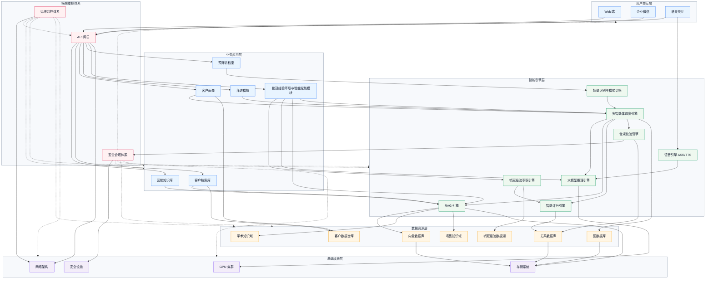

# 销冠经验萃取与智能赋能平台技术架构图

以下架构图适合直接放入技术方案、概要设计或项目建设文档中。图中采用分层架构表达，纵向体现从用户入口到基础设施的调用链路，横向体现安全合规、运维监控和 API 网关等公共支撑能力。

## 架构说明

该平台采用五层架构与三类横向支撑能力组合：

- 用户交互层：面向销售、管理者和运营人员，提供 Web、企业微信和语音交互入口。
- 业务应用层：承载营销知识库、客户档案、客户画像、拜访模拟、预拜访档案等核心业务场景。
- 智能引擎层：通过大模型推理、RAG、多智能体调度、语音识别合成、场景识别、经验萃取、智能评分和合规校验完成智能化能力编排。
- 数据资源层：沉淀学术知识、零售知识、销冠经验、客户数据，并通过向量数据库、关系数据库和图数据库支撑检索、分析与推理。
- 基础设施层：提供 GPU 算力、存储、网络和安全设施，保障平台稳定运行。
- 横向支撑体系：API 网关统一接入与流量治理，安全合规体系覆盖全链路权限、审计、脱敏与内容合规，运维监控体系覆盖服务、模型、数据和基础设施状态。

