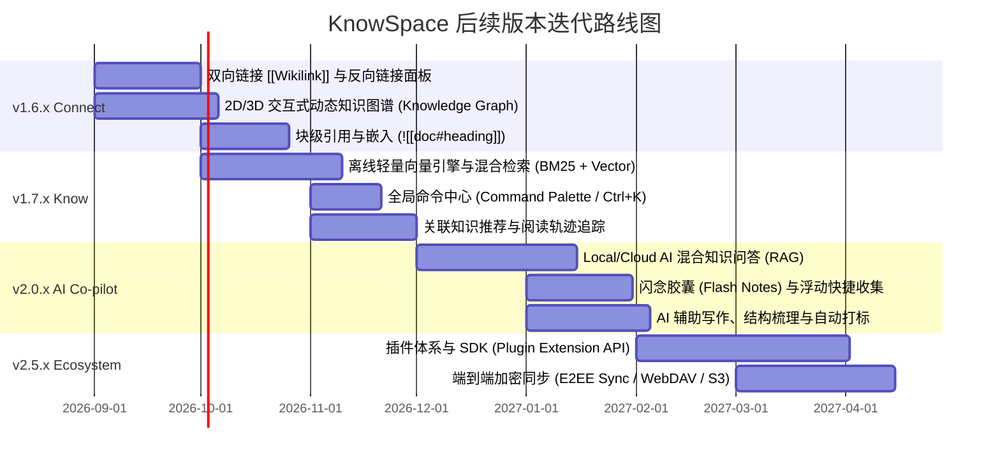

# 🪐 KnowSpace 产品演进与后续版本迭代路线图
> **KnowSpace · Personal Knowledge Workspace（个人知识工作台）**  
> **核心使命**：*Write. Read. Connect. Know.（记录 · 阅读 · 连接 · 认知）*  
> **文档版本**：`v1.0.0` | **规划基线**：基于 KnowSpace `v1.5.0` 当前架构与产品定义

---

## 🧭 一、 产品定位与演进愿景

### 1.1 品牌内核与四维阶梯
KnowSpace 从单文档 Markdown 阅读与编辑出发，逐步演进为高颜值、本地优先（Local-First）、隐私安全的 **Personal Knowledge OS（个人知识操作系统）**：

```
 [v1.0 - v1.5]             [v1.6.x]               [v1.7.x]                 [v2.0+]
   📖 Write & Read   ───►   🔗 Connect     ───►    🧠 Know        ───►     🌌 Knowledge OS
 沉浸阅读/零延迟双向编辑     双向链接/知识图谱      语义检索/混合搜索        AI 知识协作者/开放插件生态
```

- **Write（记录）**：CodeMirror 6 极客编辑体验、实时语法解析、多标签与极速分屏。
- **Read（阅读）**：沉浸纯净排版、源码双向高亮、暖橙黄护眼、超清 Mermaid 与毛玻璃全屏灯箱。
- **Connect（连接）**：打破文档孤岛，建立文档、段落、概念与多维图谱之间的双向神经网络。
- **Know（认知）**：从“被动存储”跃升为“主动理解”，提供离线向量混合检索、知识脉络生成与本地/云端混合 AI 辅助。

---

## 🗺️ 二、 迭代路线图与里程碑规划 (Milestones)



---

## 📌 三、 各版本核心特性与技术方案深度设计

### 🔗 Milestone 1: KnowSpace v1.6.x —「Connect · 知识互联与多维图谱」
> **版本核心**：消除文档孤岛，建立网状双向知识链接与交互式图谱可视化。

#### 1. 双向链接（Bidirectional Linking）与反向链接面板
- **语法规范**：
  - `[[文档名称]]`：跨文档链接，自动补全与模糊联想。
  - `[[文档名称|自定义别名]]`：支持别名渲染。
  - `[[文档名称#章节标题]]`：锚点精准跳转。
- **反向链接侧栏面板（Backlinks Panel）**：
  - **显式链接（Linked Mentions）**：解析正文中明确引用当前文档的上下文卡片。
  - **隐式提及（Unlinked Mentions）**：智能扫描工作区中提及当前文档标题但未加链接的段落，支持“一键转为链接”。

#### 2. 全局与局部交互式知识图谱（Interactive Knowledge Graph）
- **渲染技术栈**：WebGL / Force-Directed Graph（力导向图）物理引擎驱动。
- **双模态呈现**：
  - **全局星系图（Global Space Graph）**：俯瞰整个工作区知识脉络，节点大小随引用权重自适应，支持颜色按标签/目录聚类。
  - **局部脉络图（Local Focus Graph）**：在文档右侧栏实时呈现以当前文档为中心、1~3 跳（Hops）的微观关联网。
- **交互特性**：平滑缩放平移、节点孤岛过滤、搜索高亮路径、双击直接飞跃到对应文档。

#### 3. 块级引用与嵌入（Block-level Reference & Embed）
- 支持使用 `![[文档名称]]` 直接将外部文档片段嵌入正文实时渲染。
- 独特的毛玻璃嵌入容器卡片，支持独立折叠、源码定位与独立刷新。

---

### 🧠 Milestone 2: KnowSpace v1.7.x —「Know · 离线语义与混合检索」
> **版本核心**：将检索能力从“精确字符串匹配”提升到“理解上下文意图的混合语义召回”。

#### 1. 100% 本地离线混合搜索引擎（Hybrid Search Engine）
- **底层架构**：
  - **关键词检索层**：基于 SQLite FTS5 / BM25 算法，保障行号、代码、特殊符号的 0 误差定位。
  - **语义向量层**：轻量级本地 Embedding 模型（如 `all-MiniLM-L6-v2` / `BGE-Micro` ONNX 运行时），在本地安全生成向量索引。
  - **混合重排（Reciprocal Rank Fusion）**：结合字面精确度与语义相关度综合评分，呈现最具价值的知识切片。

#### 2. 全能命令中心（KnowSpace Command Palette · `Ctrl + K` / `Ctrl + P`）
- 统一交互入口：
  - 键入 `?`：列出所有快捷指令与操作动作。
  - 键入 `@`：按标题或正文极速定位章节。
  - 键入 `#`：按 Tag 标签聚类筛选文档。
  - 键入 `>`：执行系统级功能（切换主题、导出 PDF、分屏、聚焦模式等）。

#### 3. 关联知识即时推荐（Contextual Knowledge Insights）
- 在文档右侧提供「可能相关的知识（Related in Space）」悬浮胶囊：阅读或编写当前文档时，系统在后台基于上下文向量实时探测工作区内相似主题的沉睡笔记。

---

### 🌌 Milestone 3: KnowSpace v2.0.x —「AI Co-pilot · 个人知识伙伴与智能辅助」
> **版本核心**：本地隐私模型与主流云端大模型无缝融合，提供基于个人知识库的专属 RAG 问答与结构梳理。

#### 1. 知识库对话与溯源问答（Chat with Your Knowledge Base）
- **多引擎自由切换**：
  - **本地完全离线**：支持 Ollama（Llama 3 / Qwen 2.5 / DeepSeek-R1 本地运行），零数据泄露风险。
  - **云端高精度**：支持 Google Gemini 2.5 / OpenAI / Claude API 自定义 Key 直连。
- **可信溯源**：AI 回答的每一个论点均标注引用出处（`[Doc A: L42-56]`），点击即可高亮跳回原文。

#### 2. 闪念胶囊与全局浮动速记（Flash Notes / Quick Capture）
- 全局热键（如 `Alt + Space` / `Win + Alt + N`）呼出极简半透明磨砂速记浮窗。
- 随手记录灵感、代码片段、待办事项，自动按时间戳原子落盘并归档至 `Inbox/`，后续支持一键整理合并。

#### 3. 智能排版与图表公式自动生成
- 选中文本一键润色、提取 Executive Summary（摘要）、生成思维导图（Mermaid Mindmap）。
- 复杂数学公式（LaTeX）与架构图自动修补补全。

---

### 🧩 Milestone 4: KnowSpace v2.5.x —「Ecosystem & Security · 开放生态与多端协同」
> **版本核心**：打造插件化开放体系，提供无感端到端加密跨设备安全同步。

#### 1. 插件化架构（KnowSpace Plugin SDK）
- 基于微内核 + 沙箱（Sandbox）机制，开放 UI 挂载点（ActivityBar、StatusBar、Editor Extensions、Command Palette）。
- 社区可贡献：自定义代码高亮语言、图表渲染器、第三方数据导入导出器、个性化主题包。

#### 2. 本地优先的端到端加密同步（E2EE Local-First Sync）
- **零信任加密**：在本地完成 AES-256-GCM 文件加密后再上传。
- **多存储后端支持**：
  - WebDAV（坚果云、Nextcloud、群晖 NAS）
  - 对象存储（AWS S3、Cloudflare R2、阿里云 OSS、腾讯云 COS）
  - 自建局域网 P2P 同步（LAN Sync）

#### 3. 多格式高保真资产流动
- **PDF 深度阅读与划线批注**：直接在 KnowSpace 中批注 PDF 并将高亮划线一键导出为 Markdown 知识卡片。
- **Notion / Obsidian / Logseq 零损迁移向导**：自动转换双链、属性与附件路径。

---

## 🏗️ 四、 关键技术架构演进方案

```
┌────────────────────────────────────────────────────────┐
│               KnowSpace UI Layer (React 19)            │
│  ┌───────────────┐ ┌───────────────┐ ┌───────────────┐ │
│  │ CodeMirror 6  │ │  Render View  │ │ Graph / WebGL │ │
│  │ Editor Core   │ │  Markdown AST │ │ Visualization │ │
│  └───────────────┘ └───────────────┘ └───────────────┘ │
├────────────────────────────────────────────────────────┤
│             KnowSpace Service Bus (TypeScript)         │
│  ┌───────────────┐ ┌───────────────┐ ┌───────────────┐ │
│  │ Link & Graph  │ │ Hybrid Search │ │  AI Co-pilot  │ │
│  │ Index Engine  │ │ BM25 + Vector │ │ (Ollama/Cloud)│ │
│  └───────────────┘ └───────────────┘ └───────────────┘ │
├────────────────────────────────────────────────────────┤
│           Electron Desktop & Native IO Layer           │
│  ┌───────────────┐ ┌───────────────┐ ┌───────────────┐ │
│  │ Atomic FileIO │ │ SQLite / FTS5 │ │ ONNX Runtime  │ │
│  │ & Safe Write  │ │ & Key-Val DB  │ │ Local Embed   │ │
│  └───────────────┘ └───────────────┘ └───────────────┘ │
└────────────────────────────────────────────────────────┘
```

---

## 📊 五、 版本演进路线对照矩阵

| 能力维度 | 当前版本 (`v1.5.0`) | `v1.6.x` (Connect) | `v1.7.x` (Know) | `v2.0.x` (AI Co-pilot) | `v2.5.x` (Ecosystem) |
| :--- | :--- | :--- | :--- | :--- | :--- |
| **文档关系** | 树形目录管理 | `[[双向链接]]` + 反链 | 关系拓扑聚类 | 语义动态关联 | 跨库网络连接 |
| **图谱可视化** | — | 2D/3D 交互式力导向图 | 局部聚焦脉络图 | 知识演化时间线 | 概念拓扑脑图 |
| **检索能力** | 实时字面关键词匹配 | 链接/标签联合过滤 | BM25 + 本地向量混合检索 | 自然语言意图问答 | 跨模态知识搜索 |
| **智能辅助** | — | — | 相似知识自动推荐 | 本地/云端 RAG 对话 | 自动打标/结构重构 |
| **信息收集** | 手动新建文档 | 块级嵌入引用 | 快捷命令面板定位 | 闪念胶囊浮窗速记 | 浏览器剪藏插件 |
| **扩展与同步** | 本地文件系统 | 本地文件系统 | 本地 FTS/Vector 索引 | 多模型接口配置 | 开放插件SDK + E2EE同步 |

---

## 🎯 六、 近期（v1.6.0）实施规划与行动清单

### 第一阶段（1-2 周）：双向链接核心语法与索引引擎
1. **Markdown AST 扩展**：在 `remark`/`unified` 解析流中增加 `[[Wikilink]]` 自定义语法插件支持。
2. **内存索引表构建**：主进程启动时建立全工作区的文件名、别名、标题（Headings）倒排索引。
3. **编辑器补全提示**：在 CodeMirror 6 中键入 `[[` 时呼出模糊搜索下拉列表。

### 第二阶段（2-3 周）：反向链接面板与关系解析
1. **文档关联解析器**：在文件保存时原子更新双向引用关系拓扑。
2. **侧边栏 Backlinks 组件**：实现显式引用与隐式提及卡片，支持上下文预览与一键跳转。

### 第三阶段（3-4 周）：知识图谱可视化（WebGL）
1. **图谱渲染器集成**：引入高性能 2D/3D Force-Directed Graph 引擎。
2. **样式深度适配**：完美契合深色极夜黑与浅色暖橙黄主题，融入「超立方空间」设计语言。

---

> 💡 **总结**：KnowSpace 正在从一款极致好用的 Markdown 查看与编辑利器，稳步进化为兼具高美感、高速度、强安全与网状认知力的一站式个人知识工作台。
