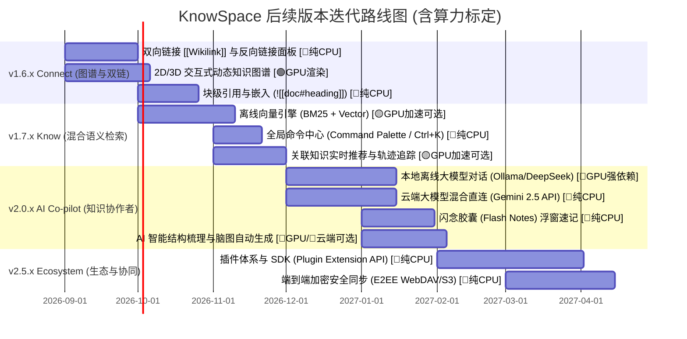

# 🪐 KnowSpace 产品演进与后续版本迭代路线图
> **KnowSpace · Personal Knowledge Workspace（个人知识工作台）**  
> **核心使命**：*Write. Read. Connect. Know.（记录 · 阅读 · 连接 · 认知）*  
> **文档版本**：`v1.1.0` | **规划基线**：基于 KnowSpace `v1.5.0` 当前架构与产品定义  
> **算力标定**：已完整标注各功能特性的 **本地 GPU / 显存 / CPU / 云端** 算力分配与动态降级策略

---

## 🧭 一、 产品定位与演进愿景

### 1.1 品牌内核与四维阶梯
KnowSpace 从单文档 Markdown 阅读与编辑出发，逐步演进为高颜值、本地优先（Local-First）、隐私安全的 **Personal Knowledge OS（个人知识操作系统）**：

```
 [v1.0 - v1.5]             [v1.6.x]               [v1.7.x]                 [v2.0+]
   📖 Write & Read   ───►   🔗 Connect     ───►    🧠 Know        ───►     🌌 Knowledge OS
 沉浸阅读/零延迟双向编辑     双向链接/知识图谱      语义检索/混合搜索        AI 知识协作者/开放插件生态
```

- **Write（记录）**：CodeMirror 6 极客编辑体验、实时语法解析、多标签与极速分屏。
- **Read（阅读）**：沉浸纯净排版、源码双向高亮、暖橙黄护眼、超清 Mermaid 与毛玻璃全屏灯箱。
- **Connect（连接）**：打破文档孤岛，建立文档、段落、概念与多维图谱之间的双向神经网络。
- **Know（认知）**：从“被动存储”跃升为“主动理解”，提供离线向量混合检索、知识脉络生成与本地/云端混合 AI 辅助。

---

## ⚡ 二、 本地算力与硬件资源分级图例 (Compute & Hardware Legend)

为了确保各类设备（从轻薄办公本到专业工作站）均能获得流畅体验，KnowSpace 将所有能力进行算力分类标注：

| 标识徽章 | 算力等级 | 硬件需求说明 | 典型功能场景 | 降级容灾方案 |
| :--- | :--- | :--- | :--- | :--- |
| 🔴 **`[⚡ GPU 强依赖 · 专属显存]`** | **Heavy GPU** | 依赖本地独立 GPU（NVIDIA CUDA / AMD ROCm / Apple Metal），推荐 **4GB~16GB+ 专属显存 (VRAM)** | 本地大模型离线推理（DeepSeek-R1 / Qwen 2.5 / Llama 3）、全库 RAG 本地生成 | 自动降级为 CPU Q4 量化模型，或一键无缝切换至云端 API（Gemini / Claude / OpenAI） |
| 🟡 **`[⚡ GPU 算力加速可选 · WebGPU]`** | **Medium GPU** | 可纯 CPU 运行；启用 **WebGPU / DirectML** GPU 加速时可获得 **10×~20× 吞吐提升** | 本地轻量 Embedding 向量生成（BGE / MiniLM）、全库知识库批量向量索引构建 | 无 GPU 时由多线程 CPU（WASM SIMD）后台平滑构建索引，不阻塞 UI 渲染 |
| 🟢 **`[⚡ GPU 图形渲染加速 · WebGL]`** | **Light GPU** | 仅依赖基础图形加速（标准**集成显卡 / 核显**或独显），显存占用极低（< 150MB） | 2D/3D 动态交互式知识图谱（Force-directed Graph 物理仿真、星系连线粒子动效） | 低配核显自动降低粒子帧率与物理步长，或切换至 2D 极简静态拓扑模式 |
| ⚪ **`[🌱 纯 CPU / 零 GPU 依赖]`** | **Zero GPU** | 100% 运行于 CPU 与系统内存，**对显卡零要求**，老旧设备及轻薄本极速流畅 | SQLite FTS5 / BM25 精确检索、CodeMirror 6 极客编辑、AST 解析、双链拓扑、E2EE 本地加密 | 天然低耗电、低发热，开箱即用 |

---

## 🗺️ 三、 迭代路线图与里程碑规划 (Milestones)



---

## 📌 四、 各版本核心特性、技术方案与算力深度设计

### 🔗 Milestone 1: KnowSpace v1.6.x —「Connect · 知识互联与多维图谱」
> **版本核心**：消除文档孤岛，建立网状双向知识链接与交互式图谱可视化。

#### 1. 双向链接（Bidirectional Linking）与反向链接面板 ⚪ `[🌱 纯 CPU / 零 GPU 依赖]`
- **算力分析**：纯字符串解析与 AST 遍历，耗时 < 5ms，完全依赖 CPU 单核性能。
- **语法规范**：
  - `[[文档名称]]`：跨文档链接，自动补全与模糊联想。
  - `[[文档名称|自定义别名]]`：支持别名渲染。
  - `[[文档名称#章节标题]]`：锚点精准跳转。
- **反向链接侧栏面板（Backlinks Panel）**：
  - **显式链接（Linked Mentions）**：解析正文中明确引用当前文档的上下文卡片。
  - **隐式提及（Unlinked Mentions）**：智能扫描工作区中提及当前文档标题但未加链接的段落，支持“一键转为链接”。

#### 2. 全局与局部交互式知识图谱（Interactive Knowledge Graph） 🟢 `[⚡ GPU 图形渲染加速 · WebGL]`
- **算力分析**：
  - **GPU 计算**：力导向物理引擎（Barnes-Hut 空间分割算法）由 WebGL / Canvas 2D 着色器硬件加速，保障 5,000+ 节点时保持 **60 FPS** 顺滑渲染。
  - **显存开销**：约 **50MB ~ 120MB**（普通核显 / 独立显卡均可秒级驱动）。
- **双模态呈现**：
  - **全局星系图（Global Space Graph）**：俯瞰整个工作区知识脉络，节点大小随引用权重自适应，支持颜色按标签/目录聚类。
  - **局部脉络图（Local Focus Graph）**：在文档右侧栏实时呈现以当前文档为中心、1~3 跳（Hops）的微观关联网。
- **交互特性**：平滑缩放平移、节点孤岛过滤、搜索高亮路径、双击直接飞跃到对应文档。

#### 3. 块级引用与嵌入（Block-level Reference & Embed） ⚪ `[🌱 纯 CPU / 零 GPU 依赖]`
- **算力分析**：虚拟 DOM 增量渲染，零显卡算力开销。
- 支持使用 `![[文档名称]]` 直接将外部文档片段嵌入正文实时渲染。
- 独特的毛玻璃嵌入容器卡片，支持独立折叠、源码定位与独立刷新。

---

### 🧠 Milestone 2: KnowSpace v1.7.x —「Know · 离线语义与混合检索」
> **版本核心**：将检索能力从“精确字符串匹配”提升到“理解上下文意图的混合语义召回”。

#### 1. 100% 本地离线混合搜索引擎（Hybrid Search Engine） 🟡 `[⚡ GPU 算力加速可选 · WebGPU]` + ⚪ `[🌱 纯 CPU]`
- **算力分析**：
  - **字面搜索层（BM25）** ⚪ `[🌱 纯 CPU]`：基于 SQLite FTS5 倒排索引，毫秒级定位精准代码与行号，内存占用 < 30MB。
  - **向量语义层（Embedding）** 🟡 `[⚡ GPU 算力加速可选]`：
    - 模型采用小巧精悍的 `bge-small-zh-v1.5` 或 `all-MiniLM-L6-v2`（ONNX 格式，仅 ~45MB）。
    - **GPU 加速模式**：启用 WebGPU / DirectML 时，批量向量化吞吐达 **1,200 段落/秒**（仅需 200MB 共享显存）。
    - **CPU 降级模式**：利用 WASM SIMD 多核并行计算，吞吐约 **150 段落/秒**，在后台空闲时增量建立，不卡顿前台交互。
  - **混合重排（Reciprocal Rank Fusion · RRF）** ⚪ `[🌱 纯 CPU]`：结合字面与向量评分排序。

#### 2. 全能命令中心（Command Palette · `Ctrl + K` / `Ctrl + P`） ⚪ `[🌱 纯 CPU / 零 GPU 依赖]`
- **算力分析**：纯内存 Trie 树与模糊匹配算法（Fzf-like），查询耗时 < 1ms。
- 统一交互入口：
  - 键入 `?`：列出所有快捷指令与操作动作。
  - 键入 `@`：按标题或正文极速定位章节。
  - 键入 `#`：按 Tag 标签聚类筛选文档。
  - 键入 `>`：执行系统级功能（切换主题、导出 PDF、分屏、聚焦模式等）。

#### 3. 关联知识即时推荐（Contextual Knowledge Insights） 🟡 `[⚡ GPU 算力加速可选]`
- 在文档右侧提供「可能相关的知识（Related in Space）」悬浮胶囊：在后台利用轻量级向量余弦相似度计算，实时探测工作区内相似主题的沉睡笔记。

---

### 🌌 Milestone 3: KnowSpace v2.0.x —「AI Co-pilot · 个人知识伙伴与智能辅助」
> **版本核心**：本地隐私模型与主流云端大模型无缝融合，提供基于个人知识库的专属 RAG 问答与结构梳理。

#### 1. 知识库本地/云端混合 RAG 对话（Chat with Knowledge Base）
- 模式 A：**本地完全离线模式** 🔴 **`[⚡ GPU 强依赖 · 专属显存]`**
  - **算力分析**：
    - 接入本地 Ollama 运行时（支持 `DeepSeek-R1-Distill-Qwen-7B` / `Qwen-2.5-7B/14B` / `Llama-3-8B`）。
    - **显存与硬件要求**：
      - **7B 模型 (Q4_K_M)**：需 **5.5GB ~ 8GB VRAM**（如 RTX 3060 / 4060 / Apple M 系列 16G 统一内存），生成速度 35~60 tokens/s。
      - **14B 模型 (Q4_K_M)**：需 **10GB ~ 16GB VRAM**（如 RTX 4070Ti / 4080 / 3090）。
    - **极致隐私**：100% 知识库数据不离开物理设备，物理断网依然可思考问答。
- 模式 B：**云端高性能模式** ⚪ **`[🌱 纯 CPU / 零 GPU 依赖]`**
  - **算力分析**：本地仅做 HTTP/SSE 流式通讯，显卡 0 占用，普通办公本即可获得顶级智能。
  - **接入生态**：一键直连 Google Gemini 2.5 Pro / Flash、OpenAI GPT-4o、Anthropic Claude 3.5 Sonnet。
- **可信溯源**：AI 回答的每一个论点均标注引用出处（`[Doc A: L42-56]`），点击即可高亮跳回原文。

#### 2. 闪念胶囊与全局浮动速记（Flash Notes / Quick Capture） ⚪ `[🌱 纯 CPU / 零 GPU 依赖]`
- 全局热键（如 `Alt + Space` / `Win + Alt + N`）呼出极简半透明磨砂速记浮窗，原子级快速记录并自动归档至 `Inbox/`。

#### 3. 智能排版与结构化梳理 🔴 **`[⚡ 本地 GPU (Ollama)]`** / ⚪ **`[🌱 云端 API (Gemini)]`**
- 选中文本一键提取 Executive Summary、一键转化生成 Mermaid 架构/思维脑图、自动修复 LaTeX 复杂公式语法。

---

### 🧩 Milestone 4: KnowSpace v2.5.x —「Ecosystem & Security · 开放生态与多端协同」
> **版本核心**：打造插件化开放体系，提供无感端到端加密跨设备安全同步。

#### 1. 插件化架构（KnowSpace Plugin SDK） ⚪ `[🌱 纯 CPU / 零 GPU 依赖]`
- 微内核 + 沙箱隔离机制，开放 UI 挂载点，零显存开销。

#### 2. 本地优先的端到端加密同步（E2EE Local-First Sync） ⚪ `[🌱 纯 CPU / 零 GPU 依赖]`
- 纯 CPU 硬件级 AES-NI 指令集加速，文件加密/解密速度 > 1.5 GB/s，支持 WebDAV、S3/R2 与局域网 P2P 同步。

#### 3. PDF 深度阅读与划线批注 ⚪ `[🌱 纯 CPU]` / 🟢 `[⚡ GPU 页面渲染]`
- 基于 PDF.js 的硬件加速渲染，批注一键导出为 Markdown 知识卡片。

---

## 📊 五、 算力消耗与硬件规格全景矩阵表

| 功能模块 | 所属版本 | 算力类型 | 最低显存/内存要求 | 推荐 GPU / 硬件配置 | CPU / 无显卡降级表现 |
| :--- | :--- | :--- | :--- | :--- | :--- |
| **Markdown 渲染与双向编辑** | `v1.5.0` | ⚪ 纯 CPU | 2GB RAM / 0 显存 | 任何双核 CPU | 完美流畅 (60fps) |
| **左右多文档分屏与独立新窗口** | `v1.5.0` | ⚪ 纯 CPU | 4GB RAM / 0 显存 | 任何主流 CPU | 完美流畅 (<50ms 秒开) |
| **`[[双向链接]]` 索引与反向链接** | `v1.6.x` | ⚪ 纯 CPU | 4GB RAM / 0 显存 | 任何主流 CPU | 毫秒级即时索引 |
| **2D/3D 动态交互式知识图谱** | `v1.6.x` | 🟢 **GPU 图形** | 128MB 显存 | Intel/AMD 核显 或 独显 | 降级为 2D 静态轻量图谱 |
| **SQLite FTS5 + BM25 搜索** | `v1.7.x` | ⚪ 纯 CPU | 4GB RAM / 0 显存 | 任何主流 CPU | 毫秒级字面定位 |
| **本地轻量向量 Embedding (ONNX)** | `v1.7.x` | 🟡 **GPU 加速** | 256MB 显存 (WebGPU) | 核显 / GTX 1650 以上 | CPU WASM 后台平滑索引 (无感) |
| **本地离线大模型问答 (Ollama 7B)** | `v2.0.x` | 🔴 **GPU 强算力** | **6GB~8GB 独显显存** | **RTX 3060/4060 / Apple M1+** | CPU Q4 生成较慢 (5~10 t/s) 或用云端 |
| **本地离线大模型问答 (Ollama 14B)** | `v2.0.x` | 🔴 **GPU 强算力** | **12GB~16GB 独显显存** | **RTX 4070Ti/3090/4080** | 不建议 CPU 运行，自动引导云端 API |
| **云端大模型问答 (Gemini/OpenAI)** | `v2.0.x` | ⚪ 纯 CPU | 4GB RAM / 0 显存 | 任何联网设备 | 极速流式返回，显卡 0 负担 |
| **E2EE 端到端本地加密与同步** | `v2.5.x` | ⚪ 纯 CPU | 4GB RAM / 0 显存 | 支持 AES-NI 的 CPU | 满速加密上传 (<1% CPU) |

---

## 🛡️ 六、 智能硬件自适应与动态降级策略 (Graceful Degradation)

KnowSpace 坚持 **“硬件高配发挥极致、低配稳定丝滑”** 的自适应原则，底层内置智能环境嗅探器（`HardwareProbe`）：

```
                       ┌────────────────────────┐
                       │   KnowSpace 启动探测   │
                       │   Hardware Probe Init  │
                       └───────────┬────────────┘
                                   │
                    ┌──────────────┴──────────────┐
                    ▼                             ▼
         【检测到 Dedicated GPU】        【仅检测到 CPU / 核显】
        (VRAM ≥ 6GB, CUDA/Metal)        (无独显 / 显存 < 2GB)
                    │                             │
       ┌────────────┴────────────┐   ┌────────────┴────────────┐
       ▼                         ▼   ▼                         ▼
  🚀 激活全速本地 AI         🌐 激活 WebGPU   💡 推荐云端 API (Gemini)   🧵 CPU WASM 增量索引
  - Ollama 7B/14B 本地满血   - 向量秒级建库    - 0 显卡负担/极速响应      - 线程池后台静默运行
  - 3D 粒子星系图谱 (60fps)  - 实时上下文推荐  - 降级 2D 轻量力导向图     - 绝不阻塞前台打字与阅读
```

1. **零阻断原则（Non-blocking UI）**：任何本地算力密集型任务（如 Embedding 向量构建、大模型推理）均严格运行在 **Worker 子进程 / 独立主进程管道** 中，绝不占用渲染主线程，确保码字编辑与阅读始终维持 0 延迟。
2. **弹性按需加载（On-demand Allocation）**：图谱仅在用户切换到图谱标签页时初始化 WebGL 上下文，离开后自动释放 GPU 纹理与显存缓存。
3. **混合双模无缝切换**：用户既可以在家里使用高配台式机运行纯离线本地 DeepSeek/Qwen 获得极致隐私，也可以在轻薄笔记本外出时一键切换至 Gemini API 获得毫秒级云端响应。

---

> 💡 **总结**：通过清晰的 **[🔴 GPU 强依赖]**、**[🟡 GPU 加速可选]**、**[🟢 GPU 图形加速]** 与 **[🌱 纯 CPU]** 分级标定，KnowSpace 既能充分释放高性能硬件的 AI 与图谱潜力，又能坚守轻巧、高效、低耗电的个人知识工作台底色。
