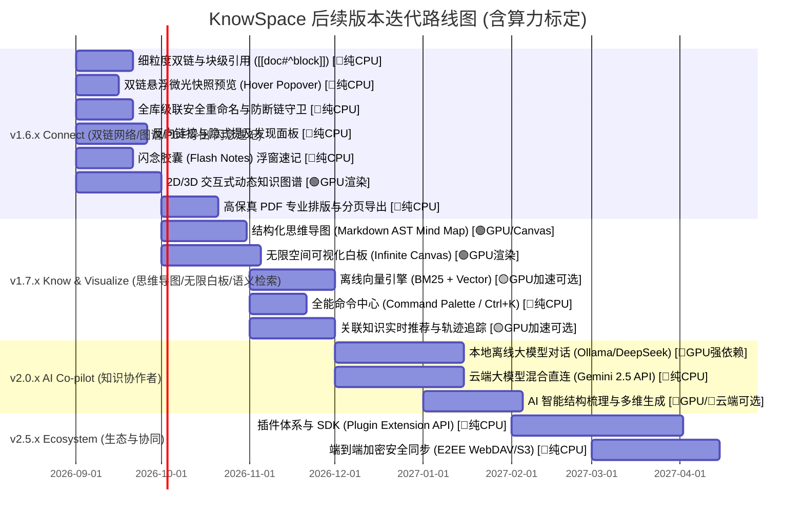

# 🪐 KnowSpace 产品演进与后续版本迭代路线图
> **KnowSpace · Personal Knowledge Workspace（个人知识工作台）**  
> **核心使命**：*Write. Read. Connect. Know.（记录 · 阅读 · 连接 · 认知）*  
> **文档版本**：`v1.4.0` | **规划基线**：基于 KnowSpace `v1.5.1` 当前架构与产品定义  
> **算力标定**：已完整标注各功能特性的 **本地 GPU / 显存 / CPU / 云端** 算力分配与动态降级策略  
> **重大调整**：完善 **「双向链接 (Wikilinks) 全生命周期与级联防断链体系」**（v1.6.x 核心底座）；正式将 **「结构化思维导图 (Mind Map)」** 与 **「无限空间可视化白板 (Infinite Canvas / Whiteboard)」** 深度纳入 **`v1.7.x` 空间视觉认知里程碑**！

---

## 🧭 一、 产品定位与演进愿景

### 1.1 品牌内核与四维阶梯
KnowSpace 从单文档 Markdown 阅读与编辑出发，逐步演进为高颜值、本地优先（Local-First）、隐私安全的 **Personal Knowledge OS（个人知识操作系统）**：

```
 [v1.0 - v1.5]             [v1.6.x]                       [v1.7.x]                                    [v2.0+]
   📖 Write & Read   ───►   🔗 Connect & Network    ───►    🧠 Know & Visualize                 ───►    🌌 Knowledge OS
 沉浸阅读/零延迟双向编辑     全生命周期双链/反链/PDF/速记     思维导图/无限白板/离线混合语义检索/命令中心   AI 知识协作者/开放插件生态
```

- **Write & Capture（记录与速记）**：CodeMirror 6 极客编辑体验、实时语法解析、多标签与极速分屏；全局闪念胶囊秒级呼出，随时捕捉灵感火花。
- **Read（阅读）**：沉浸纯净排版、源码双向高亮、暖橙黄护眼、超清 Mermaid、毛玻璃灯箱与**高保真专业 PDF 打印导出**。
- **Connect & Network（连接与网络）**：打破文档孤岛，建立文档级、小节级与块级（`[[doc#^block]]`）原子双向链接，辅以悬浮微光快照预览、全库级联重构防断链与反向链接面板，编织紧密的网状知识拓扑。
- **Visualize & Know（视觉与认知）**：打破一维线性纯文本局限，提供 Markdown AST 实时双向思维导图、多维无限空间画布白板（`.canvas` 开放格式），结合本地混合语义检索，实现空间与多维结构化思考。

---

## ⚡ 二、 本地算力与硬件资源分级图例 (Compute & Hardware Legend)

为了确保各类设备（从轻薄办公本到专业工作站）均能获得流畅体验，KnowSpace 将所有能力进行算力分类标注：

| 标识徽章 | 算力等级 | 硬件需求说明 | 典型功能场景 | 降级容灾方案 |
| :--- | :--- | :--- | :--- | :--- |
| 🔴 **`[⚡ GPU 强依赖 · 专属显存]`** | **Heavy GPU** | 依赖本地独立 GPU（NVIDIA CUDA / AMD ROCm / Apple Metal），推荐 **4GB~16GB+ 专属显存 (VRAM)** | 本地大模型离线推理（DeepSeek-R1 / Qwen 2.5 / Llama 3）、全库 RAG 本地生成 | 自动降级为 CPU Q4 量化模型，或一键无缝切换至云端 API（Gemini / Claude / OpenAI） |
| 🟡 **`[⚡ GPU 算力加速可选 · WebGPU]`** | **Medium GPU** | 可纯 CPU 运行；启用 **WebGPU / DirectML** GPU 加速时可获得 **10×~20× 吞吐提升** | 本地轻量 Embedding 向量生成（BGE / MiniLM）、全库知识库批量向量索引构建 | 无 GPU 时由多线程 CPU（WASM SIMD）后台平滑构建索引，不阻塞 UI 渲染 |
| 🟢 **`[⚡ GPU 图形渲染加速 · WebGL]`** | **Light GPU** | 仅依赖基础图形加速（标准**集成显卡 / 核显**或独显），显存占用极低（< 150MB） | 2D/3D 动态交互式知识图谱（Force-directed Graph 物理仿真、星系连线粒子动效） | 低配核显自动降低粒子帧率与物理步长，或切换至 2D 极简静态拓扑模式 |
| ⚪ **`[🌱 纯 CPU / 零 GPU 依赖]`** | **Zero GPU** | 100% 运行于 CPU 与系统内存，**对显卡零要求**，老旧设备及轻薄本极速流畅 | **高保真 PDF 分页导出**、SQLite FTS5 / BM25 精确检索、CodeMirror 6 极客编辑、AST 解析、双链拓扑、E2EE 本地加密 | 天然低耗电、低发热，开箱即用 |

---

## 🗺️ 三、 迭代路线图与里程碑规划 (Milestones)



---

## 📌 四、 各版本核心特性、技术方案与算力深度设计

### 🔗 Milestone 1: KnowSpace v1.6.x —「Connect · 知识互联、多维图谱、PDF 导出与闪念速记」
> **版本核心**：消除文档孤岛，建立网状双向知识链接与交互式图谱，提供一站式专业级 PDF 文档排版导出，并引入全局闪念胶囊实现零延迟灵感捕获。

#### 1. 双向链接（Bidirectional Linking）全生命周期体系 ⚪ `[🌱 纯 CPU / 零 GPU 依赖]`
- **算力分析**：纯 AST 语法分析与轻量倒排索引，单个文档解析 < 2ms，全库万人双链图谱内存占用 < 20MB，完全依赖 CPU 单核，零 GPU 负担。
- **细粒度语法与块级引用规范**：
  - `[[文档名称]]`：跨文档链接，自动补全与模糊联想，支持中文、空格与特殊符号，自动省略 `.md`。
  - `[[文档名称|自定义别名]]`：支持别名（Alias）渲染，保持行文语境通顺。
  - `[[文档名称#章节标题]]`：锚点精准跳转到目标小节并触发 1.8 秒聚焦微光。
  - `[[文档名称#^block-id]]`：**块级原子引用（Block-level Reference）**，精确引用段落、表格、代码块或数学公式，实现知识最小颗粒度互联。
- **悬浮微光快照预览（Hover Popover Preview）**：
  - 在阅读模式或源码预览中，鼠标悬停在 `[[双链]]` 上 300ms 自动弹出半透明磨砂浮层。
  - 浮层即时渲染目标小节的 Markdown 正文、公式与代码片段，无需切离当前阅读视线。
  - 快捷交互：支持 `Ctrl + 单击` 直接在右侧开启左右分屏对比，右键支持独立新窗口打开。
- **全库级联安全重命名与防断链守卫（Cascade Rename & Broken-Link Shield）**：
  - **原子级联重构**：重命名文档或修改小节标题时，后台自动扫描并安全重构所有引用了该文档/章节的 `[[双链]]`，绝不留下死链。
  - **断链预警与一键补全**：若引用目标不存在，双链显示为淡红微光，点击弹出「创建此文档」浮动胶囊。
- **反向链接侧栏面板（Backlinks Panel）与网络拓扑**：
  - **显式引用（Linked Mentions）**：聚合所有明确引用当前文档的上下文卡片，支持上下文快速折叠与点击平滑定位。
  - **隐式提及（Unlinked Mentions）**：智能扫描工作区中提及当前文档标题但未包裹 `[[ ]]` 的段落，提供快捷「➕ 一键转为双链」。
  - **知识孤岛与枢纽分析**：自动统计「孤岛笔记（Orphan Notes）」与「核心枢纽笔记（Hub Notes / MOC）」，辅助建立紧密知识网络。

#### 2. 全局与局部交互式知识图谱（Interactive Knowledge Graph） 🟢 `[⚡ GPU 图形渲染加速 · WebGL]`
- **算力分析**：
  - **GPU 计算**：力导向物理引擎（Barnes-Hut 空间分割算法）由 WebGL / Canvas 2D 着色器硬件加速，保障 5,000+ 节点时保持 **60 FPS** 顺滑渲染。
  - **显存开销**：约 **50MB ~ 120MB**（普通核显 / 独立显卡均可秒级驱动）。
- **双模态呈现**：
  - **全局星系图（Global Space Graph）**：俯瞰整个工作区知识脉络，节点大小随引用权重自适应，支持颜色按标签/目录聚类。
  - **局部脉络图（Local Focus Graph）**：在文档右侧栏实时呈现以当前文档为中心、1~3 跳（Hops）的微观关联网。
- **交互特性**：平滑缩放平移、节点孤岛过滤、搜索高亮路径、双击直接飞跃到对应文档。

#### 3. 块级引用与嵌入（Block-level Reference & Embed） ⚪ `[🌱 纯 CPU / 零 GPU 依赖]`
- **算力分析**：虚拟 DOM 增量渲染，零显卡算力开销。
- 支持使用 `![[文档名称]]` 直接将外部文档片段嵌入正文实时渲染。
- 独特的毛玻璃嵌入容器卡片，支持独立折叠、源码定位与独立刷新。

#### 4. 高保真 PDF 专业排版与分页导出（Hi-Fi PDF Layout & Paginated Export） ⚪ `[🌱 纯 CPU / 零 GPU 依赖]`
- **算力分析**：基于 Chromium 原生打印渲染管线（`printToPDF`），无额外显卡负担，内存消耗 < 40MB。
- **核心能力亮点**：
  - **纸张与边距精细定制**：支持标准 A4 / Letter / A5 纸张、纵向/横向切换及自定义页边距。
  - **专业页眉页脚与动态页码**：支持在导出时注入文档主标题、生成时间与动态页码（`Page X / Y`）。
  - **代码与表格智能分页防截断**：注入 `@media print` 智能规则（`break-inside: avoid`），确保代码块、表格、Mermaid 图表绝不发生跨页被生硬切断的尴尬现象。
  - **超清矢量合成**：Mermaid 图表与 KaTeX 数学公式以纯矢量 SVG 打印输出，无论放大多少倍依然清晰无锯齿。
  - **自动生成 PDF 目录书签（Bookmarks / Outline）**：根据正文 `H1 ~ H6` 层级自动生成 PDF 导航大纲，方便在 Adobe Reader、Edge 等阅读器中快速折叠跳转。

#### 5. 闪念胶囊与全局浮动速记（Flash Notes / Quick Capture） ⚪ `[🌱 纯 CPU / 零 GPU 依赖]`
- **算力分析**：极轻量独立渲染微进程，纯 CPU 单核驱动，内存消耗 < 25MB，冷热唤起延时 < 30ms，零 GPU/显存开销。
- **核心交互与能力体系**：
  - **全局热键秒级唤起**：按下全局快捷键（默认 `Alt + Space` 或 `Win + Alt + N`，可自定义），瞬间呼出轻量居中/边缘贴靠的磨砂玻璃微窗，无需切换或聚焦主应用界面。
  - **极简无干扰录入**：支持极简 Markdown 语法输入、待办任务清单（`- [ ]`）、代码段与标签（`#标签`），输入完毕按 `Ctrl + Enter` 瞬时保存，窗口自动隐匿并释放焦点。
  - **智能落盘与归档流转**：
    - 默认原子写入个人知识库 `Inbox/YYYY-MM-DD.md` 或统一的 `FlashNotes.md` 时间戳流中。
    - 支持快速指定知识库分类或追加至已有文档末尾。
  - **双链与灵感关联**：在速记浮窗中直接支持 `[[文档名称]]` 模糊匹配，记录当下瞬间便与知识网络完成交织互联。

---

### 🧠 Milestone 2: KnowSpace v1.7.x —「Know & Visualize · 空间视觉思考、思维导图、无限白板与混合检索」
> **版本核心**：打破传统线性文本笔记壁垒，引入结构化思维导图与无限画布白板两大视觉思考引擎，并将检索能力从“精确字符串匹配”升维至“理解上下文意图的混合语义召回”。

#### 1. 结构化思维导图（Markdown AST Mind Map & 双向脑图大纲） 🟢 `[⚡ GPU/Canvas 渲染加速]` / ⚪ `[🌱 纯 CPU]`
- **算力分析**：
  - **渲染性能**：基于 HTML5 2D Canvas / 矢量 SVG 高性能渲染管线，节点变换享受 GPU 硬件合成加速，内存开销 < 30MB，支撑 2,000+ 节点保持 **60 FPS** 顺滑缩放平移。
  - **CPU 开销**：Markdown 标题树 AST 转换耗时 < 3ms，完全零顿挫。
- **核心能力与交互体验**：
  - **双向实时无损同步（Bi-directional AST Sync）**：
    - 任意 Markdown 文档的标题结构（`# H1` ~ `###### H6`）与多级缩进列表（`-` / `1.`）自动映射为层级清晰的思维导图节点。
    - **全双向联动回写**：在思维导图中拖拽重排节点顺序、修改节点文字、新增子主题或删除节点，实时差异化（Diff）回写至 Markdown 源码；在源码侧输入，脑图秒级热更新。
  - **全键盘极客交互流（Keyboard-First Workflow）**：
    - `Tab`：选中节点后插入子节点（Child Topic）。
    - `Enter`：插入同级兄弟节点（Sibling Topic）。
    - `Shift + Tab`：提升当前节点层级。
    - `Space`：展开 / 折叠当前分支，快速聚焦思考脉络。
    - `Ctrl + ↑ / ↓ / ← / →`：键盘直觉调整节点相对排序与所属父级。
  - **多模态富内容与双链原生支持**：
    - 节点内原生支持渲染行内代码、粗斜体、KaTeX 行内公式、标签（`#tag`）与**双向链接 `[[文档名称]]`**。
    - 在思维导图节点上悬停即可触发双链快照预览，点击直接穿梭至目标文档。
  - **多样化结构版式与超清导出**：
    - 支持「经典左右平衡思维导图」、「单向向右树状逻辑图」、「向下组织架构图」与「时间线大纲」。
    - 一键导出为 3× Retina 超清 PNG、纯矢量 SVG、OPML 跨平台大纲格式与标准 Markdown 文本。

#### 2. 本地优先无限空间可视化白板（Infinite Canvas / Whiteboard） 🟢 `[⚡ GPU 图形渲染加速 · WebGL/Canvas]`
- **算力分析**：
  - **GPU 图形加速**：基于 WebGL / 2D Canvas 硬件加速视口矩阵变换（Transform Matrix），显存占用约 **50MB ~ 80MB**。
  - **视口裁剪优化（Frustum Culling）**：仅渲染当前屏幕视口覆盖及外延 20% 范围内的卡片与线条，离屏元素休眠并剔除 DOM，即刻保证 5,000+ 卡片与复杂拓扑连线在 4K 屏下恒定 **60 FPS** 满帧运行。
- **核心能力与空间认知体系**：
  - **无限平移与无级缩放（Pan & Zoom Infinite Canvas）**：
    - `0.1× ~ 10.0×` 自由平滑缩放，支持触控板双指缩放/平移、鼠标滚轮模式切换及空格拖拽平移。
    - 点阵网格（Dot Grid）与工程方格背景自适应，完美融入三大主题（暖橙日光、仿电子墨水纸质、极客纯黑）。
  - **多形态多维知识卡片实体（Multi-Entity Canvas Nodes）**：
    - **Markdown 笔记卡片**：内嵌轻量编辑与渲染引擎，双击直接就地写作，保留所有格式与公式。
    - **知识库文档传送门卡片（Document Portal Cards）**：直接从左侧目录树拖拽 Markdown 章节进白板，以卡片预览形式呈现，实时联动双向保存。
    - **彩色便签卡片（Sticky Notes）**：黄、蓝、绿、粉多色便签，专为头脑风暴、灵感闪念与待办速记打造。
    - **多媒体与架构图嵌入**：本地图片拖入直显、Mermaid 动态架构图嵌入、网页书签智能抓取预览。
  - **智能磁吸矢量连线与语义关系标记（Smart Connectors & Semantic Edges）**：
    - 贝塞尔平滑曲线、正交直角折线、直线三种连线形态，自动智能避障寻路。
    - 鼠标悬停卡片边缘自动点亮 4~8 个磁吸锚点，拖拽即可吸附连线。
    - **连线语义文字标注**：双击连线可输入关系语义标签（如“推导”、“反驳”、“依赖”、“同义引用”），支持单向、双向箭头与虚线关系。
  - **画框分组（Frames / Grouping）与手绘涂鸦**：
    - 画框容器（Frame）：框选多个卡片聚类为一个主题看板，支持整体移动、收起为卡片或单独导出为图片。
    - 自由荧光笔批注与手绘草图，赋予物理白板般的自由创作质感。
  - **本地优先与开放 `.canvas` 标准格式**：
    - 采用标准 JSON 规范的 `.canvas` 文件格式落盘，完全透明可读，与开源生态（如 Obsidian Canvas）无缝互通，保证用户知识资产永不受制于私有软件。
    - 接入底层物理原子落盘与撤销重做（Undo/Redo）状态机。

#### 3. 100% 本地离线混合搜索引擎（Hybrid Search Engine） 🟡 `[⚡ GPU 算力加速可选 · WebGPU]` + ⚪ `[🌱 纯 CPU]`
- **算力分析**：
  - **字面搜索层（BM25）** ⚪ `[🌱 纯 CPU]`：基于 SQLite FTS5 倒排索引，毫秒级定位精准代码与行号，内存占用 < 30MB。
  - **向量语义层（Embedding）** 🟡 `[⚡ GPU 算力加速可选]`：
    - 模型采用小巧精悍的 `bge-small-zh-v1.5` 或 `all-MiniLM-L6-v2`（ONNX 格式，仅 ~45MB）。
    - **GPU 加速模式**：启用 WebGPU / DirectML 时，批量向量化吞吐达 **1,200 段落/秒**（仅需 200MB 共享显存）。
    - **CPU 降级模式**：利用 WASM SIMD 多核并行计算，吞吐约 **150 段落/秒**，在后台空闲时增量建立，不卡顿前台交互。
  - **混合重排（Reciprocal Rank Fusion · RRF）** ⚪ `[🌱 纯 CPU]`：结合字面与向量评分排序。

#### 4. 全能命令中心（Command Palette · `Ctrl + K` / `Ctrl + P`） ⚪ `[🌱 纯 CPU / 零 GPU 依赖]`
- **算力分析**：纯内存 Trie 树与模糊匹配算法（Fzf-like），查询耗时 < 1ms。
- 统一交互入口：
  - 键入 `?`：列出所有快捷指令与操作动作。
  - 键入 `@`：按标题或正文极速定位章节。
  - 键入 `#`：按 Tag 标签聚类筛选文档。
  - 键入 `>`：执行系统级功能（切换主题、**一键导出 PDF**、分屏、聚焦模式等）。

#### 5. 关联知识即时推荐（Contextual Knowledge Insights） 🟡 `[⚡ GPU 算力加速可选]`
- 在文档右侧提供「可能相关的知识（Related in Space）」悬浮胶囊：在后台利用轻量级向量余弦相似度计算，实时探测工作区内相似主题的沉睡笔记。

---

### 🌌 Milestone 3: KnowSpace v2.0.x —「AI Co-pilot · 个人知识伙伴与智能辅助」
> **版本核心**：本地隐私模型与主流云端大模型无缝融合，提供基于个人知识库的专属 RAG 问答与结构梳理。

#### 1. 知识库本地/云端混合 RAG 对话（Chat with Knowledge Base）
- 模式 A：**本地完全离线模式** 🔴 **`[⚡ GPU 强依赖 · 专属显存]`**
  - **算力分析**：
    - 接入本地 Ollama 运行时（支持 `DeepSeek-R1-Distill-Qwen-7B` / `Qwen-2.5-7B/14B` / `Llama-3-8B`）。
    - **显存与硬件要求**：
      - **7B 模型 (Q4_K_M)**：需 **5.5GB ~ 8GB VRAM**（如 RTX 3060 / 4060 / Apple M 系列 16G 统一内存），生成速度 35~60 tokens/s。
      - **14B 模型 (Q4_K_M)**：需 **10GB ~ 16GB VRAM**（如 RTX 4070Ti / 4080 / 3090）。
    - **极致隐私**：100% 知识库数据不离开物理设备，物理断网依然可思考问答。
- 模式 B：**云端高性能模式** ⚪ **`[🌱 纯 CPU / 零 GPU 依赖]`**
  - **算力分析**：本地仅做 HTTP/SSE 流式通讯，显卡 0 占用，普通办公本即可获得顶级智能。
  - **接入生态**：一键直连 Google Gemini 2.5 Pro / Flash、OpenAI GPT-4o、Anthropic Claude 3.5 Sonnet。
- **可信溯源**：AI 回答的每一个论点均标注引用出处（`[Doc A: L42-56]`），点击即可高亮跳回原文。

#### 2. 智能排版与结构化梳理 🔴 **`[⚡ 本地 GPU (Ollama)]`** / ⚪ **`[🌱 云端 API (Gemini)]`**
- 选中文本一键提取 Executive Summary、一键转化生成 Mermaid 架构/思维脑图、自动修复 LaTeX 复杂公式语法。

---

### 🧩 Milestone 4: KnowSpace v2.5.x —「Ecosystem & Security · 开放生态与多端协同」
> **版本核心**：打造插件化开放体系，提供无感端到端加密跨设备安全同步与外部资产互通。

#### 1. 插件化架构（KnowSpace Plugin SDK） ⚪ `[🌱 纯 CPU / 零 GPU 依赖]`
- 微内核 + 沙箱隔离机制，开放 UI 挂载点，零显存开销。

#### 2. 本地优先的端到端加密同步（E2EE Local-First Sync） ⚪ `[🌱 纯 CPU / 零 GPU 依赖]`
- 纯 CPU 硬件级 AES-NI 指令集加速，文件加密/解密速度 > 1.5 GB/s，支持 WebDAV、S3/R2 与局域网 P2P 同步。

#### 3. 外部 PDF 深度阅读与划线批注 ⚪ `[🌱 纯 CPU]` / 🟢 `[⚡ GPU 页面渲染]`
- 基于 PDF.js 的硬件加速阅读器，直接批注外部 PDF 并将高亮划线一键导出为 Markdown 知识卡片。

---

## 📊 五、 算力消耗与硬件规格全景矩阵表

| 功能模块 | 所属版本 | 算力类型 | 最低显存/内存要求 | 推荐 GPU / 硬件配置 | CPU / 无显卡降级表现 |
| :--- | :--- | :--- | :--- | :--- | :--- |
| **Markdown 渲染与双向编辑** | `v1.5.0` | ⚪ 纯 CPU | 2GB RAM / 0 显存 | 任何双核 CPU | 完美流畅 (60fps) |
| **左右多文档分屏与独立新窗口** | `v1.5.0` | ⚪ 纯 CPU | 4GB RAM / 0 显存 | 任何主流 CPU | 完美流畅 (<50ms 秒开) |
| **`[[双向链接]]` 细粒度与块级引用** | `v1.6.x` | ⚪ 纯 CPU | 4GB RAM / 0 显存 | 任何主流 CPU | 毫秒级即时索引与解析 |
| **双链悬浮微光快照预览** | `v1.6.x` | ⚪ 纯 CPU | 2GB RAM / 0 显存 | 任何主流 CPU | 毫秒级无感呼出 (<30ms) |
| **全库双链级联重构与防断链** | `v1.6.x` | ⚪ 纯 CPU | 4GB RAM / 0 显存 | 任何主流 CPU | 后台原子批量扫描替换 |
| **闪念胶囊全局浮窗速记** | `v1.6.x` | ⚪ 纯 CPU | 2GB RAM / 0 显存 | 任何主流 CPU | 毫秒级极速唤起与原子落盘 |
| **2D/3D 动态交互式知识图谱** | `v1.6.x` | 🟢 **GPU 图形** | 128MB 显存 | Intel/AMD 核显 或 独显 | 降级为 2D 静态轻量图谱 |
| **高保真 PDF 专业排版与分页导出** | `v1.6.x` | ⚪ 纯 CPU | 4GB RAM / 0 显存 | 任何主流 CPU | 毫秒级无损矢量导出 |
| **结构化思维导图 (Mind Map)** | `v1.7.x` | 🟢 **GPU 图形** | 64MB 显存 | Intel/AMD 核显 或 独显 | 毫秒级双向 Diff 同步 (60fps) |
| **无限空间可视化白板 (Infinite Canvas)** | `v1.7.x` | 🟢 **GPU 图形** | 128MB 显存 | Intel/AMD 核显 或 独显 | 视口裁剪 60fps 满帧运作 |
| **SQLite FTS5 + BM25 搜索** | `v1.7.x` | ⚪ 纯 CPU | 4GB RAM / 0 显存 | 任何主流 CPU | 毫秒级字面定位 |
| **本地轻量向量 Embedding (ONNX)** | `v1.7.x` | 🟡 **GPU 加速** | 256MB 显存 (WebGPU) | 核显 / GTX 1650 以上 | CPU WASM 后台平滑索引 (无感) |
| **本地离线大模型问答 (Ollama 7B)** | `v2.0.x` | 🔴 **GPU 强算力** | **6GB~8GB 独显显存** | **RTX 3060/4060 / Apple M1+** | CPU Q4 生成较慢 (5~10 t/s) 或用云端 |
| **本地离线大模型问答 (Ollama 14B)** | `v2.0.x` | 🔴 **GPU 强算力** | **12GB~16GB 独显显存** | **RTX 4070Ti/3090/4080** | 不建议 CPU 运行，自动引导云端 API |
| **云端大模型问答 (Gemini/OpenAI)** | `v2.0.x` | ⚪ 纯 CPU | 4GB RAM / 0 显存 | 任何联网设备 | 极速流式返回，显卡 0 负担 |
| **E2EE 端到端本地加密与同步** | `v2.5.x` | ⚪ 纯 CPU | 4GB RAM / 0 显存 | 支持 AES-NI 的 CPU | 满速加密上传 (<1% CPU) |

---

## 🎯 六、 近期（v1.6.0）实施规划与行动清单

### 第一阶段（1-2 周）：双向链接核心语法与索引引擎
1. **Markdown AST 扩展**：在 `remark`/`unified` 解析流中增加 `[[Wikilink]]` 自定义语法插件支持。
2. **内存索引表构建**：主进程启动时建立全工作区的文件名、别名、标题（Headings）倒排索引。
3. **编辑器补全提示**：在 CodeMirror 6 中键入 `[[` 时呼出模糊搜索下拉列表。

### 第二阶段（2-3 周）：高保真 PDF 导出与反向链接面板
1. **PDF 打印排版管道**：实现基于 Electron `webContents.printToPDF` 的无损分页渲染与书签树生成。
2. **打印样式 `@media print`**：定制代码块、表格跨页防截断规则、页眉页脚与动态页码。
3. **侧边栏 Backlinks 组件**：实现显式引用与隐式提及卡片，支持上下文预览与一键跳转。

### 第三阶段（3-4 周）：闪念胶囊 (Flash Notes) 独立微窗与全局捕获
1. **轻量无边框微窗**：Electron 主进程注册全局快捷键（`globalShortcut`），创建单例半透明毛玻璃浮窗。
2. **失焦自动隐藏与极速唤起**：毫秒级响应，窗口失去焦点或按 `Esc` 自动隐匿。
3. **原子落盘与收集箱归档**：按 `Ctrl+Enter` 瞬间将速记追加写入 `Inbox/` 收集箱，并支持在速记中联动 `[[双链]]`。

### 第四阶段（4-5 周）：知识图谱可视化（WebGL）
1. **图谱渲染器集成**：引入高性能 2D/3D Force-Directed Graph 引擎。
2. **样式深度适配**：完美契合深色极夜黑与浅色暖橙黄主题，融入「超立方空间」设计语言。

---

> 💡 **总结**：KnowSpace 正在从一款极致好用的 Markdown 查看与编辑利器，稳步进化为兼具高美感、高速度、强安全与网状认知力的一站式个人知识工作台。
