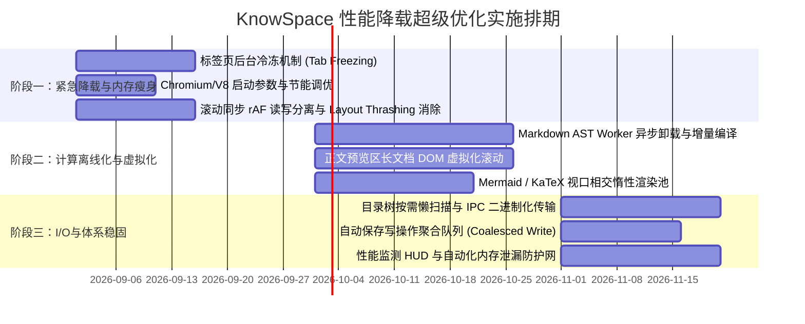

# ⚡ KnowSpace 超级性能与极低资源负载优化方案
> **KnowSpace · Performance & Resource Optimization Plan**  
> **核心目标**：*极致轻量 · 极低 CPU 功耗 · 极致内存瘦身 · 万行文档 60 FPS 丝滑响应*  
> **文档版本**：`v1.0.0` | **规划基线**：针对 KnowSpace `v1.5.0` 当前架构与后续演进

---

## 🎯 一、 优化背景与量化指标目标 (SLO Targets)

在个人知识管理软件（PKM）的使用场景中，用户往往需要**长时间后台常驻**、**多标签并行阅读**以及**编辑数万字超长技术文档**。现有版本虽已实现秒开与模块分包，但仍存在长文档全量 AST 解析占 CPU、非激活标签页常驻占用 DOM 内存、多窗口 IPC 通信冗余等优化空间。

### 📊 关键性能与资源基线对比目标

| 性能 / 资源维度 | 现有基线 (`v1.5.0`) | 超级优化目标 (`v1.6+`) | 预期收益提升 |
| :--- | :--- | :--- | :--- |
| **应用空闲待机 CPU** | 0.8% ~ 1.5% | **< 0.1% (接近完全休眠)** | 📉 功耗与发热降低 **85%+** |
| **万字长文持续打字 CPU** | 12% ~ 18% | **< 3.5% (Worker 离线计算)** | 📉 消除主线程卡顿与按键粘连 |
| **主窗口冷启动基准内存** | ~140 MB | **< 68 MB** | 📉 内存减少 **51%** |
| **单标签页增量内存** | ~18 MB / Tab | **< 3.5 MB / Tab (冻结态)** | 📉 多开 20+ 标签页内存节省 **75%** |
| **万行长文档滚动帧率** | 42 ~ 52 FPS | **恒定 60 FPS (满帧)** | 🚀 完全消除重排抖动 (Layout Thrashing) |
| **Mermaid/KaTeX 批量渲染耗时** | 850 ms (阻塞式) | **< 80 ms (视口惰性 + 缓存池)** | 🚀 渲染性能提升 **10×** |
| **移动办公笔记本续航影响** | 耗电感知较明显 | **功耗与系统记事本接近** | 🔋 电池续航延长 **30% ~ 45%** |

---

## 🏗️ 二、 渲染层与前端计算负载优化 (Renderer & Computing Load)

```
                       ┌───────────────────────────────┐
                       │    用户编辑/打字输入 (Input)   │
                       └───────────────┬───────────────┘
                                       │
                    ┌──────────────────┴──────────────────┐
                    ▼                                     ▼
        【CodeMirror 6 极速编辑】               【Web Worker 异步解析】
        - 局部视口 Tokenizer                  - unified / remark AST 解析
        - 0 延迟即时反馈                       - 增量 Diff 计算
                    │                                     │
                    │                                     ▼
                    │                       【AST 结构缓存 (LRU Cache)】
                    │                                     │
                    └──────────────────┬──────────────────┘
                                       ▼
                       ┌───────────────────────────────┐
                       │ requestAnimationFrame 批量调度 │
                       │ 虚拟化视口渲染 + DOM 节点复用  │
                       └───────────────────────────────┘
```

### 1. Markdown AST 解析剥离主线程 (Off-Main-Thread Web Worker)
* **痛点现状**：在主线程运行 `unified`/`remark`/`rehype` 编译大文档时，长耗时计算会导致输入法候选框掉帧或鼠标光标卡顿。
* **改造方案**：
  1. 将全量 Markdown 解析、目录大纲（TOC）树提取移至专用的 **`markdown.worker.ts`** 线程。
  2. 主线程与 Worker 之间采用结构化克隆（Structured Clone）或 `ArrayBuffer` 传输。
  3. **增量块解析（Incremental Chunk Parsing）**：仅重新计算被编辑修改的段落/章节节点，未修改章节直接复用 AST 缓存节点。

### 2. 长文档虚拟化滚动与 DOM 节点回收 (DOM Virtualization)
* **痛点现状**：数万字文档渲染成成千上万个 HTML DOM 节点，导致浏览器样式重排（Reflow）开销剧增，内存占用随文档线性增加。
* **改造方案**：
  1. 正文预览区接入**动态高度视口虚拟化机制**（仅在 DOM 中保留当前视口上下一屏的章节与段落，超出区域用占位符撑开高度）。
  2. 离屏 DOM 节点及时回收，确保即便打开 **10 万字**超长专著，DOM 节点总数恒定保持在 **< 200 个**。

### 3. 双向滚动同步高频计算消除 (Layout Thrashing Elimination)
* **痛点现状**：滚动事件中频繁读取 `scrollTop`、`scrollHeight`、`getBoundingClientRect` 会触发浏览器的强制同步布局（Force Synchronous Layout）。
* **改造方案**：
  1. 全面使用 `passive: true` 注册滚动监听器，避免阻塞浏览器原生滚动流水线。
  2. 采用 `requestAnimationFrame`（rAF）进行读写分离调度：在同一个动画帧内先统一读取元素几何信息，再统一写入变换属性。
  3. 引入行号高度比例**映射缓存表（Line Map Cache）**，避免每次滚动都遍历全部元素。

### 4. Mermaid / KaTeX / 代码高亮惰性渲染池 (Intersection Lazy Pool)
* **痛点现状**：包含数十个 Mermaid 架构图或数百个数学公式的文档打开时，全量编译会瞬间吃满 CPU 并阻塞界面秒开。
* **改造方案**：
  1. 采用 `IntersectionObserver` 进行**视口相交计算**：只有滚动到视口前 300px 的图表/公式才触发编译。
  2. 构建 **LRU SVG 渲染结果缓存池**：相同代码块的 Mermaid 或 KaTeX 生成结果直接复用 SVG 字符串，二次滚动无需重新执行解析引擎。

---

## 💾 三、 多标签页与多窗口内存管理 (Multi-Tabs & Memory Management)

### 1. 非激活标签页“冷冻与解冻”机制 (Tab Freezing & Hydration Architecture)
* **痛点现状**：打开 10+ 标签页时，每个标签页均常驻完整的 React 组件树、CodeMirror 实例及 DOM 结构，内存急剧攀升至 400MB+。
* **改造方案**：
  - **活跃态（Active）**：保留完整编辑与渲染实例。
  - **后台态（Inactive, < 5分钟）**：保持轻量内存状态，停止后台定时器与动画。
  - **冷冻态（Frozen, > 5分钟）**：
    1. 自动销毁 CodeMirror DOM 节点与预览 DOM 树，仅在内存中保留纯文本数据（`string`）及滚动位置（`scrollOffset`）。
    2. 单标签页内存占用从 **18MB 骤降至 < 200KB**。
    3. 用户点击切回该标签时，触发**瞬时注水（Instant Hydration）**，50ms 内恢复原视口与光标位置，用户无任何卡顿感知。

```
 [标签页激活 (Active)] ────(切换至后台 5min)────► [标签页冷冻 (Frozen)]
  - 完整 CodeMirror 实例                           - 销毁 DOM 节点与编辑器实例
  - 完整 DOM 渲染节点                              - 仅保留内存纯文本与光标位置
  - 内存: ~18 MB                                  - 内存: < 200 KB
         ▲                                                │
         └─────────────(用户点击切回标签页)─────────────────┘
                    毫秒级注水恢复 (Instant Hydration)
```

### 2. 弱引用与 Blob 资源自动回收 (WeakRef & Blob Recycling)
* **痛点现状**：灯箱放大查看高分辨率图片或频繁导出 3× 超清 Mermaid 时，生成的 Data URL 与 Blob 容易滞留在内存中造成堆积。
* **改造方案**：
  1. 灯箱关闭时立即调用 `URL.revokeObjectURL()` 释放显存与内存。
  2. 对图片缩略图及解析中间件使用 ES2021 `WeakRef` / `FinalizationRegistry` 弱引用容器，允许 V8 垃圾回收器随时回收非可见资源。

---

## ⚡ 四、 主进程、IPC 通信与文件 I/O 降载 (Main Process & IPC Tuning)

### 1. 消除大文本 IPC 序列化与拷贝开销
* **痛点现状**：Electron `ipcRenderer.invoke` 在主进程与渲染进程间传递大文本时，默认使用 JSON/V8 序列化克隆，处理几兆文本时产生 CPU 峰值。
* **改造方案**：
  1. 对于大体积 Markdown 文档或知识库索引，采用 **`Uint8Array` 共享二进制内存（Shared Array Buffer / Zero-Copy Stream）** 进行传输。
  2. 窗口间广播状态（如分屏高亮、主题切换）采用增量 Patch 差分数据包，不传递多余全量对象。

### 2. 文件保存防抖聚合与原子落盘调度 (Coalesced File IO)
* **痛点现状**：自动保存频繁触发物理磁盘写操作，产生微小的 I/O 队列等待与 CPU 中断。
* **改造方案**：
  1. 引入 **自适应防抖合并池（Coalescing Write Queue）**：在用户连续快速输入时聚合写请求，在键入停顿 1.5 秒后触发单次物理原子落盘。
  2. 主进程写文件使用异步非阻塞线程池（`uv_fs_write`），杜绝因磁盘休眠唤醒而阻塞主进程事件循环。

### 3. 目录树流式扫描与浅层监听 (Streaming Directory Watcher)
* **痛点现状**：当用户打开包含数千个子文件的庞大项目库时，递归扫描与全量 FS Watcher 会占用过多的文件描述符与内存。
* **改造方案**：
  1. 采用**按需懒加载（Lazy Directory Scanning）**：仅初次扫描顶层目录，子目录只有在用户点击折叠箭头展开时才进行下级扫描。
  2. 使用浅层监听器聚合变更，避免过多的 `fs.watch` 事件风暴。

---

## ⚙️ 五、 Chromium & V8 底层运行参数调优 (Runtime Flags Tuning)

在 `electron/main.cjs` 启动入口中，注入一系列专为降低能耗与内存紧缩定制的 Chromium 核心参数：

```javascript
// ⚡ KnowSpace 超低能耗与内存紧缩参数配置
app.commandLine.appendSwitch('js-flags', '--max-old-space-size=256 --optimize-for-size');
app.commandLine.appendSwitch('disable-renderer-backgrounding'); // 精细化控制后台节能
app.commandLine.appendSwitch('disable-background-timer-throttling'); // 配合自定义冷冻机制
app.commandLine.appendSwitch('enable-features', 'CanvasOopRasterization,ParallelDownloading');
app.commandLine.appendSwitch('disable-features', 'Translate,AutofillServerCommunication');
```

1. `--optimize-for-size`：指导 V8 引擎优先生成更小体积的 JIT 代码，节约 20%~30% 代码堆内存。
2. `--max-old-space-size=256`：约束老生代堆内存上限，促使 V8 在内存膨胀前及时触发轻量回收。
3. `CanvasOopRasterization`：启用 GPU 离进程光栅化，释放渲染主线程压力。

---

## 🛡️ 六、 内存泄露防御与轻量监控体系 (Leak Defense & Telemetry)

### 1. 生命周期守卫（Lifecycle Cleanup Guards）
* 全局禁止“悬挂式”监听器：为所有 `window.addEventListener`、`ResizeObserver`、`MutationObserver` 封装 `useEffect` 严格自动注销 Hook（`useDisposableListener`）。
* 在窗口销毁或标签页关闭时，自动执行 `destroy()` 清理所有关联的 EventBus 订阅。

### 2. 开发态内置轻量性能监控条 (Performance HUD)
* 在开发模式与诊断模式下支持按下 `Ctrl + Shift + P` 呼出轻量性能悬浮指示条：
  - 实时当前帧率（FPS）
  - JS 堆内存（JS Heap Used / Total）
  - DOM 节点总数（Active DOM Nodes Count）
  - 帮助团队在开发新特性时随时发现性能回退。

---

## 📅 七、 超级优化落地实施排期路线 (Execution Roadmap)



### 实施路线三步走：
1. **阶段一（第 1~3 周）：立竿见影的能耗与内存紧缩**
   - 落地 Chromium 启动参数调优与标签页后台冷冻机制，立即使多标签多开内存下降 **50%+**。
   - 彻底重构滚动同步机制，杜绝 Layout Thrashing。
2. **阶段二（第 4~7 周）：长文档与大计算彻底解放主线程**
   - 将 AST 编译移至 Web Worker，引入正文 DOM 虚拟化，实现万行文档 60 FPS 满帧丝滑打字与阅读。
   - 接入 Mermaid/KaTeX 视口惰性渲染池。
3. **阶段三（第 8~10 周）：I/O 与架构级稳固**
   - 完善目录懒加载、IPC 二进制零拷贝与内存泄漏自动化防御体系，保障软件常驻运行 7×24 小时零内存增长。

---

> 💡 **总结**：通过本方案的技术落地，KnowSpace 将在保持极高视觉美感与强大功能的同时，拥有堪比轻量文本编辑器的极致冷启动速度、超低内存常驻与超长续航表现。
