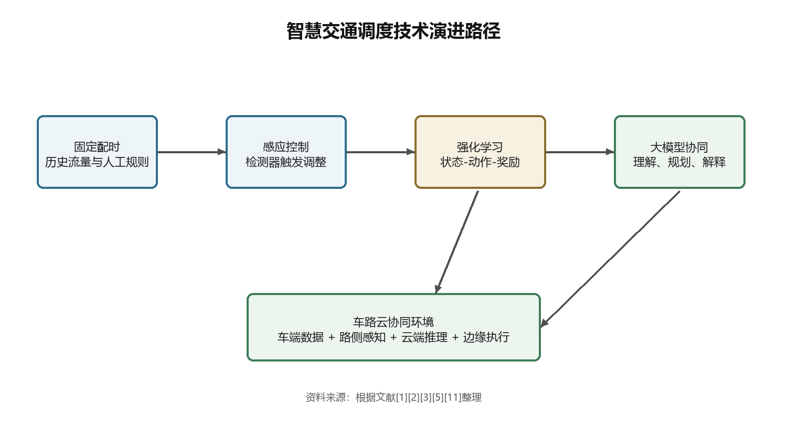
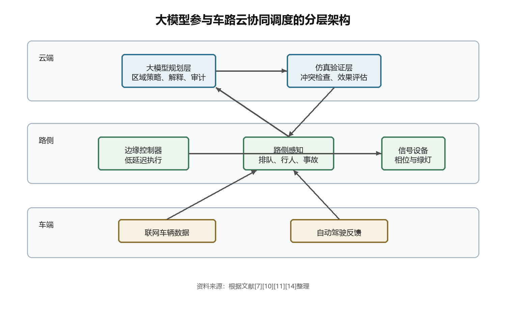
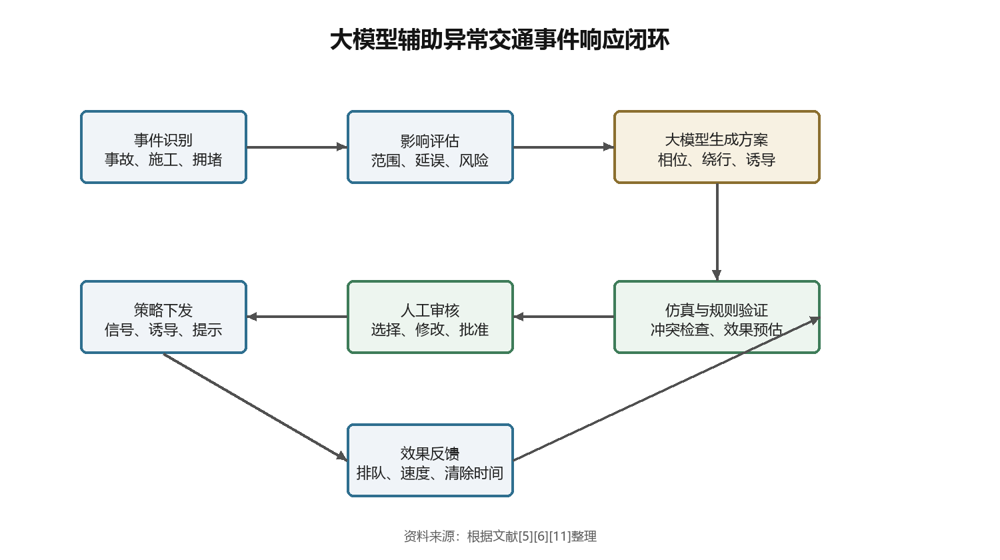

# 大模型在智慧交通调度中的应用研究

作者：XXX    单位：XXX

## 摘要

摘要：城市交通调度正在从固定配时、人工经验和单点优化，转向面向路网状态的动态协同。大模型进入这一领域后，最直接的价值并不是替代所有控制算法，而是在交通状态解释、复杂场景推理、调度策略生成和人机交互层面补足传统模型的短板。围绕智慧交通调度问题，本文基于 TSC、CAV、V2X 与 LLM 智能体研究，梳理大模型参与交通调度的技术基础、典型场景与落地约束。研究发现，大模型适合承担“理解层”和“规划层”功能，强化学习、小模型和规则控制仍应保留在实时执行层；车路云体系则为大模型获取多源数据、调用边缘算力和输出区域协同策略提供了运行环境。论文从数据治理、可靠性验证、分级部署和责任审计四个方面提出优化路径。

## 关键词

关键词：大模型；智慧交通；交通调度；交通信号控制；车路云协同

## 一、引言

### 1.1 研究背景：交通调度从单点控制走向智能协同

城市路口并不只是红绿灯切换的物理节点。它也是人流、车流、公交优先、事故处置和城市管理目标交汇的地方。早期 TSC 多依赖固定周期、感应控制或人工经验，适合交通流相对稳定的路段；可一旦进入早晚高峰、学校周边、施工绕行或突发事故场景，单一路口的最优配时就可能把压力推给相邻路口。堵点会移动。问题也会变形。

智慧交通调度的核心任务，是在时间、空间和交通参与者之间重新分配有限道路资源。已有研究围绕模糊推理、深度强化学习、软件定义网络和混合交通控制提出了多种方案。例如，Kumar 等将模糊推理与深度强化学习结合，用于智能交通系统中的交通灯控制[1]；另一项研究把深度强化学习引入 SDN 支撑的智慧交通灯调度框架，尝试通过网络层资源组织改善信号控制效率[3]。这些工作说明，交通调度已经从单点配时问题扩展为数据、网络、算法和控制执行共同参与的系统问题。

车路云协同进一步改变了交通调度的边界。联网车辆可以上传位置、速度和意图，路侧 RSU 能够感知局部交通状态，MEC 节点和云端平台则负责跨区域计算与策略管理。Song 和 Fan 在混合交通环境下研究联网自动驾驶车辆参与的交通信号控制，证明 CAV 数据能够改变路口控制的信息条件[7]。Li 和 Peng 则把联网自动驾驶车辆作为探针，用于半自动化交通流中的自适应信号控制[14]。这些研究给大模型进入交通调度留下了空间：如果交通系统可以收集 V2X 数据，也需要把复杂信息转化为可解释、可执行的调度策略[10]。

### 1.2 研究意义：大模型补足交通调度的理解与解释环节

大模型的能力不应被简单理解为“生成文字”。在智慧交通调度中，它更像一个能够阅读交通状态、解释算法输出、组织调度知识并参与策略讨论的中间层。传统强化学习模型擅长在仿真环境中学习动作策略，但面对跨城市、跨路网、跨事件类型的迁移时，泛化能力容易受限。LLMLight 研究把大模型作为交通信号控制智能体，关注其在交通场景理解和策略选择上的能力[2]；Lai 等后续讨论了大模型作为交通信号控制智能体的能力边界与机会，指出其在语义理解和跨场景推理方面存在潜力[4]。

这正是智慧交通调度的难处。交通状态并不总是一个干净的数值向量。路口可能同时出现排队溢出、公交到站、行人过街、救护车通行和临时封闭。调度员需要知道“为什么这样配时”，也需要知道“如果执行这条策略，风险在哪里”。Movahedi 和 Choi 关于大模型与自适应交通信号控制的研究，把大模型置于交通控制交叉点上讨论，强调其与现有交通控制技术结合的必要性[5]。Masri 等则提出以大模型作为城市交叉口交通控制系统的新范式，关注其逻辑推理、场景理解和反馈生成能力[6]。

从工程角度看，大模型的价值不是让交通系统更“智能”这个笼统判断，而是让调度链条中原本断裂的几个环节接起来。交通检测数据需要被解释，仿真模型结果需要被翻译成人能理解的策略，异常事件需要快速生成备选方案，多路口协同需要在局部目标和全局目标之间做权衡。大模型可以进入这些环节。它不一定直接控制信号灯，却可以让控制决策更容易被生成、审核和修正。

### 1.3 研究现状：强化学习、联网车辆与大模型三条线索

现有研究可以粗略分为三条线索。第一条是以交通信号控制算法为中心的研究。Kumar 等利用模糊推理增强深度强化学习交通灯控制[1]，Ducrocq 和 Farhi 则讨论部分检测条件下的深度强化 Q 学习交通信号控制[9]。这类研究主要回答“在给定状态下如何选择控制动作”。它们通常依赖仿真环境、奖励函数和状态空间设计，优势是控制目标明确，短板是解释性和迁移性不足。

第二条线索来自联网车辆和混合交通。自动驾驶车辆并不会一次性取代传统车辆，较长时期内城市路网将处于混合交通状态。Song 和 Fan 采用迁移型深度强化学习方法研究联网自动驾驶车辆参与的混合交通信号控制[7]；Andreotti 等利用真实交通流仿真分析自动驾驶车辆对混合交通的潜在影响[8]。这些文献说明，车辆端数据不只是被动观测对象，也可能成为信号控制的主动信息源。

第三条线索是大模型交通控制。LLMLight、CoLLMLight 和相关工作把大模型引入交通信号控制，分别关注单路口控制、网络级协同和多智能体策略生成[2][4][11]。在这些研究中，大模型不再只是一个对话工具，而被测试为交通控制代理或协同代理。它可以读取交通队列、等待时间、相位状态等信息，输出对下一个信号相位的判断。这个方向仍处在探索期，可靠性、实时性和安全边界尚未稳定，但它已经把“可解释交通调度”推到了更具体的位置。

本文采用文献分析和技术框架归纳的方法，围绕“大模型在智慧交通调度中的应用”展开讨论。研究重点不在于证明某个模型一定优于强化学习，而是辨析大模型适合进入交通调度链条的哪些位置。换句话说，问题不是“大模型能不能管红绿灯”，而是“在车路云协同条件下，大模型该管什么、不该管什么”。

## 二、智慧交通调度的技术基础与问题结构

### 2.1 智慧交通调度的基本对象

智慧交通调度面对的对象至少包括三类：交通流、控制资源和参与主体。交通流表现为车辆到达率、排队长度、平均延误、饱和度和速度变化；控制资源包括信号相位、绿灯时长、车道功能、诱导信息和优先通行策略；参与主体则包括普通车辆、联网车辆、自动驾驶车辆、公交、行人和应急车辆。三类对象并不独立。一次公交优先可能影响行人过街时间，也可能改变下游路口排队。

交通信号控制是智慧交通调度中最典型的任务。传统信号控制强调周期、绿信比和相位差的设计，算法目标通常是减少车辆延误或提高路口通行能力。深度强化学习把这个问题转化为状态、动作和奖励的交互过程，试图让控制器在仿真中学习合适策略[1][9]。在复杂路网中，这种方法能处理传统模型难以穷举的状态组合，但也带来新的依赖：需要足够真实的仿真环境，需要稳定的数据输入，还需要可接受的训练成本。

智慧交通调度的另一个对象是“区域”。单路口最优并不等于区域最优。某个路口延长绿灯，可能短期消除本路口排队，却把车流压入下游瓶颈。Kumar 等提出的 SDN 支撑交通灯调度框架，把交通控制与通信网络结合起来，说明信号控制已经离不开网络层的数据组织和资源协调[3]。这对大模型很关键。大模型擅长处理多源信息之间的语义关系，但它必须被放进一个能稳定获取数据、调用工具和反馈结果的系统里。

### 2.2 规则控制与强化学习控制的边界

固定配时和规则控制的优势很清楚：稳定、可解释、便于维护。对于交通规律明显的路段，这类方法不一定落后。问题出现在状态变化太快、事件类型太多、控制目标互相冲突的时候。人工规则很难覆盖所有场景。即使规则库不断扩充，也会遇到优先级冲突和维护成本上升的问题。

强化学习控制改变了这一点。它不需要人为枚举所有规则，而是通过奖励函数让智能体在仿真环境中学习。Kumar 等的模糊推理增强方案试图把人类可解释规则和深度强化学习结合，减少纯黑箱控制带来的不确定性[1]。Ducrocq 和 Farhi 在部分检测条件下研究深度强化 Q 学习，回应了现实路网中传感器覆盖不足的问题[9]。这些工作把交通信号控制从“事先写规则”推进到“让系统根据状态学习”。

可强化学习也有几个绕不开的约束。奖励函数怎么写？仿真环境是否足够接近真实路网？训练出来的策略能否迁移到另一个城市？当控制结果被质疑时，模型能不能解释自己为什么选择某个相位？Xiao 等关于无冷启动强化学习交通信号控制的研究，正是针对强化学习在实际部署中的启动和迁移难题展开[13]。LLMLight 与 CoLLMLight 的实验则提示，LLM 可参与策略解释和跨路口协同[2][11]。这些难题给大模型留下了位置：它不负责毫秒级控制动作，却可以参与场景解释、规则补充和策略审核。

### 2.3 车路云协同的数据与算力条件

车路云协同让交通调度拥有更丰富的数据入口。车端可以回传速度、位置、加速度、转向意图和周边感知结果；路侧设备可以采集路口排队、行人状态、事故检测和道路环境信息；云端平台可以汇聚跨区域数据，完成模型训练、仿真评估和策略管理。Viktorovic 等提出的 CTDO 面向联网半自动驾驶车辆，讨论了城市交通系统中连接数据的组织问题[10]。CAV、V2X 与路侧感知结合后，信号控制获得了传统检测器难以覆盖的细粒度状态[7][14]。这类研究提醒我们，车路云协同的底层难点不只是“有没有数据”，还有数据如何被描述、交换和理解。

联网车辆参与交通控制后，调度系统可以获得比传统线圈、摄像头更细粒度的信息。Song 和 Fan 研究混合交通下联网自动驾驶车辆参与信号控制，说明车辆状态可以成为交通信号控制的增强信息源[7]。Andreotti 等基于真实交通流仿真讨论自动驾驶车辆在混合交通中的潜在影响，显示车端智能与路网控制之间存在双向影响[8]。车变聪明了，路口控制也必须变聪明。否则车辆端能力会被粗糙的道路调度抵消。

算力结构同样会影响大模型的部署位置。云端适合复杂推理和长周期优化，边缘节点适合低延迟控制，车端适合局部感知和执行反馈。把大模型直接放在每个路口实时决策，成本和安全风险都很高；把它放在云端进行区域调度规划，再由边缘小模型或规则控制器执行，工程上更稳。这个分层思路也符合交通安全系统对确定性的要求。

### 2.4 大模型进入交通调度的技术条件

大模型能进入交通调度，至少依赖三个条件。其一是交通状态必须可被结构化表达。交通排队、车道占有率、相位状态、事故类型和天气影响，需要被转换为模型可读取的文本、表格或工具调用参数。其二是大模型输出必须被约束。交通调度不是开放式聊天，输出策略需要满足安全规则、道路法规和信号控制边界。其三是系统必须能验证策略。没有仿真验证和人工审计，大模型生成的建议不能直接进入执行层。

LLMLight 的研究把交通状态转化为大模型可理解的提示信息，让模型扮演交通信号控制代理[2]。CoLLMLight 则进一步面向网络级交通信号控制，尝试让多个大模型代理协同处理区域交通问题[11]。这两类工作共同说明，大模型进入交通控制的关键不是参数规模，而是“状态描述、动作约束、反馈机制”三者能否闭合。

从这一角度出发，大模型与强化学习并非替代关系。DRL 适合在明确状态空间和奖励函数下学习控制动作，大模型适合处理多源语义信息、解释控制原因和生成候选策略。LLMLight 这一路线的价值，正是在 RL 控制与 LLM 推理之间寻找接口[2][4]。两者结合，可能比单独使用其中一种更贴近真实交通调度。

## 三、大模型在智慧交通调度中的主要应用场景

### 3.1 交通状态理解与自然语言查询

交通调度员面对的不是一串孤立数字，而是一幅不断变化的城市运行图。某个路口排队长度增加，可能来自信号配时不足，也可能来自下游道路占满；平均速度下降，可能是事故，也可能是雨天或学校放学。传统系统可以显示数据，但未必能解释数据之间的关系。大模型的第一类应用，就是把交通数据转化为可理解的调度语义。

例如，系统可以把检测器数据、摄像头事件、公交运行状态和道路施工信息整理为提示，让大模型生成“当前拥堵原因假设”和“可选调度措施”。这种方式与交通数据本体研究存在衔接。Connected Traffic Data Ontology 关注联网交通数据的组织和语义描述[10]，它为大模型读取车路云数据奠定了基础。没有统一语义层，大模型只能处理零散文本；有了标准化交通数据描述，模型才可能把不同来源的信息放到同一个调度问题中分析。

LLMLight 和相关大模型交通控制研究也表明，大模型可以读取路口状态并输出控制意图[2][4]。但在实际系统中，更稳妥的切入点是自然语言查询和状态解释。调度员可以询问“为什么 A 路口连续三周期排队未消散”“如果给公交优先，会影响哪两个下游路口”。这类问题不要求模型直接控制信号灯，却能缩短人工研判时间。

短一点说：先让模型看懂路网。

### 3.2 自适应交通信号控制

交通信号控制是大模型应用最集中的方向。LLMLight 将大模型作为交通信号控制代理，测试其根据交通状态选择信号动作的能力[2]。Movahedi 和 Choi 在自适应交通信号控制中研究大模型作用，说明大模型能够与交通控制技术形成新的组合方式[5]。Masri 等提出把大模型作为城市交叉口交通控制系统，强调其场景理解、逻辑推理和反馈生成能力[6]。这些文献共同指向一个判断：大模型可以参与信号控制，但参与方式需要分层。

直接让大模型以秒级频率输出绿灯时长并不理想。原因很现实。大模型推理延迟高，输出存在随机性，且对安全约束的遵守需要外部机制保证。更可行的方式，是把大模型放在策略生成和解释层，由强化学习控制器、优化算法或边缘规则执行器完成实时动作。Kumar 等的模糊推理增强深度强化学习方法已经把可解释规则与学习控制结合起来[1]；大模型可以在此基础上承担更高层的策略解释与规则修订。

一个可能的流程是：边缘控制器负责采集路口状态并运行低延迟控制策略，云端大模型周期性读取路口表现、异常事件和仿真结果，给出策略调整建议。建议不会直接执行，而是经过约束检查、仿真评估和人工审核后进入规则库或模型参数更新。这种方式把大模型的推理优势用于“慢变量”，把实时执行留给稳定控制模块。

### 3.3 网络级协同调度

单路口控制相对容易评估，网络级协同难得多。一个区域内的路口互相影响，车辆从上游进入下游，某条道路的排队溢出可能迅速扩散。CoLLMLight 面向网络级交通信号控制，探索协作式大模型代理如何在多个路口之间协调[11]。这类研究把大模型从单点控制推向多智能体协同，也让智慧交通调度更接近车路云体系的实际形态。

网络级调度需要解决三个问题。局部目标和全局目标怎么统一？多个路口的控制器如何交换状态？当某个区域出现事故或临时管制，哪些路口需要同步调整？传统强化学习可以训练多智能体控制策略，但策略解释和跨场景迁移仍然困难。大模型可以在这里承担“协调语言”的角色：把各路口状态、下游影响和区域目标组织成可讨论的调度方案。

表 1 对几类交通信号控制方法进行归纳。它不是实验数据，而是基于已确认文献中方法特征形成的比较，用于说明大模型在调度链条中的位置。

| 方法类型 | 主要输入 | 优势 | 局限 | 适合的大模型参与位置 |
|---|---|---|---|---|
| 固定配时/规则控制 | 历史流量、人工规则 | 稳定、易维护 | 难处理突发变化 | 规则解释与规则库更新 |
| 深度强化学习控制 | 状态向量、奖励函数 | 自适应能力较强 | 训练成本高、解释弱 | 策略解释与仿真评审 |
| 联网车辆辅助控制 | 车辆位置、速度、意图 | 信息粒度细 | 依赖渗透率和通信质量 | 车路云状态融合 |
| 大模型辅助控制 | 文本化状态、多源事件、工具输出 | 语义理解和方案生成强 | 实时性与可靠性不足 | 规划层、解释层、审核层 |

这种分工也解释了为什么大模型不宜被神化。交通控制系统的底层仍需要确定性。信号灯不能因为语言模型一次生成错误而放行冲突车流。大模型更适合在多目标协调、异常场景分析和区域策略生成中发挥作用。

### 3.4 异常事件响应

交通调度最能考验系统能力的时刻，往往不是常态高峰，而是异常事件。事故占道、道路施工、恶劣天气、临时活动和应急车辆通行，会让历史规律失效。传统信号控制面对这类事件通常依赖人工介入；强化学习模型如果训练集中缺少类似场景，也可能输出不稳。

大模型适合处理异常事件的原因，在于它可以把事件描述、道路规则、历史案例和实时状态放在同一段推理中。Masri 等关于大模型作为交叉口交通控制系统的研究，强调模型可以基于交通条件给出反馈[6]。Movahedi 和 Choi 对大模型在自适应信号控制中的研究，也把大模型放在复杂交通控制问题的交叉位置上[5]。这些研究虽仍偏实验和模拟，但方向清楚：大模型可以作为异常事件下的策略生成器。

在车路云场景中，异常事件响应可设计为闭环流程。路侧设备识别事件，边缘节点确认影响范围，云端 LLM 生成绕行、相位调整和诱导信息草案，仿真模块评估候选策略，人工调度员选择并发布。执行后，系统继续回收排队长度、平均速度和事故清除时间等 3 类反馈，更新下一轮策略[5][6][11]。

这一流程里，大模型不是最终裁判。它更像调度参谋。它提出选项，也解释选项。真正的执行需要经过控制约束、仿真验证和人工审核；在 ITSC/KDD 等相关研究语境中，这一点比单纯追求模型规模更关键[2][11]。

### 3.5 车路云协同决策

车路云协同把交通调度分成多个层级。车端负责局部感知和执行，路侧负责近场融合与边缘控制，云端负责跨区域优化和模型管理。大模型可以在云端承担区域级规划，也可以在边缘侧以较小模型形式承担场景摘要和异常识别。关键在于分工。

联网车辆作为交通调度信息源已经被多项研究关注。Song 和 Fan 证明联网自动驾驶车辆可参与混合交通信号控制[7]；Li 和 Peng 把联网车辆消息用于增强自适应交通信号控制[14]；Andreotti 等则通过真实交通流仿真分析自动驾驶车辆混入后对交通流的影响[8]。这些研究意味着，车端数据可以帮助路侧和云端更早判断拥堵趋势。大模型若能读取这些信息，就能生成更贴近真实路况的区域策略。

车路云协同也要求系统处理不同时间尺度。车辆避障和跟驰控制以毫秒为单位，路口信号配时以秒为单位，区域诱导和拥堵疏解以分钟为单位，交通政策评估以天或月为单位。大模型适合分钟级和更长周期的规划、解释和复盘；秒级以下的控制，应交给专用模型、规则控制器和安全冗余机制。这个边界如果不清楚，大模型应用会很容易从“辅助调度”滑向“不可控自动化”。

## 四、大模型赋能智慧交通调度的挑战与优化路径

### 4.1 数据质量与实时性

交通数据并不干净。摄像头可能被遮挡，检测器可能失灵，车辆上传数据可能延迟，事故信息可能来自人工报送。大模型如果直接读取这些信息，可能把噪声当作事实。Connected Traffic Data Ontology 之所以有价值，就在于它尝试给联网交通数据建立更明确的组织方式[10]。对于大模型应用而言，数据标准化不是后台细节，而是安全前提。

实时性是另一个硬约束。交通信号控制不能等待长时间生成。Kumar 等关于 SDN 支撑交通灯调度的研究体现了网络基础设施对交通控制的重要影响[3]。如果通信延迟、云端推理排队和边缘执行之间没有协调，再强的大模型也会成为系统瓶颈。可行路径是把实时控制和策略推理拆开：实时动作由边缘控制器完成，大模型周期性生成调整建议，并在低峰或仿真环境中验证。

### 4.2 模型可靠性与安全边界

大模型存在幻觉、输出不稳定和约束遵守不完全的问题。交通调度不能容忍高风险错误。比如，模型若忽略行人相位、应急车辆优先或冲突方向，就可能造成安全事故。LLMLight 和 CoLLMLight 等研究展示了大模型在交通信号控制中的能力[2][11]，但从研究原型到真实路口，还需要更严格的安全封装。

可靠性可以通过三层机制增强。第一层是输入约束，只给模型读取经过校验的交通状态。第二层是输出约束，把模型建议限制在合法相位、合理绿灯区间和可执行调度动作内。第三层是验证约束，所有策略先进入仿真或规则检查，不能直接下发。Movahedi 和 Choi 的研究把大模型放在交通控制交叉点上讨论[5]，也提示我们不能只看模型能力，还要看控制系统怎样限制模型。

### 4.3 部署成本与系统架构

大模型部署成本高。城市级交通调度如果每个路口都调用大型模型，云端费用、通信压力和延迟都会迅速上升。车路云体系支撑分层部署：云端 LLM 负责区域规划和事件分析，边缘小模型负责状态摘要和快速判断，路口控制器负责确定性执行。这样可以把昂贵推理集中在真正复杂的场景，把常规控制留给低成本模块。

已有强化学习研究仍有价值。Kumar 等、Ducrocq 和 Farhi、Savithramma 与 Sumathi 等研究都说明，专用交通控制模型在特定任务上仍然有效[1][9][12]。大模型应用不应抛弃这些成果，而应把它们纳入工具链。大模型可以调用强化学习控制器的输出，解释为什么某个策略可能有效，也可以在模型表现异常时提示调度员关注数据漂移。

### 4.4 治理机制：人机协同与责任审计

交通调度是公共服务的一部分，不能只以技术效率评价。谁批准了模型建议？谁对信号策略负责？系统如何记录每一次策略生成、审核和下发？这些问题决定 LLM 能否进入真实交通管理场景。没有日志、版本号、API 调用记录、SLA 约束和 3 级审批链，任何自动化建议都难以被长期信任。

人机协同需要从界面和流程上设计。调度员不应只看到“建议延长东向绿灯 20 秒”这样的结果，还要看到拥堵来源、影响范围、替代方案和风险提示。大模型在这里有优势：它可以把模型输出翻译成调度语言，也可以把人工反馈转化为后续规则调整。我们可以把它理解为 TSC 知识的组织者，而不是替代调度员的机器。

### 4.5 优化路径：小模型执行、大模型规划、仿真验证

面向落地，本文认为较稳妥的路径是“小模型执行、大模型规划、仿真验证、人工审计”。执行层由规则控制、RL 控制器或边缘小模型完成，保证低延迟和确定性；规划层由 LLM 读取区域状态、历史策略和事件信息，生成候选调度方案；验证层通过 SUMO 等交通仿真、冲突检查和安全规则筛查策略；审计层记录模型输入、输出、人工修改和执行效果。

这一路径与现有研究并不冲突。LLMLight 和 CoLLMLight 可以被理解为大模型参与控制的探索[2][11]；强化学习交通灯控制研究构成执行层基础[1][3][9][12][13]；联网车辆和车路云研究构成数据入口与协同环境[7][8][10][14]。把这些线索合起来，大模型在智慧交通调度中的角色就更清楚：它不必控制每一秒的灯色，却可以帮助系统理解更复杂的交通状态，形成更可解释的区域策略。

## 五、结论

大模型在智慧交通调度中的应用，不是把交通控制简单改写为对话系统。它真正有价值的位置，是交通状态理解、策略生成、区域协同和调度解释。对于需要毫秒级响应的车端控制和秒级信号执行，大模型并不天然适合直接承担核心控制；对于分钟级区域调度、异常事件响应和车路云协同规划，大模型的语义理解与推理能力可以补足传统模型短板。

本文基于 14 篇已核验英文文献展开分析。研究发现，交通信号控制领域已经形成从规则控制到强化学习、再到大模型智能体的技术演进线索[1][2][5][11]。车路云协同则为大模型应用准备了数据、算力和系统分层条件[7][10][14]。更现实的落地方式，是让大模型承担规划层和解释层，让强化学习、小模型和规则控制器承担执行层，并通过仿真验证与人工审计限制风险。

研究也存在不足。中文文献源本轮采集受反爬和证书问题影响，未能形成可核验中文参考文献池；部分大模型交通控制研究仍处在仿真或预印本阶段，距离真实城市级部署还有距离。后续研究可以围绕国产交通数据集、真实路网仿真平台、车路云接口标准和大模型安全评估体系继续推进。路口不会因为模型变大而自动通畅。可如果模型能帮助人更快理解拥堵、更稳地生成方案、更清楚地追踪责任，它就已经进入了智慧交通调度的关键位置。

## 参考文献

[1] Kumar N, Rahman S S, Dhakad N. Fuzzy Inference Enabled Deep Reinforcement Learning-Based Traffic Light Control for Intelligent Transportation System[J]. IEEE Transactions on Intelligent Transportation Systems, 2021. DOI: 10.1109/TITS.2020.2984033.

[2] Lai S, Xu Z, Zhang W, Liu H, Xiong H. LLMLight: Large Language Models as Traffic Signal Control Agents[C]. Proceedings of the 31st ACM SIGKDD Conference on Knowledge Discovery and Data Mining, 2023. DOI: 10.1145/3690624.3709379.

[3] Kumar N, Mittal S, Garg V, Kumar N. Deep Reinforcement Learning-Based Traffic Light Scheduling Framework for SDN-Enabled Smart Transportation System[J]. IEEE Transactions on Intelligent Transportation Systems, 2022. DOI: 10.1109/TITS.2021.3095161.

[4] Lai S, Xu Z, Zhang W, Liu H, Xiong H. Large Language Models as Traffic Signal Control Agents: Capacity and Opportunity[EB/OL]. arXiv, 2023. DOI: 10.48550/arXiv.2312.16044.

[5] Movahedi M, Choi J. The Crossroads of LLM and Traffic Control: A Study on Large Language Models in Adaptive Traffic Signal Control[J]. IEEE Transactions on Intelligent Transportation Systems, 2025. DOI: 10.1109/TITS.2024.3498735.

[6] Masri S, Ashqar H I, Elhenawy M. Large Language Models (LLMs) as Traffic Control Systems at Urban Intersections: A New Paradigm[J]. Vehicles, 2025. DOI: 10.3390/vehicles7010011.

[7] Song L, Fan W. Traffic Signal Control Under Mixed Traffic With Connected and Automated Vehicles: A Transfer-Based Deep Reinforcement Learning Approach[J]. IEEE Access, 2021. DOI: 10.1109/ACCESS.2021.3123273.

[8] Andreotti E, Selpi, Boyraz P. Potential impact of autonomous vehicles in mixed traffic from simulation using real traffic flow[J]. Journal of Intelligent and Connected Vehicles, 2023. DOI: 10.26599/JICV.2023.9210001.

[9] Ducrocq R, Farhi N. Deep Reinforcement Q-Learning for Intelligent Traffic Signal Control with Partial Detection[J]. International Journal of Intelligent Transportation Systems Research, 2023. DOI: 10.1007/s13177-023-00346-4.

[10] Viktorovic M, Yang D, de Vries B. Connected Traffic Data Ontology (CTDO) for Intelligent Urban Traffic Systems Focused on Connected (Semi) Autonomous Vehicles[J]. Sensors, 2020. DOI: 10.3390/s20102961.

[11] Yuan Z, Lai S, Liu H. CoLLMLight: Cooperative Large Language Model Agents for Network-Wide Traffic Signal Control[EB/OL]. arXiv, 2025. DOI: 10.48550/arXiv.2503.11739.

[12] Savithramma R M, Sumathi R. Intelligent traffic signal controller for heterogeneous traffic using reinforcement learning[J]. Green Energy and Intelligent Transportation, 2023. DOI: 10.1016/j.geits.2023.100124.

[13] Xiao N, Yu L, Yu J, Chen P, Liu Y. A cold-start-free reinforcement learning approach for traffic signal control[J]. Journal of Intelligent Transportation Systems, 2022. DOI: 10.1080/15472450.2021.1934679.

[14] Li Y, Peng L. Elevating adaptive traffic signal control in semi-autonomous traffic dynamics by using connected and automated vehicles as probes[J]. IET Intelligent Transport Systems, 2024. DOI: 10.1049/itr2.12483.
